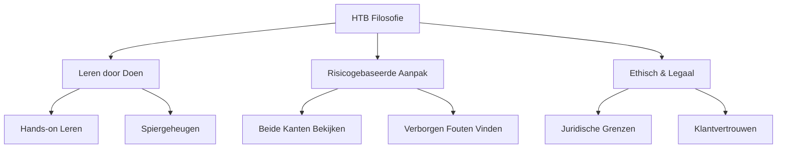
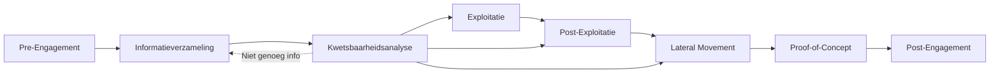
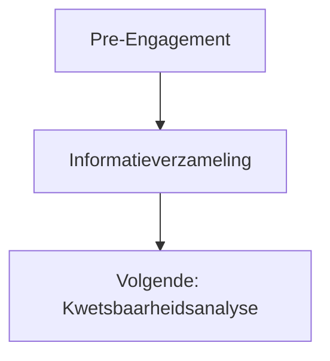
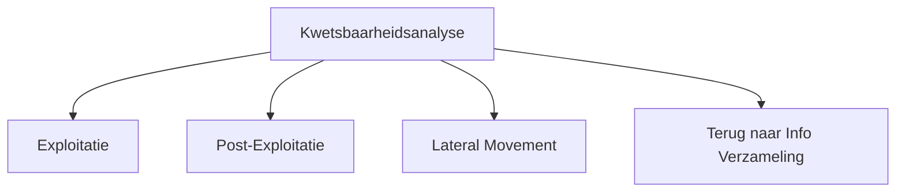

# HTB Academy: Penetration Tester Leerpad - Volledige Introductie

> **Certificering**: CPTS (Certified Penetration Testing Specialist)  
> **Platform**: Hack The Box Academy  
> **Niveau**: Beginner tot Gevorderd  
> **Datum gestart**: 2026-01-13

---

## 📋 Inhoudsopgave

- [[#Over Dit Leerpad]]
- [[#HTB Academy Leerfilosofie]]
- [[#Ethische en Juridische Kaders]]
- [[#IT Beveiliging Fundamentals]]
- [[#De Penetratietest Fasen]]
- [[#Volledige Module Overzicht]]
- [[#Vereiste Voorkennis]]
- [[#Studietips]]

---

## 🎯 Over Dit Leerpad

### Doelgroep

Dit leerpad is ontworpen voor:

- **Aspirant pentesters** van alle achtergronden
- **Ervaren pentesters** die zich willen bijscholen
- **IT professionals** die hun vaardigheden willen verbreden
- **Carrièrezoekers** die de cybersecurity wereld in willen

### Wat Je Leert

Het pad behandelt de **kernconcepten** voor:

1. **Externe Penetratietests** - Aanvallen van buitenaf
2. **Interne Penetratietests** - Netwerk EN Active Directory
3. **Webapplicatie Beveiligingsbeoordelingen** - Webapp security tests

### Unieke Aanpak

> [!important] Niet Alleen Tools! "Elke module duikt diep in het **'waarom'** achter de problemen en tactieken die we presenteren en is **niet alleen een tutorial** voor het draaien van point-and-click tools."

**Wat maakt HTB anders:**

- ✅ Verhalen uit echte beveiligingsbeoordelingen
- ✅ Klanten uit alle sectoren (bedrijfsleven + overheid)
- ✅ Beide kanten van een probleem bekijken
- ✅ Fouten vinden die anderen missen
- ✅ Herhaalbare methodologie ontwikkelen

### Eindresultaat

Na voltooiing kun je:

- ✅ Professionele beveiligingsbeoordelingen uitvoeren
- ✅ Echte netwerken aanvallen (basis-gevorderd niveau)
- ✅ Het "waarom" achter kwetsbaarheden uitleggen
- ✅ Nauwkeurig hersteladvies geven
- ✅ Advies aanpassen aan de situatie van de klant

---

## 🧠 HTB Academy Leerfilosofie

### Kernfilosofie

> **"Leren door te doen"** - Een risicogebaseerde aanpak met sterke nadruk op hands-on leren en legaal & ethisch gebruik van onze vaardigheden.

### De Drie Pilaren



### 1. Leren door Doen

**Hoe het werkt:**

- **Honderden** praktische, hands-on voorbeelden
- Elke module eindigt met **Vaardigheidsbeoordelingen**
- Concepten worden **herhaald** in verschillende contexten
- Bouw **"spiergeheugen"** op voor standaardprocedures

**Waarom belangrijk:**

> "Als we de basis goed beheersen, hebben we **meer tijd om dieper te graven** en extra waarde te leveren aan onze klanten."

### 2. All-round Professional

Je leert voor **elke** kwetsbaarheid:

|Aspect|Wat Je Leert|
|---|---|
|**Ontdekken**|Hoe vind je de fout?|
|**Exploiteren**|Hoe misbruik je het?|
|**Herstellen**|Hoe los je het op?|
|**Detecteren**|Hoe detecteer je het?|
|**Voorkomen**|Hoe voorkom je het?|

### 3. Begrijp het "Waarom"

**Voorbeeld:**

- ❌ **Slechte training**: "Voer dit commando uit om in te breken"
- ✅ **HTB aanpak**: "Dit werkt omdat de service X doet, wat Y toestaat, en hier is waarom tool Z faalt als..."

**Voordelen:**

- Beter begrijpen hoe dingen werken
- Weten waarom een tool faalt
- Beter hersteladvies
- Uniek afgestemd op de klantomgeving

### De Gitaar Analogie

> [!note] HTB Filosofie Citaat "We kunnen alles leren over een gitaar, de geschiedenis van gitaren, de naam van elk onderdeel, enz., maar als we er een oppakken **zonder te oefenen**, kunnen we geen muziek maken die overeenkomt met onze kennis van gitaren. **Hetzelfde geldt voor penetratietesten.**"

**Betekenis:**

- Kennis ≠ Vaardigheid
- Je moet **oefenen**, niet alleen lezen
- Analytische vaardigheden komen door **ervaring**
- "Alles in vraag stellen" mindset moet **getraind** worden

---

## ⚖️ Ethische en Juridische Kaders

### De Unieke Positie van Penetratietesten

> [!warning] Cruciale Kennis "Penetratietesten is een van de weinige beroepen waarbij je, **tijdelijk** (tijdens de geautoriseerde testperiode), acties mag uitvoeren tegen een bedrijf die **onder andere omstandigheden tegen de wet** zouden zijn."

### De Grens: Legaal vs. Illegaal

#### ✅ LEGAAL (Toegestaan)

**Passieve OSINT:**

- Publieke databases raadplegen
- Zoekmachines gebruiken
- Social media onderzoek
- Alleen **publiek beschikbare** informatie

**Met Toestemming:**

- Scannen van systemen **binnen scope**
- Exploits uitvoeren **binnen RoE**
- Bug bounty programma's (binnen hun regels)

#### ❌ ILLEGAAL (NIET Toegestaan)

**Zonder Contract:**

- ALLE scanning van bedrijfssystemen
- ALLE interactie met systemen
- Probing van externe infrastructuur
- "Oefenen" tegen echte bedrijven

> [!danger] Juridische Gevolgen "Het uitvoeren van ENIGE scanning of activiteiten die interactie hebben met ENIG systeem van een organisatie **zonder expliciete schriftelijke toestemming** in de vorm van een Scope of Work is **tegen de wet** en kan leiden tot **juridische en zelfs strafrechtelijke vervolging**."

### Vereiste Documentatie

#### 1. Scope of Work (SoW)

**Moet bevatten:**

- [ ] Gedetailleerde testscope
- [ ] Contract (juridisch bindend)
- [ ] Rules of Engagement (RoE)
- [ ] Handtekeningen van beide partijen

#### 2. Formeel Scope Document

**Specificaties:**

- **Web**: URLs, subdomeinen
- **Netwerk**: Individuele IP-adressen, CIDR-bereiken
- **Draadloos**: SSIDs
- **Fysiek**: Gebouwadressen
- **Social Engineering**: E-maillijsten, telefoonnummers

**Ondertekend door:**

- [ ] Klant (officiële vertegenwoordiger)
- [ ] Pentest bedrijf
- [ ] Datum en handtekeningen

### Best Practices Tijdens Beoordeling

#### Pre-Assessment

> [!tip] Doe Je Huiswerk **Controleer altijd:**
> 
> - Is het bedrijf legitiem?
> - Is er een **ondertekend** contract?
> - Heb je een kopie van de SoW?
> - Is de scope **duidelijk** gedefinieerd?

> [!warning] Criminele Organisaties "Hoewel zeldzaam, kunnen sommige **criminele organisaties** zich voordoen als legitieme bedrijven om talent te rekruteren voor illegale activiteiten. Als je meedoet, zelfs met goede bedoelingen, **kun je nog steeds aansprakelijk zijn**."

#### Tijdens Assessment

**Gouden Regels:**

1. **Blijf Binnen de Scope**

```
❌ FOUT: "Dit IP ziet er interessanter uit, laat ik die ook scannen"
✅ GOED: "Ik zie IP X buiten scope - mag ik die toevoegen?" (SCHRIFTELIJK!)
```

2. **Doe Geen Schade**

- Klanten vertrouwen je met hun netwerk
- Tools kunnen **downtime** veroorzaken
- Downtime = **inkomstenverlies**
- Leidend principe: **"Doe geen schade"**

3. **Bij Twijfel**

- [ ] Stop met testen
- [ ] Overleg met je manager
- [ ] Neem contact op met de klant
- [ ] Verkrijg **expliciete toestemming SCHRIFTELIJK**
- [ ] Documenteer alles

#### Vragen om Jezelf te Stellen

```
- Alleen omdat we een tool KUNNEN draaien, MOETEN we dat?
- Kan deze exploit PoC servers laten crashen?
- Is dit IP daadwerkelijk binnen de scope?
- Heb ik schriftelijke toestemming hiervoor?
```

### Documentatie Mindset

> [!important] Documenteer, Documenteer, Documenteer "**Documenteer, documenteer, documenteer.** Bij twijfel, documenteer en **communiceer over**. Zorg dat alle 'saaie' compliance-zaken **eerst** geregeld zijn, zodat je kunt ontspannen en kunt genieten van het uitvoeren van uitstekende uitgebreide beoordelingen."

**Wat te documenteren:**

- Alle communicatie met klant
- Scope wijzigingen (schriftelijk!)
- Gebruikte tools en wanneer
- Bevindingen met tijdstempels
- Screenshots als bewijs
- Gevonden credentials
- Bezochte systemen

### Bug Bounty Programma's (Oefenmogelijkheid)

**Platforms:**

- HackerOne
- Bugcrowd

**Voordelen:**

- ✅ Legaal oefenen op echte doelen
- ✅ Verschillende bedrijven
- ✅ Verschillende scopes

**Regels:**

- Elk programma heeft eigen **scope**
- Elk programma heeft eigen **engagement regels**
- Meestal **GEEN** geautomatiseerde scanning toegestaan
- Perfect voor **handmatige** webapp testing vaardigheden

> [!tip] Uitstekende Oefening "Waardoor ze een geweldige manier zijn om je informatieverzameling en **handmatige webapplicatie test** vaardigheden te oefenen."

### Samenvatting: De Juiste Weg

> [!quote] HTB Wijsheid "We zijn zeer bekwaam en **groot vertrouwen wordt in ons gesteld**. Misbruik dit vertrouwen niet, werk altijd **ethisch** en **binnen de grenzen van de wet**, en je zult een **lange en vruchtbare carrière** hebben en geweldige zakelijke en persoonlijke relaties opbouwen. Streef er altijd naar om **de juiste weg te kiezen** en **het juiste te doen**."

---

## 💻 IT Beveiliging Fundamentals

### Waarom IT Begrip Essentieel Is

> [!important] Kernvereiste "We **kunnen niet met vertrouwen werken** als penetratie testers als we geen **diep begrip** hebben van de technologieën die we beoordelen."

### IT vs. Cyberbeveiliging

**Informatietechnologie (IT):**

- Computersystemen bouwen
- Systemen beheren
- Technologie ondersteunen
- Bedrijfsfunctie van organisaties

**Cyberbeveiliging:**

- Vereist **basis IT kennis** PLUS
- **Veel dieper begrip** van alle gebieden
- Netwerken
- Linux & Windows beheer
- Scripting
- Databases
- En meer...

### Het Ontwikkelaar Voorbeeld

> [!note] HTB Voorbeeld "Een webontwikkelaar richt zich alleen op het ontwikkelen van webapplicaties en websites. Dit vereist over het algemeen kennis van HTML, JavaScript, CSS, SQL en server-side programmeertalen zoals PHP. **Zelfs als de ontwikkelaar meer dan tien jaar ervaring** heeft op zijn gebied, **is slechts één fout nodig** om de hele webserver onbruikbaar te maken of voor data om gestolen te worden."

**Als aanvaller:**

> "De truc is om een manier te vinden om deze fouten te **identificeren en exploiteren**."

### Kennisgebieden Voor Pentesters

|Gebied|Waarom Belangrijk|
|---|---|
|**Netwerken**|Begrijp hoe hosts communiceren|
|**Linux**|Meest stabiele OS, overal in bedrijfsnetwerken|
|**Windows**|Gebruiksvriendelijk, meest voorkomend in IT|
|**Webtechnologieën**|HTML, JS, CSS, SQL, PHP, etc.|
|**Active Directory**|Hoe bedrijven 100en/1000en systemen beheren|
|**Databases**|MySQL, MSSQL, PostgreSQL, etc.|
|**Scripting**|Python, Bash, PowerShell|

---

## 🔄 De Penetratietest Fasen

### Compleet Proces Overzicht



---

### 1️⃣ Pre-Engagement

**Doel:** Afspraken, scope, beperkingen en overeenkomsten documenteren

**Deliverables:**

- Contractdocumenten
- Scope of Work (SoW)
- Rules of Engagement (RoE)
- Essentiële informatie-uitwisseling

**Belangrijke Vragen:**

- Wat is de exacte scope?
- Welke systemen zijn in/buiten scope?
- Wat zijn de testvensters?
- Wie zijn de contactpersonen?
- Wat zijn de noodprocedures?

---

### 2️⃣ Informatieverzameling

**Doel:** Identificeer doelsystemen voordat je aanvalt

**Scenario:**

> "Het kan zo zijn dat de klant ons **geen informatie geeft** over hun netwerk en componenten behalve **een domeinnaam** of slechts **een lijst met in-scope IP-adressen/netwerkbereiken**."

**Wat Je Moet Doen:**

- Krijg overzicht van doel webapplicaties
- Krijg overzicht van netwerk
- Identificeer alle potentiële doelen
- Breng infrastructuur in kaart

**Module Connectie:**



**Eerst de Fundamentals:**

#### Module 1: Leerproces

> "Om deze kennis zo snel en zo goed mogelijk te verwerven, moeten we weten hoe het **Leerproces** van een mens werkt en hoe we struikelblokken tijdens het proces kunnen vermijden."

**Wat je leert:**

- Hoe je brein werkt
- Leerefficiëntie dramatisch verhogen
- Veelvoorkomende leervalkuilen vermijden

**Stats:**

- **Tier**: 0 (Fundamenteel)
- **Moeilijkheid**: Algemeen
- **Secties**: 12
- **Tijd**: ~3 uur

#### Module 2: Linux Fundamentals

> "Linux is een van de **meest stabiele besturingssystemen** van vandaag en **alomtegenwoordig in bedrijfsnetwerken**."

**Waarom cruciaal:**

- Je MOET de structuur kennen
- Passende stappen kunnen nemen
- Je doelen bereiken

**Stats:**

- **Tier**: 0
- **Secties**: 18
- **Tijd**: ~6 uur

#### Module 3: Windows Fundamentals

> "Windows is een van de **meer gebruiksvriendelijke** besturingssystemen die **de meeste bedrijven** in hun IT-infrastructuur vinden."

**Stats:**

- **Secties**: 14
- **Tijd**: ~6 uur

#### Module 4: Introductie tot Netwerken

> "Het grootste deel van de informatiewereld is **met elkaar verbonden**, en begrijpen hoe hosts **communiceren** en **elkaar vinden** op het internet en binnen interne netwerken is een ander **fundamentele bouwsteen**."

**Zonder dit:**

> "Zonder diep begrip van Netwerken, zullen we **niet effectief zijn** in het beoordelen van onderling verbonden systemen."

**Stats:**

- **Secties**: 12
- **Tijd**: ~3 uur

#### Module 5: Introductie tot Webapplicaties

> "Computernetwerken op het internet zijn gestandaardiseerd over veel lagen en protocollen. Het **meest gebruikte** type applicaties zijn **Webapplicaties**."

**Focus:**

- Hoe ze functioneren
- Backend processen
- Browser interacties

**Stats:**

- **Secties**: 17
- **Tijd**: ~3 uur

#### Module 6: Web Requests

> "De communicatie vindt plaats via verschillende soorten **Web Requests**, die de webapplicatie verwerkt met specifieke functies."

**Bonus:**

> "Sommige webserver **misconfiguraties** kunnen ons zelfs toegang geven tot het systeem **zonder een webapplicatie direct te hoeven exploiteren**."

**Stats:**

- **Secties**: 8
- **Tijd**: ~4 uur

#### Module 7: JavaScript Deobfuscation

> "De meeste webapplicaties tegenwoordig zijn **dynamisch** en bevatten **JavaScript**, waar we ook vertrouwd mee moeten zijn."

**Uitdaging:**

> "JavaScript is vaak **geobfusceerd** om het moeilijk te maken voor aanvallers (en verdedigers) om de exacte functionaliteit van de code te begrijpen."

**Stats:**

- **Secties**: 11
- **Tijd**: ~4 uur
- **Type**: Defensief

#### Module 8: Introductie tot Active Directory

> "Tegenwoordig gebruiken de meeste bedrijven een gestructureerde manier om **honderden of duizenden** computers en gebruikers te beheren. **Active Directory** wordt gebruikt om beheer voor beheerders te vereenvoudigen en te versnellen."

**Waarom belangrijk:**

- Bedrijfsstandaard
- Centraal beheer
- Authenticatie/Autorisatie
- Meeste interne pentests betreffen AD

**Stats:**

- **Secties**: 16
- **Tijd**: ~7 uur

#### Module 9: Aan de Slag

> "Wat veroorzaakt de meeste moeilijkheden voor de meesten bij het beginnen? Het antwoord hierop is veel gemakkelijker dan de meesten zich kunnen voorstellen, want we hoeven alleen maar **Aan de Slag** te gaan."

**Inhoud:**

- Tips & tricks voor beginners
- Technologieën die je zult zien
- Overzicht aanvalsmethoden
- **Begeleide walkthrough** van kwetsbare box
- Je **eerste box oplossen zonder hulp**

**Stats:**

- **Secties**: 23
- **Tijd**: ~8 uur

---

### 3️⃣ Kwetsbaarheidsanalyse

**Doel:** Gebruik informatie om zwakke punten te identificeren

**Twee Benaderingen:**

#### Geautomatiseerde Scanning

- Kwetsbaarheidsscanners gebruiken
- Scan voor **bekende** kwetsbaarheden
- Vergelijk met databases

#### Handmatige Analyse

- "Achter de schermen kijken"
- **Potentiële** kwetsbaarheden vinden
- Creatief denken vereist

**HTB Citaat:**

> "Een analyse gaat meer over **out-of-the-box denken**. We proberen hiaten en mogelijkheden te ontdekken om **systemen te misleiden** en applicaties in ons voordeel te gebruiken en **onbedoelde toegang of privileges** te verkrijgen. Dit vereist **creativiteit** en een **diep technisch begrip**."

**Benodigde Vaardigheden:**

- Informatiepunten verbinden
- Processen begrijpen
- Patroonherkenning
- Ervaring (komt met tijd)

**Mogelijke Paden Vanaf Hier:**



|Pad|Wanneer Te Nemen|Aanname|
|---|---|---|
|**Exploitatie**|Hiaat gevonden, nog geen toegang|Kwetsbaarheid geïdentificeerd|
|**Post-Exploitatie**|Privileges verhogen|Al op doelsysteem|
|**Lateral Movement**|Door netwerk bewegen|Al op doelsysteem|
|**Info Verzameling**|Meer data nodig|Niet genoeg informatie|

#### Module 14: Kwetsbaarheidsanalyse

> "Na het samenvatten van de informatie, kunnen we **geautomatiseerde tools** gebruiken om de gedefinieerde doelen te scannen om **bekende kwetsbaarheden** in de systemen te detecteren."

**Wat Je Leert:**

- Scoringssystemen (CVSS)
- Tools efficiënt configureren & gebruiken
- Scanresultaten interpreteren
- Nieuwe paden vinden uit resultaten

**Stats:**

- **Moeilijkheid**: Makkelijk
- **Secties**: 17
- **Tijd**: ~2 uur

#### Module 15: Bestandsoverdrachten

> "Voordat we de potentiële kwetsbaarheden efficiënt kunnen exploiteren, moeten we vertrouwd zijn met technieken en methoden om **de vereiste data over te dragen** naar de doelsystemen."

**Waarom Kritiek:**

> "Als we een potentieel hiaat hebben gevonden en **niet weten hoe we** de bijbehorende data naar het doelsysteem kunnen overbrengen, zal het ons naar een **doodlopend einde** leiden."

**Methoden:**

- Windows bestandsoverdrachten
- Linux bestandsoverdrachten
- Beperkingen omzeilen
- Handmatige aanpassingen

**Stats:**

- **Moeilijkheid**: Gemiddeld
- **Secties**: 8
- **Tijd**: ~3 uur

#### Module 16: Shells & Payloads

> "We moeten ook weten **welke bestanden** we moeten overdragen om initiële of verdere toegang tot de systemen te krijgen."

**Focus:**

- Wat zijn shells?
- Wat zijn payloads?
- Aanpassen aan omgeving
- Aanpassen aan doelsysteem

**Stats:**

- **Tier**: I
- **Moeilijkheid**: Gemiddeld
- **Secties**: 17
- **Tijd**: ~2 dagen

#### Module 17: Het Metasploit Framework Gebruiken

> "Daarnaast is er een handig framework genaamd **Metasploit-Framework** dat veel aanvallen, enumeratie en privilege escalatie methoden dekt en het **sneller** voor ons maakt om te configureren en uit te voeren."

**Mogelijkheden:**

- Geautomatiseerde aanvallen
- Enumeratie
- Privilege escalatie
- Snellere configuratie

---

### 4️⃣ Exploitatie

**Doel:** Verkrijg toegang tot systeem/applicatie

**Vereisten:**

- Minimaal één hiaat geïdentificeerd
- Alles noodzakelijke voorbereid
- Weet hoe bestanden over te dragen
- Begrijp benodigde payloads

#### Module 10: Netwerk Enumeratie met Nmap

> "Stel dat we onze scope beperken tot de bedrijfsnetwerkinfrastructuur. In dat geval moeten we weten hoe we de **Netwerk Enumeratie met Nmap** uitvoeren, de **potentiële doelen identificeren**, en **beveiligingsmaatregelen omzeilen** zoals firewalls, intrusion prevention en intrusion detection systemen (IPS/IDS)."

**Vaardigheden:**

- Nmap beheersing
- Doelen identificeren
- IPS/IDS omzeilen
- Firewall ontwijking

**Stats:**

- **Tier**: I
- **Moeilijkheid**: Makkelijk
- **Secties**: 12
- **Tijd**: ~7 uur

#### Module 11: Footprinting

> "Zodra we de potentiële doelen hebben geïdentificeerd, moeten we weten hoe de **individuele services** van deze hosts kunnen worden onderzocht."

**Essentieel Begrip:**

- Waarvoor services worden gebruikt
- Hoe ze kunnen worden **misconfigureerd**
- Hoe we ze kunnen **exploiteren**
- Service-specifieke footprints

**HTB Filosofie:**

> "Omdat elke service die via het netwerk communiceert **zijn eigen Footprint** achterlaat die we moeten ontdekken, zal het kennen van deze footprints ons een **nauwkeuriger beeld** geven van welke stappen we hierna kunnen nemen."

**Stats:**

- **Tier**: II
- **Moeilijkheid**: Gemiddeld
- **Secties**: 20
- **Tijd**: ~2 dagen

#### Module 12: Informatieverzameling - Web Editie

> "In de meeste gevallen bevatten webservers en webapplicaties een **grote hoeveelheid informatie** die tegen hen gebruikt kan worden."

**Waarom Apart:**

- Web is uitgebreid technisch gebied
- Heeft toegewijde focus nodig
- Andere methodologie

**Wat Te Vinden:**

- Meerdere webapplicaties
- Alleen voor ontwikkelaars/admins bedoelde apps
- Applicatiestructuur
- Functie & gedrag

**Stats:**

- **Tier**: II
- **Moeilijkheid**: Makkelijk
- **Secties**: 10
- **Tijd**: ~7 uur

#### Module 13: OSINT: Bedrijfsverkenning

> "Dingen kunnen behoorlijk **complex** worden wanneer we informatie willen vinden over een doelbedrijf op het internet. Het doorspitten van verschillende bronnen en social media platforms is immers **tijdrovend** en vereist een **grote mate van aandacht en geduld**."

**OSINT Definitie:**

- Open-Source Intelligence
- Info verzamelen van **publiek beschikbare bronnen**
- Veel subcategorieën
- Duidelijke & gestructureerde aanpak

**Voorbeeld:**

> "Een eenvoudig voorbeeld zou het vinden zijn van een **privé SSH sleutel** die ons toelaat om in te loggen op het bedrijfsnetwerk als een **beheerder**."

**Stats:**

- **Tier**: IV
- **Moeilijkheid**: Moeilijk
- **Secties**: 23
- **Tijd**: ~2 dagen

---

### 5️⃣ Post-Exploitatie

**Doel:** Verhoog privileges op gecompromitteerd systeem

**Aanname:**

- Al op doelsysteem
- Kan ermee interacteren

#### Module 25: Linux Privilege Escalation

**Focus:**

- Kernel exploits
- SUID/SGID misbruik
- Sudo misconfiguraties
- Cron jobs
- Path hijacking
- Capabilities

#### Module 26: Windows Privilege Escalation

**Focus:**

- Token impersonation
- UAC bypass
- Unquoted service paths
- AlwaysInstallElevated
- Scheduled tasks
- Kernel exploits

---

### 6️⃣ Lateral Movement

**Doel:** Beweeg door netwerk naar andere systemen

**Aanname:**

- Al op doelsysteem
- Privilege escalatie niet strikt noodzakelijk

**Opmerking:**

> "Andere keren zullen we privileges moeten verhogen voordat we lateraal bewegen. **Elke beoordeling is anders**."

#### Module 12: Pivoting, Tunneling en Port Forwarding

**Technieken:**

- SSH tunneling
- Chisel
- Proxychains
- Port forwarding
- SOCKS proxies

#### Module 13: Active Directory Enumeratie & Aanvallen

**Waarom Aparte Behandeling:**

- De meeste bedrijfsnetwerken gebruiken AD
- Extreem veelvoorkomend doel
- Complex aanvalsoppervlak
- Veel privilege escalatie paden

**Dekking:**

- AD enumeratie
- Kerberoasting
- AS-REP roasting
- Pass-the-hash
- Pass-the-ticket
- Golden/Silver tickets
- DCSync
- En meer...

---

### 7️⃣ Web Exploitatie

**Toegewijde Fase voor Webapplicaties**

**Modules 14-24:**

|#|Module|Focus|
|---|---|---|
|14|Web Proxies Gebruiken|Burp Suite, verkeer onderscheppen|
|15|Webapps Aanvallen met Ffuf|Fuzzing|
|16|Login Brute Forcing|Credential aanvallen|
|17|SQL Injection Fundamentals|Database aanvallen|
|18|SQLMap Essentials|Geautomatiseerde SQL injection|
|19|Cross-Site Scripting (XSS)|Client-side aanvallen|
|20|File Inclusion|LFI/RFI|
|21|File Upload Attacks|Filters omzeilen|
|22|Command Injections|OS commando uitvoering|
|23|Web Attacks|Verschillende technieken|
|24|Common Applications Aanvallen|CMS, frameworks|

---

### 8️⃣ Post-Engagement

**Doel:** Documenteer & rapporteer bevindingen aan klant

#### Module 27: Documentatie & Rapportage

**Kritieke Soft Skills:**

- Notities maken
- Organisatie
- Documentatie
- Professionele rapportage
- Klantcommunicatie

> [!important] Jouw Product "In dit vakgebied is **jouw rapport jouw product**. Alles wat je hebt gevonden betekent niets als je het niet duidelijk kunt communiceren naar de klant."

**Rapport Componenten:**

- Managementsamenvatting
- Technische bevindingen
- Proof of concepts
- Hersteladvies
- Risicobeoordelingen
- Bewijs (screenshots, logs)

---

### 9️⃣ Capstone Module

#### Module 28: Enterprise Netwerken Aanvallen

**De Eindtoets:**

- Volledige gesimuleerde penetratietest
- Oefen ALLE vaardigheden
- Groot, gesimuleerd bedrijfsnetwerk
- Bootst echte beoordeling na

**Gesimuleerd Bedrijf:**

- **Inlanefreight** (fictief bedrijf)
- Realistische netwerkopzet
- Meerdere aanvalsvectoren
- Verschillende moeilijkheidsniveaus

---

## 📚 Volledige Module Overzicht

### Introductie (Modules 1-2)

1. **Penetratietest Proces** - De algemene workflow
2. **Aan de Slag** - Basistools, eerste box

### Verkenning & Planning (Modules 3-9)

3. **Netwerk Enumeratie met Nmap** - Netwerk scannen
4. **Footprinting** - Service onderzoek
5. **Informatieverzameling - Web Editie** - Web verkenning
6. **Kwetsbaarheidsanalyse** - Zwakke punten vinden
7. **Bestandsoverdrachten** - Data verplaatsen
8. **Shells & Payloads** - Toegang verkrijgen
9. **Het Metasploit Framework Gebruiken** - Geautomatiseerde exploitatie

### Exploitatie & Lateral Movement (Modules 10-13)

10. **Wachtwoord Aanvallen** - Credential aanvallen
11. **Veelvoorkomende Services Aanvallen** - Service exploitatie
12. **Pivoting, Tunneling en Port Forwarding** - Netwerk pivoting
13. **Active Directory Enumeratie & Aanvallen** - AD aanvallen

### Web Exploitatie (Modules 14-24)

14. **Web Proxies Gebruiken** - Burp Suite, etc.
15. **Webapps Aanvallen met Ffuf** - Fuzzing
16. **Login Brute Forcing** - Authenticatie aanvallen
17. **SQL Injection Fundamentals** - Database aanvallen
18. **SQLMap Essentials** - Geautomatiseerde SQLi
19. **Cross-Site Scripting (XSS)** - Client-side aanvallen
20. **File Inclusion** - LFI/RFI
21. **File Upload Attacks** - Upload omzeilingen
22. **Command Injections** - OS commando's
23. **Web Attacks** - Verschillende web technieken
24. **Common Applications Aanvallen** - CMS/framework aanvallen

### Post-Exploitatie (Modules 25-26)

25. **Linux Privilege Escalation** - Linux privesc
26. **Windows Privilege Escalation** - Windows privesc

### Rapportage & Capstone (Modules 27-28)

27. **Documentatie & Rapportage** - Professionele rapportage
28. **Enterprise Netwerken Aanvallen** - Finale capstone

---

## 🎓 Vereiste Voorkennis

### Als Je Nog Niet Klaar Bent

> [!tip] Foundation Pad "Voor degenen die zich misschien nog niet zelfverzekerd genoeg voelen om dit Job Role Pad aan te gaan, raden we aan om door alle modules in het **Information Security Foundations Skill Path** te werken."

**Foundation Modules:**

- Leerproces
- Linux Fundamentals
- Windows Fundamentals
- Introductie tot Netwerken
- Introductie tot Webapplicaties
- Web Requests
- JavaScript Deobfuscation
- Introductie tot Active Directory

### Aanbevolen Volgorde

> [!important] Neem Modules in Volgorde "Het is het beste om de modules in het Penetration Tester Path **in volgorde** te nemen, omdat de **concepten op elkaar voortbouwen**."

**Waarom:**

- Concepten bouwen progressief op
- Vaardigheden versterken elkaar
- Herhaalde oefening in verschillende contexten
- Zelfde concepten gepresenteerd op verschillende manieren

---

## 💡 Studietips & Filosofie

### De HTB Lesmethode

> [!quote] HTB over Hun Aanpak "We hebben ons lesmateriaal zo gestructureerd en opgebouwd dat het in het begin **moeilijk kan lijken**, maar met tijd zul je beseffen dat dit de **gemakkelijkste en meest efficiënte manier** is om dergelijk complex materiaal efficiënt te onderwijzen."

### Analytische Vaardigheden Ontwikkelen

**HTB Doel:**

> "Veel van onze taken zijn opgezet om je **op een bepaalde manier te laten denken**. We doen dit om je te helpen de **essentiële analytische vaardigheden** te ontwikkelen die noodzakelijk zijn om succesvol te zijn in een vakgebied dat zoveel onzekerheid kan hebben."

**Gewenst Resultaat:**

- Dingen anders zien
- Alles in vraag stellen
- Genuanceerde problemen vinden
- Meer waarde leveren aan klanten

### Je Kunt Dit Niet in Één Module Leren

> [!note] Vaardigheden Hebben Tijd Nodig "We kunnen **analytische vaardigheden** en het vermogen om **dieper te graven** en **'alles in vraag te stellen'** niet in één enkele module of pad leren."

### De Muziekinstrument Vergelijking

**Kennis vs. Vaardigheid:**

- Je kunt alles weten over een gitaar
- Geschiedenis, componenten, theorie
- Maar zonder **oefening** kun je geen muziek maken

**Toepassing op Pentesting:**

- Je kunt alles weten over computers
- Geschiedenis, componenten, hoe ze werken
- Maar zonder **diepe hands-on ervaring** zul je geen pentests op hoog niveau uitvoeren

### Pillaging & Lateral Movement

**Waarom Geen Aparte Modules:**

> "Lateral Movement en Pillaging zijn vitale vaardigheden om te slagen als penetratie tester. We hebben **geen aparte modules** voor elk van deze fasen omdat pillaging en lateral movement kunnen worden gezien als **iteratieve processen** die we **vele keren** tijdens een beoordeling zullen herzien."

**In plaats daarvan:**

- Geïntroduceerd door het hele pad
- Breed scala aan scenario's
- Verschillende contexten
- Herhaalde oefening

### Primaire Focus

> [!important] HTB's Missie "Onze primaire focus is het creëren van **boeiende en versterkende** trainingsbronnen die individuen op **ALLE vaardigheidsniveaus** ten goede komen."

---

## 🚀 Vervolgstappen & Specialisatie

### Na Het Voltooien Van Dit Pad

> [!tip] Aanbevolen Pad "Na het voltooien van dit pad, raden we studenten aan om naar een **specialisatie** te werken, of het nu **Active Directory**, **Web** of **Reverse Engineering** is."

### De All-round Professional

**Doel:**

- **Langzaam** blijven vaardigheden opbouwen in alle gebieden
- Zo all-round mogelijk worden
- Terwijl je streeft naar **expert-niveau kennis** in **ten minste één discipline**

### HTB Platform Integratie

**Hoofdplatform:**

- 100en boxes
- Meerdere grote, real-world lab netwerken
- Oefen geleerde vaardigheden

**Starting Point:**

- Beginnersvriendelijk
- Begeleide aanpak
- Overgang naar zelfstandig oplossen
- Uiteindelijk → competitieve boxes

### Platform Evolutie

**HTB Geschiedenis:**

- Begonnen als competitief CTF platform
- Mix van machines en uitdagingen
- Punten gebaseerd op moeilijkheid
- "Black box" aanpak
- Geen walkthroughs/begeleiding/hints

**HTB Academy:**

- Beginnersvriendelijke content
- Begeleide leeraanpak
- Mid-level & gevorderde bijscholing
- Aanvulling op competitief platform

---

## 📝 Documentatie Mindset

### Tijdens Je Hele Reis

**Documenteer Altijd:**

- [ ] Screenshots van flags
- [ ] Gebruikte commando's
- [ ] Fouten tegengekomen
- [ ] Gevonden oplossingen
- [ ] Ontdekte credentials
- [ ] Aanvalspaden
- [ ] Herstel ideeën

### Bouw Je Repository

**Maak in Obsidian:**

- Machine templates
- Checklists
- Commando spiekbriefjes
- Kwetsbaarheidsdatabase
- Tools referentie
- Methodologie notities

### Link Alles

**Verbind Je Notities:**

- `[[Nmap]]` → `[[Netwerk Enumeratie]]`
- `[[Metasploit]]` → `[[Exploitatie]]`
- `[[Burp Suite]]` → `[[Web Proxies]]`
- `[[Active Directory]]` → `[[Lateral Movement]]`

---

## 🎯 Succes Metrics

### Wat "Voltooid" Betekent

Na het afronden van dit pad, zou je in staat moeten zijn om:

- [ ] Professionele beveiligingsbeoordelingen uitvoeren
- [ ] Echte netwerken aanvallen (basis-gevorderd)
- [ ] Het "waarom" achter kwetsbaarheden uitleggen
- [ ] Nauwkeurig hersteladvies geven
- [ ] Advies afstemmen op klantomgeving
- [ ] Bevindingen professioneel documenteren
- [ ] Effectief communiceren met klanten
- [ ] Tools efficiënt gebruiken
- [ ] Weten wanneer tools falen en waarom
- [ ] Overstappen naar handmatige technieken
- [ ] Denken als zowel aanvaller als verdediger

### De HTB Standaard

> [!quote] Einddoel "Studenten die dit pad in zijn geheel voltooien, zullen zijn gewapend met de **praktische vaardigheden en mindset** die nodig zijn om professionele beveiligingsbeoordelingen uit te voeren tegen real-world netwerken op een **basis tot gevorderd niveau**."

---

## 🔗 Gerelateerde Notities

- [[Leerproces]]
- [[Linux Fundamentals]]
- [[Windows Fundamentals]]
- [[Nmap]]
- [[Metasploit]]
- [[Active Directory]]
- [[Webapplicatie Beveiliging]]
- [[Documentatie & Rapportage]]

---

## ✅ Persoonlijke Checklist

### Foundation Fase

- [ ] Leerproces module voltooid
- [ ] Linux Fundamentals onder de knie
- [ ] Windows Fundamentals onder de knie
- [ ] Netwerkconcepten solide
- [ ] Web fundamentals begrepen
- [ ] JavaScript deobfuscation geoefend
- [ ] Active Directory basis geleerd

### Tools Vaardigheid

- [ ] Nmap expert
- [ ] Burp Suite comfortabel
- [ ] Metasploit bekend
- [ ] SQLMap geoefend
- [ ] Ffuf vaardig

### Mindset Ontwikkeling

- [ ] Vraag altijd "waarom?"
- [ ] Stel alles in vraag
- [ ] Documenteer obsessief
- [ ] Denk aan herstel
- [ ] Overweeg beide aanvaller/verdediger visies
- [ ] Blijf ethisch en legaal

### Capstone Voorbereiding

- [ ] Alle 27 modules voltooid
- [ ] Vaardigheidsbeoordelingen gehaald
- [ ] Notities georganiseerd
- [ ] Klaar voor gesimuleerde pentest

---

_Laatst bijgewerkt: 2026-01-13_  
_Bron: HTB Academy - Penetration Tester Path Introductie_  
_Totaal Modules: 28_  
_Geschatte Tijd: Meerdere maanden toegewijde studie_