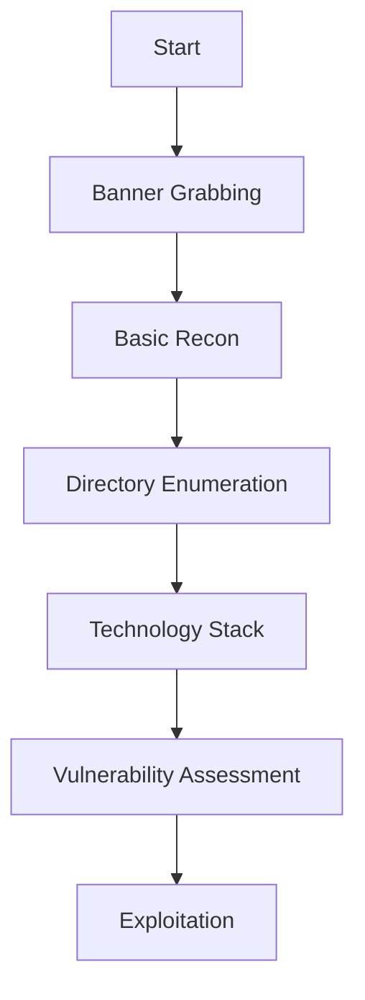

# Firewall and IDS/IPS Evasion - HTB Academy

## Easy Lab
### Doel
Identificeer het Operating System van de target machine.

### Oplossing
```bash
# Nmap scan
sudo nmap -sV -sC -A 10.129.131.205

# FTP banner op port 10001
curl --http0.9 http://10.129.131.205:10001/
```

### Resultaat
- **OS**: Ubuntu
- **Flag**: `HTB{pr0F7pDv3r510nb4nn3r}` (in FTP banner op port 10001)

---

## Medium Lab
### Doel
Vind de DNS server versie.

### Belangrijke Note
⚠️ **Gebruik UDP VPN** (UDP 1337, niet TCP 443)

### Oplossing
```bash
# DNS version query via CHAOS class
dig @10.129.2.48 version.bind chaos txt
```

### Resultaat
- **Flag**: `HTB{GoTtgUnyze9Psw4vGjcuMpHRp}` (in DNS versie TXT record)

---

## Hard Lab
### Doel
Vind de versie van de database service (large amounts of data hint).

### Context
- Administrator heeft 1 week IDS/IPS training gehad
- Services draaien op non-standard ports
- Communicatie is gemodificeerd

### Discovery Process

#### Stap 1: Initial Recon
```bash
# Top 20 ports scan met stealth
sudo nmap -sS --top-ports 20 -T0 --scan-delay 10s --source-port 53 10.129.2.47
```

**Open ports gevonden:**
- 22/tcp - SSH
- 80/tcp - HTTP

**Filtered ports:**
- 53, 443, 445, 139, etc.

#### Stap 2: UDP Scan
```bash
# UDP scan voor NetBIOS
sudo nmap -sU -p53,161,123,137 10.129.2.47
```

**Resultaat:**
- 137/udp - NetBIOS (open)

#### Stap 3: Database Port Discovery
```bash
# Scan high ports voor IBM DB2
sudo nmap -sV -p50000 --source-port 53 10.129.2.47
```

**Resultaat:**
- 50000/tcp - **filtered** (IBM DB2 service)

### Oplossing - Source Port Evasion met Netcat
```bash
# Netcat met source port 53 (DNS traffic bypass)
sudo nc -nv -p 53 10.129.2.47 50000
```

**Flags uitleg:**
- `-n` = Disable DNS resolution (sneller)
- `-v` = Verbose output
- `-p 53` = **Source port 53** (firewall evasion)

### Resultaat
```
220 HTB{kjnsdf2n982n1827eh76238s98di1w6}
```

---

## Key Learnings

### Stealth Scan Technieken

#### Timing Templates
```bash
-T0  # Paranoid (300+ sec delays)
-T1  # Sneaky (15 sec delays)
-T2  # Polite (0.4 sec delays)
-T3  # Normal (default)
-T4  # Aggressive
-T5  # Insane
```

#### Evasion Techniques
```bash
# Fragment packets
-f

# Source port spoofing (DNS = 53)
--source-port 53

# Decoy scans
-D RND:10

# Scan delay
--scan-delay 10s

# Data length randomization
--data-length 200
```

### Service Version Detection

#### Nmap
```bash
# Basic version scan
sudo nmap -sV -p<port> <target>

# Aggressive version detection
sudo nmap -sV --version-intensity 9 -p<port> <target>

# With scripts
sudo nmap -sV --script=<script-name> -p<port> <target>
```

#### Manual Banner Grabbing
```bash
# Netcat
nc <target> <port>
sudo nc -nv -p 53 <target> <port>  # Met source port

# Telnet
telnet <target> <port>

# Curl (voor HTTP-achtige services)
curl http://<target>:<port>
curl --http0.9 http://<target>:<port>/
```

### DNS Enumeration
```bash
# CHAOS class queries (version info)
dig @<target> version.bind chaos txt
dig @<target> hostname.bind chaos txt

# TCP DNS query
dig +tcp @<target> version.bind chaos txt

# Nmap DNS scripts
sudo nmap -sU -p53 --script dns-nsid,dns-recursion <target>
```

### Database Services

#### Common Ports
- **MySQL**: 3306, 3307, 33060
- **PostgreSQL**: 5432
- **MSSQL**: 1433
- **MongoDB**: 27017
- **IBM DB2**: 50000
- **Redis**: 6379

#### DB2 Specific
```bash
# DB2 Discovery (UDP 523)
sudo nmap -sU -p523 --script db2-discover <target>

# DB2 DAS Info
sudo nmap -p50000 --script db2-das-info <target>

# Banner grab via netcat
sudo nc -nv -p 53 <target> 50000
```

---

## IDS/IPS Evasion Principles

### 1. **Go Slow**
- Use `-T0` or `-T1` timing
- Add `--scan-delay`
- Scan one port at a time

### 2. **Legitimate Traffic Patterns**
- Use source port 53 (DNS)
- Use source port 80/443 (HTTP/HTTPS)
- Fragment packets (`-f`)

### 3. **Avoid Aggressive Scans**
❌ **NEVER** in IDS/IPS labs:
- `nmap -A`
- `nmap -sV -sC` (zonder timing control)
- `nuclei` / automated scanners
- `dirb` / `gobuster` (zonder delays)

✅ **DO**:
- Single port checks: `nc <target> <port>`
- Specific queries: `dig`, `curl`
- Slow, targeted scans: `nmap -T0 -p<port>`

### 4. **Tool Selection**
- **Reconnaissance**: Use protocol-specific tools (dig, curl)
- **Scanning**: Nmap with evasion flags
- **Banner Grabbing**: Netcat > Nmap
- **Web Enum**: Manual curl > automated tools

---

## Common Filtered Ports & Bypass

### Filtered vs Closed
- **Filtered**: Firewall blocks, service might be running
- **Closed**: No service, port actively refused

### Bypass Filtered Ports
```bash
# Try different scan types
-sS  # SYN scan
-sA  # ACK scan  
-sF  # FIN scan
-sN  # NULL scan

# Source port manipulation
--source-port 53
--source-port 20  # FTP-data
--source-port 80  # HTTP

# Fragmentation
-f    # 8-byte fragments
-ff   # 16-byte fragments
--mtu <size>

# Netcat with source port (most effective)
sudo nc -nv -p 53 <target> <port>
```

---

## Lab Summary Table

| Lab | Target | Service | Port | Method | Flag Location |
|-----|--------|---------|------|--------|---------------|
| Easy | 10.129.131.205 | ProFTPD | 10001 | `curl --http0.9` | FTP banner |
| Medium | 10.129.2.48 | DNS | 53 | `dig version.bind` | TXT record |
| Hard | 10.129.2.47 | IBM DB2 | 50000 | `sudo nc -p 53` | DB2 banner |

---

## Quick Reference Commands

### Initial Recon (Stealth)
```bash
# Ping check
ping -c 1 <target>

# Basic services
curl http://<target>
nc <target> 22
nc <target> 80

# Top ports (slow)
sudo nmap -sS --top-ports 50 -T2 --source-port 53 <target>
```

### Version Detection
```bash
# DNS
dig @<target> version.bind chaos txt

# HTTP
curl -I http://<target>

# Service banner
nc <target> <port>
sudo nc -nv -p 53 <target> <port>

# Nmap
sudo nmap -sV -p<port> --source-port 53 <target>
```

### Firewall Bypass
```bash
# Source port 53 (DNS)
sudo nmap -sS -p<port> --source-port 53 <target>
sudo nc -nv -p 53 <target> <port>

# Fragmentation
sudo nmap -sS -f -p<port> <target>

# ACK scan (test firewall rules)
sudo nmap -sA -p<port> <target>
```

---

## Tags
#htb #academy #nmap #firewall-evasion #ids-ips #network-enumeration #stealth-scanning #netcat #dns-enumeration

## Related Modules
- [[Network Enumeration with Nmap]]
- [[Footprinting]]
- [[Attacking Common Services]]


welk ip heb ik? typ:     ip route get 10.129.200.170
# Web Enumeration Checklist

> **Category**: Methodology  
> **Phase**: Information Gathering / Reconnaissance  
> **Target**: Web Applications

---

## Workflow Overview



---

## 1. Banner Grabbing & Initial Recon

### HTTP Headers

```bash
# Basic header grab
curl -I http://10.10.11.5

# Verbose output
curl -v http://10.10.11.5

# Specific port
curl -I http://10.10.11.5:8080

# HTTPS
curl -I -k https://10.10.11.5
```

**Check voor:**

- Server type en versie (Apache, Nginx, IIS)
- Programming language (X-Powered-By header)
- Cookies (session management)
- Security headers (CSP, HSTS, X-Frame-Options)

### Manual Browser Inspection

```
1. Open in browser
2. Rechtermuisknop → View Page Source
3. Check voor:
   - Commentaar in HTML
   - JavaScript files
   - Hidden input fields
   - API endpoints
   - Email addresses
   - Version numbers
```

---

## 2. Robots.txt & Sitemap

### Robots.txt

```bash
# Check robots.txt
curl http://10.10.11.5/robots.txt

# Of in browser
http://10.10.11.5/robots.txt
```

**Let op:**

- Disallowed paths (vaak interessant!)
- Admin panels
- Backup directories
- Development/staging environments

**Voorbeeld:**

```
User-agent: *
Disallow: /admin/
Disallow: /backup/
Disallow: /config/
Disallow: /.git/
```

### Sitemap.xml

```bash
# Check sitemap
curl http://10.10.11.5/sitemap.xml
```

---

## 3. Source Code Analysis

### View Source

```bash
# Download en bekijk source
curl http://10.10.11.5 > index.html

# Grep naar interessante dingen
curl -s http://10.10.11.5 | grep -i "password"
curl -s http://10.10.11.5 | grep -i "todo"
curl -s http://10.10.11.5 | grep -i "admin"
```

### Zoek naar:

- **Commentaar:**

```html
<!-- TODO: Remove debug mode before production -->
<!-- Default password: admin123 -->
```

- **Hidden Fields:**

```html
<input type="hidden" name="admin" value="false">
```

- **JavaScript Endpoints:**

```javascript
fetch('/api/v1/users')
axios.get('http://internal-api.local/data')
```

- **Hardcoded Credentials:**

```javascript
const API_KEY = "sk_live_123456789";
const db_password = "SuperSecret123!";
```

---

## 4. Directory & File Brute Forcing

### Gobuster

```bash
# Basic directory scan
gobuster dir -u http://10.10.11.5 -w /usr/share/wordlists/dirb/common.txt

# Extended scan
gobuster dir -u http://10.10.11.5 -w /usr/share/wordlists/dirbuster/directory-list-2.3-medium.txt

# Specific extensions
gobuster dir -u http://10.10.11.5 -w /usr/share/wordlists/dirb/common.txt -x php,html,txt,pdf

# Follow redirects
gobuster dir -u http://10.10.11.5 -w wordlist.txt -r

# Custom User-Agent
gobuster dir -u http://10.10.11.5 -w wordlist.txt -a "Mozilla/5.0"

# Exclude status codes
gobuster dir -u http://10.10.11.5 -w wordlist.txt -b 404,403
```

### Ffuf

```bash
# Directory fuzzing
ffuf -u http://10.10.11.5/FUZZ -w /usr/share/wordlists/dirb/common.txt

# File fuzzing with extension
ffuf -u http://10.10.11.5/FUZZ -w wordlist.txt -e .php,.html,.txt

# Subdomain fuzzing
ffuf -u http://10.10.11.5 -H "Host: FUZZ.target.com" -w subdomains.txt

# POST parameter fuzzing
ffuf -u http://10.10.11.5/login -X POST -d "username=admin&password=FUZZ" -w passwords.txt

# Filter by response size
ffuf -u http://10.10.11.5/FUZZ -w wordlist.txt -fs 1234

# Match status code
ffuf -u http://10.10.11.5/FUZZ -w wordlist.txt -mc 200,301,302
```

### Dirsearch

```bash
# Basic scan
dirsearch -u http://10.10.11.5

# With extensions
dirsearch -u http://10.10.11.5 -e php,html,js,txt

# Recursive
dirsearch -u http://10.10.11.5 -r

# Custom wordlist
dirsearch -u http://10.10.11.5 -w /path/to/wordlist.txt
```

---

## 5. Technology Stack Identification

### Whatweb

```bash
# Basic scan
whatweb http://10.10.11.5

# Verbose output
whatweb -v http://10.10.11.5

# Aggressive scan
whatweb -a 3 http://10.10.11.5
```

### Wappalyzer

- Browser extension
- Identifies technologies used
- CMS, frameworks, analytics, etc.

### Builtwith

```bash
# Online: builtwith.com
# Shows technology stack
```

### Manual Identification

**Check voor:**

- CMS (WordPress, Joomla, Drupal)
- Frameworks (Laravel, Django, Rails)
- JavaScript libraries (jQuery, React, Vue)
- Web servers (Apache, Nginx, IIS)

**Common indicators:**

```
WordPress: /wp-content/, /wp-admin/
Joomla: /administrator/, /components/
Drupal: /sites/default/, /modules/
Laravel: /public/, /.env
```

---

## 6. Vulnerability Scanning

### Nikto

```bash
# Basic scan
nikto -h http://10.10.11.5

# Specific port
nikto -h http://10.10.11.5:8080

# Save output
nikto -h http://10.10.11.5 -o nikto_results.txt

# Tune scan
nikto -h http://10.10.11.5 -Tuning x  # x = 1-9
```

### WPScan (WordPress)

```bash
# Basic scan
wpscan --url http://10.10.11.5

# Enumerate users
wpscan --url http://10.10.11.5 --enumerate u

# Enumerate vulnerable plugins
wpscan --url http://10.10.11.5 --enumerate vp

# Aggressive scan
wpscan --url http://10.10.11.5 --enumerate ap,at,u --plugins-detection aggressive
```

### Nuclei

```bash
# Basic scan
nuclei -u http://10.10.11.5

# Specific templates
nuclei -u http://10.10.11.5 -t exposures/

# All templates
nuclei -u http://10.10.11.5 -t ~/nuclei-templates/
```

---

## 7. Common Directories to Check

### Must-Check Paths

```
/admin/
/administrator/
/login/
/phpmyadmin/
/backup/
/.git/
/.svn/
/.env
/config/
/uploads/
/files/
/api/
/v1/
/dev/
/test/
/temp/
/old/
```

### Config & Backup Files

```
/config.php
/configuration.php
/settings.php
/db.php
/database.php
/backup.sql
/dump.sql
/site.zip
/backup.tar.gz
/www.zip
```

### Development Files

```
/.git/config
/.gitignore
/.DS_Store
/composer.json
/package.json
/webpack.config.js
/.env
/.env.backup
```

---

## 8. API Enumeration

### REST API Discovery

```bash
# Common endpoints
curl http://10.10.11.5/api/
curl http://10.10.11.5/api/v1/
curl http://10.10.11.5/api/v2/

# Try different HTTP methods
curl -X GET http://10.10.11.5/api/users
curl -X POST http://10.10.11.5/api/users
curl -X PUT http://10.10.11.5/api/users/1
curl -X DELETE http://10.10.11.5/api/users/1

# Check for API documentation
curl http://10.10.11.5/api/docs
curl http://10.10.11.5/swagger
curl http://10.10.11.5/api/swagger.json
```

### GraphQL

```bash
# GraphQL endpoint
curl http://10.10.11.5/graphql

# Introspection query
curl -X POST http://10.10.11.5/graphql \
  -H "Content-Type: application/json" \
  -d '{"query": "{__schema{types{name}}}"}'
```

---

## 9. SSL/TLS Testing

### SSLScan

```bash
# Basic scan
sslscan 10.10.11.5:443

# Show certificate
sslscan --show-certificate 10.10.11.5:443
```

### TestSSL

```bash
# Full test
testssl.sh https://10.10.11.5

# Quick check
testssl.sh --fast https://10.10.11.5
```

---

## Quick Checklist Template

```markdown
## Target: http://10.10.11.5

### Initial Recon
- [ ] Banner grabbing (curl -I)
- [ ] View source code
- [ ] Check robots.txt
- [ ] Check sitemap.xml

### Technology Stack
- [ ] Whatweb scan
- [ ] Manual identification (CMS, frameworks)
- [ ] Version detection

### Directory Enumeration
- [ ] Gobuster scan
- [ ] Check common paths (/admin, /backup, etc.)
- [ ] Look for config files

### Vulnerability Scanning
- [ ] Nikto scan
- [ ] CMS-specific scan (WPScan, etc.)
- [ ] Check for known CVEs

### Manual Testing
- [ ] Test input fields
- [ ] Check for file upload
- [ ] Look for API endpoints
- [ ] Test authentication mechanisms

### Findings
- Open ports:
- Web technologies:
- Interesting directories:
- Potential vulnerabilities:
```

---

## Tools Summary

|Tool|Purpose|Command|
|---|---|---|
|**curl**|Banner grabbing, manual requests|`curl -I http://target.com`|
|**gobuster**|Directory brute forcing|`gobuster dir -u URL -w wordlist`|
|**ffuf**|Fuzzing (dirs, params, subdomains)|`ffuf -u URL/FUZZ -w wordlist`|
|**nikto**|Web vulnerability scanner|`nikto -h http://target.com`|
|**whatweb**|Technology identification|`whatweb http://target.com`|
|**wpscan**|WordPress scanner|`wpscan --url http://target.com`|

---

## Related

- [[Common Ports]]
- [[OWASP Top 10]]
- [[SQL Injection]]
- [[File Upload Vulnerabilities]]
- [[XSS]]

---

_Last updated: 2026-01-13_